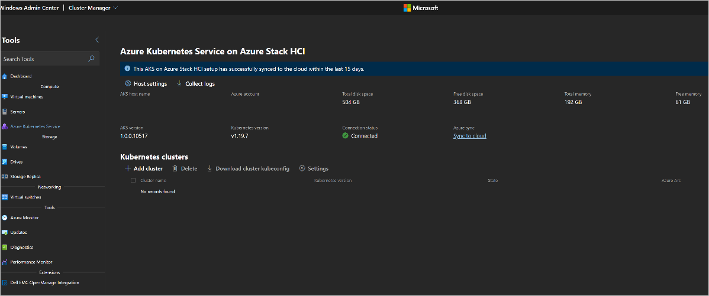
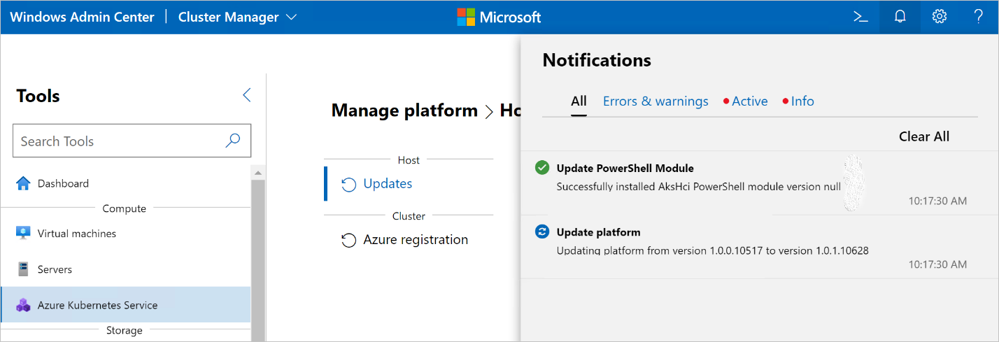
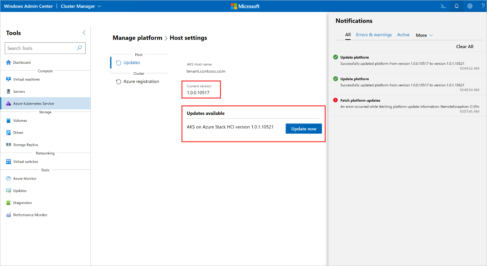

# Known issues in Windows Admin Center

## Restarting Azure Stack HCI nodes causes timing issue

Restarting the Azure Stack HCI cluster nodes hosting the AKS-HCI management cluster and workload clusters may cause the workload clusters to disappear from the Windows Admin Center (WAC) dashboard. The workaround would be to restart WAC. Sometimes the target clusters take longer to show up in the dashboard.



## Deployment: Connecting to remote server localhost failed

AKS-host cluster deployment fails at system checks with WinRM service error. Try applying remedies suggested in the following article [Manual troubleshooting](/azure-stack/hci/manage/troubleshoot-credssp#manual-troubleshooting). 


## Incorrect upgrade notification

Incorrect upgrade notification: `Successfully installed AksHci PowerShell module version null`. You may see the incorrect notification message. The upgrade operation is successful even if the notification is misleading.



## WAC update dashboard doesn't refresh after successful updates

After a success upgrade, the WAC update dashboard still shows the previous version.



## Networking field names inconsistent in WAC portal

There are inconsistencies in network field names showing up in the host cluster deployment flow and the target cluster deployment flow.

## Error appears when moving from PowerShell to Windows Admin Center to create an Arc enabled workload cluster

The error "Cannot index into a null array" appears when moving from PowerShell to Windows Admin Center to create an Arc enabled workload cluster. You can safely ignore this error as it is part of the validation step, and the cluster has already been created. 

## Recovering from a failed AKS on Azure Stack HCI deployment
If you're experiencing deployment issues or want to reset your deployment, make sure you close all Windows Admin Center instances connected to Azure Kubernetes Service on Azure Stack HCI before running [Uninstall-AksHci](./uninstall-akshci.md) from a PowerShell administrative window.

## IPv6 must be disabled in the hosting environment
If both IPv4 and IPv6 addresses are bound to the physical NIC, the `cloudagent` service for clustering uses the IPv6 address for communication. Other components in the deployment framework only use IPv4. This issue will result in Windows Admin Center unable to connect to the cluster and will report a failure when trying to remotely connect to the machine. The workaround is to disable IPv6 the physical network adapters.

## Cannot deploy AKS to an environment that has separate storage and compute clusters
Windows Admin Center will not deploy Azure Kubernetes Service to an environment with separate storage and compute clusters as it expects the compute and storage resources to be provided by the same cluster. In most cases, it will not find CSVs exposed by the compute cluster and will refuse to continue with deployment.

## Windows Admin Center doesn't have an Arc offboarding experience
Windows Admin Center does not currently have a process to off board a cluster from Azure Arc. To delete Arc agents on a cluster that has been destroyed, navigate to the resource group of the cluster in the Azure portal, and manually delete the Arc content. To delete Arc agents on a cluster that is still up and running, you should run the following command:

```azurecli
az connectedk8s delete --name AzureArcTest1 --resource-group AzureArcTest
``` 
 
> [!NOTE]
> If you use the Azure portal to delete the Azure Arc-enabled Kubernetes resource, it removes any associated configuration resources, but does not remove the agents running on the cluster. Best practice is to delete the Azure Arc-enabled Kubernetes resource using `az connectedk8s delete` instead of Azure portal.

## Cannot connect Windows Admin Center to Azure when creating a new Azure App ID
If you're unable to connect Windows Admin Center to Azure because you can't automatically create and use an Azure App ID on the gateway, create an Azure App ID and assign it the right permissions on the portal. Then, select **Use existing in the gateway**. For more information, visit [connecting your gateway to Azure.](/windows-server/manage/windows-admin-center/azure/azure-integration).

## Only the user who set up the AKS host can create clusters
When deploying Azure Kubernetes Service on Azure Stack HCI through Windows Admin Center, only the user who set up the AKS host can create Kubernetes clusters. To work around this issue, copy the _wssd_ folder from the profile of the user who set up the AKS host to the profile of the user who will be creating the new Kubernetes clusters.

## Error occurs when attempting to use Windows Admin Center
For CredSSP to function successfully in the Cluster Create wizard, Windows Admin Center must be installed and used by the same account. If you install Windows Admin Center with one account and try to use it with another, you'll get errors.

## On Windows Admin Center, the message **error occurred while creating service principal** appears while installing an AKS host on Azure Stack HCI
You will get this error if you have disabled pop-ups. Google Chrome blocks pop-ups by default, and therefore, the Azure sign in pop-up is blocked and causes the service principal error.

## Next steps
- [Troubleshoot Windows Admin Center](./troubleshoot-windows-admin-center.md)
- [Resolve known issues](./troubleshoot-known-issues.md)

