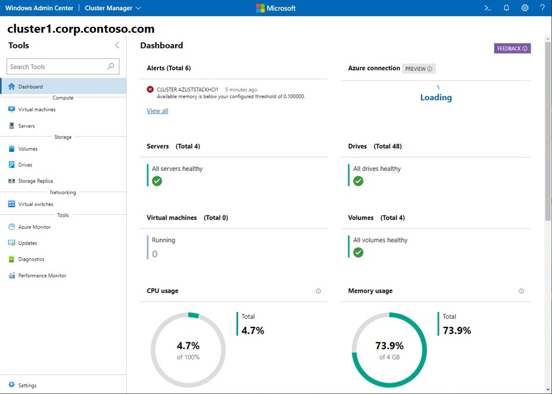
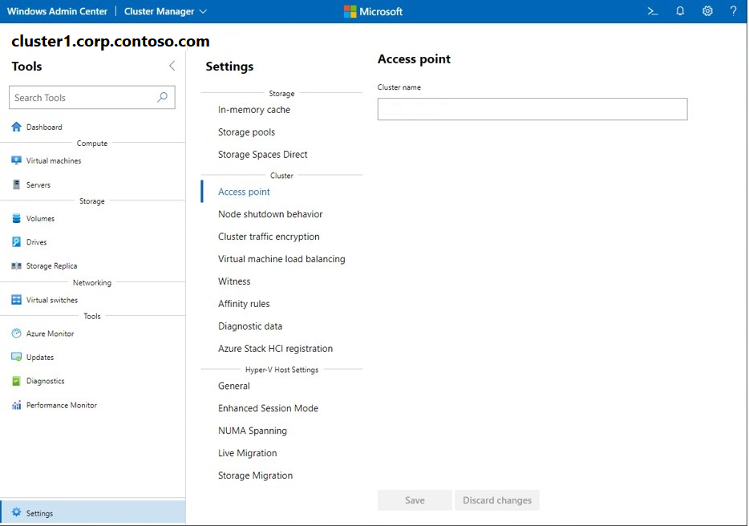
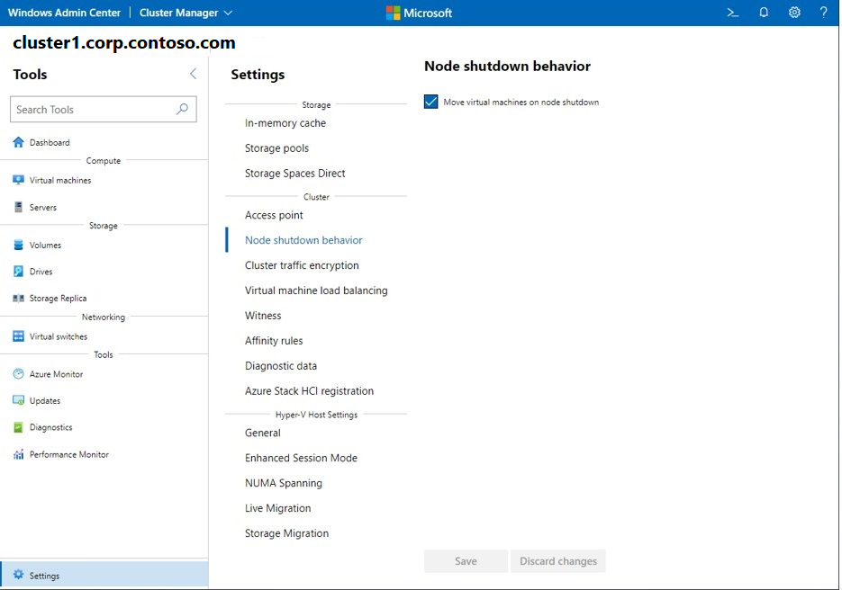
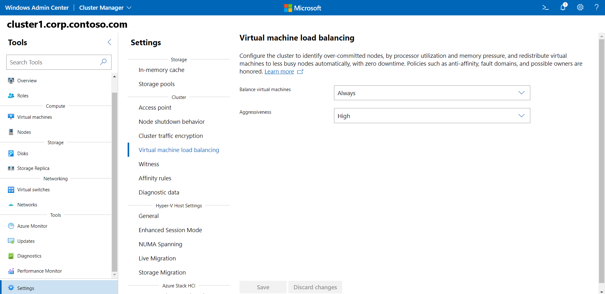
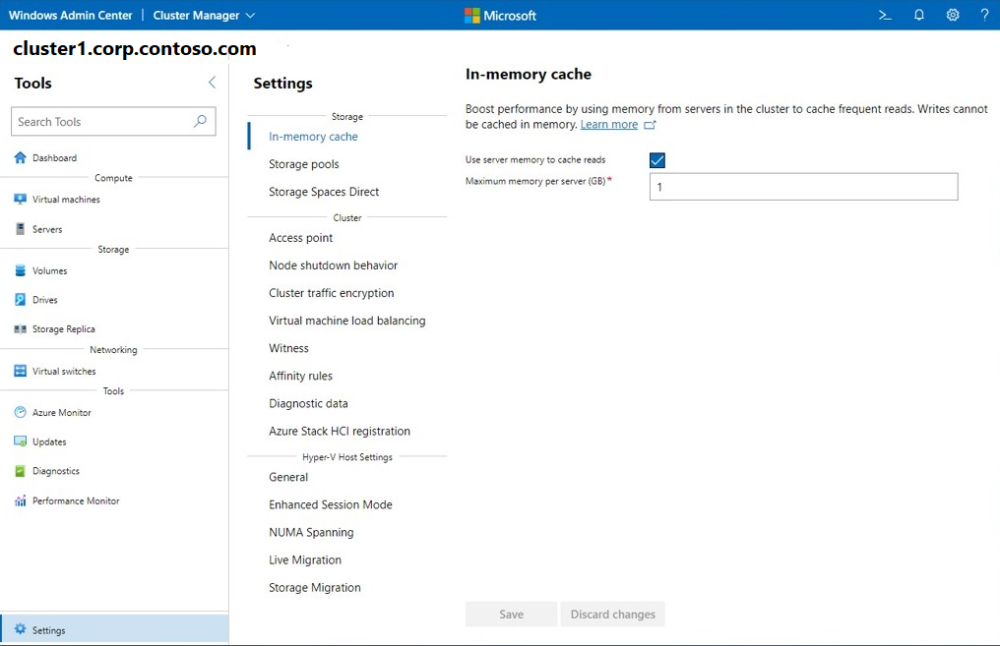

# Manage Azure Stack HCI clusters

>Applies to: Windows Server 2019

Windows Admin Center can be used to manage your clusters in Azure Stack HCI. Specifically, you will be using the Cluster Manager extension in Windows Admin Center to manage your clusters.

## View the cluster dashboard ##

The cluster dashboard displays information regarding cluster health and performance.

>[!div class="mx-imgBorder"]
>

1. In Windows Admin Center, click the cluster name under **All connections**.
1. Under **Tools** on the left, select **Dashboard**. You can view the following:
    - Cluster event alerts
    - List of the servers joined to the cluster
    - List of virtual machines running on the cluster
    - List of disk drives available on the cluster
    - List of disk volumes available on the cluster
    - Total cluster CPU usage for the cluster
    - Total cluster memory usage for the cluster
    - Total cluster storage usage for the cluster
    - Total cluster input/output operations/second (IOPS)
    - Average cluster latency in milliseconds

## Change cluster general settings ##

There are five general settings that can be applied to your cluster.

1. In Windows Admin Center, click **Cluster Manager** from the top drop-down arrow.
1. Under **Tools**, click **Settings**.
1. To change the cluster name, select **Access point** and enter the new name.

>[!div class="mx-imgBorder"]
>

4. To control node shutdown behavior, select **Node shutdown behavior** and ensure the checkbox is enabled. This moves any virtual machines from the node first to allow graceful node shutdown.

>[!div class="mx-imgBorder"]
>

5. To encrypt SMB connections used to send data between cluster nodes, select **Cluster traffic encryption**, then select **Encrypt** from the dropdown boxes for the following:

 - **Core traffic** - encrypts traffic sent over NetFT (cluster virtual adapter) on port 3343

  - **Server traffic** - encrypts Cluster Shared Volume (CSV) and Storage Bus Layer (SBL) traffic

>[!div class="mx-imgBorder"]
>

6. To automatically load-balance virtual machines across the cluster, select **Virtual machine load balancing**, and do the following:

 - For **Balance virtual machines**, select the appropriate action
 - For **Aggressiveness**, select the appropriate behavior

 For information on how this works, see [Virtual Machine Load Balancing overview](https://docs.microsoft.com/windows-server/failover-clustering/vm-load-balancing-overview).

>[!div class="mx-imgBorder"]
>

7. To select a quorum witness type, select **Witness**, then select one of the following:

  - **Cloud witness** - to use an Azure cloud resource as witness 
   - **Disk witness** - to use a disk resource as witness
  - **File share witness** - to use a file share as witness 

For more information, see [Configure and manage quorum](https://docs.microsoft.com/windows-server/failover-clustering/manage-cluster-quorum).

>[!div class="mx-imgBorder"]
>

## Change cluster Hyper-V settings ##

There are five Hyper-V host settings that can be applied to your cluster.

1. In Windows Admin Center, click **Cluster Manager** from the top drop-down arrow.
2. Under **Tools**, click **Settings**.
3. Select **General** and do the following:

 - for **Virtual Hard Disks Path**, specify the default folder to store the virtual hard disk files to

 - for **Virtual Machines Path**, specify the default folder to store the virtual machine configuration files to

 - for **Hypervisor Scheduler Type**, select either **Core Scheduler** or **Classic Scheduler**. This determines how the hypervisor schedules virtual processes to run on physical processors that use simultaneous multi-threading (also known as SMT or hyper-threading)

>[!div class="mx-imgBorder"]
>

4. To allow redirection of local devices and resources from virtual machines, select **Enhanced Session Mode**. Note that enhanced session mode connections require a supported guest operating system.

>[!div class="mx-imgBorder"]
>

5. To allow virtual machines to span physical NUMA nodes, select **NUMA Spanning**. Non-uniform memory architecture (NUMA) spanning can provide a virtual machine with more memory than what is available on a single NUMA node.

>[!div class="mx-imgBorder"]
>

6. To specify the number of live migrations that can be performed at the same time, select **Live Migration**, select a number, then specify the following:

 - for **Authentication Protocol**, select either **CredSSP** or **Kerberos**.

  - for **Performance Option**, select either **Compression** or **SMB**. Compressed data is sent over a TCP/IP connection.

   - enable the **Use any network** checkbox to use any available network on a node to perform the migration

>[!div class="mx-imgBorder"]
>

7. To specify the number of storage migrations that can be performed at the same time, select **Storage Migration**, then select a number. 

>[!div class="mx-imgBorder"]
>

## Change cluster storage settings ##

There are two settings you can change related to Storage Spaces Direct that can be applied to your cluster.

1. In Windows Admin Center, click **Cluster Manager** from the top drop-down arrow.
1. Under **Tools**, click **Settings** at the bottom.
1. To configure the storage cache, select **Storage Spaces Direct**, then configure the following:

 - for **Persistent cache**, select either **Enabled** or **Disabled**

  - for **Cache mode for HDD**, select **Read only**, **Write only**, or **Read/Write**

   - for **Cache mode for SSD**, select **Read only**, **Write only**, or **Read/Write** 

>[!div class="mx-imgBorder"]
>

4. To use server memory to cache frequent reads, select **In-memory cache** and specify the maximum memory to be used per sever. Also see [Using Storage Spaces Direct with the CSV in-memory read cache](https://docs.microsoft.com/windows-server/storage/storage-spaces/csv-cache).

>[!div class="mx-imgBorder"]
>

## Next Steps ##

- To add or remove a server node from a cluster, see [Add or remove servers on an Azure HCI cluster].