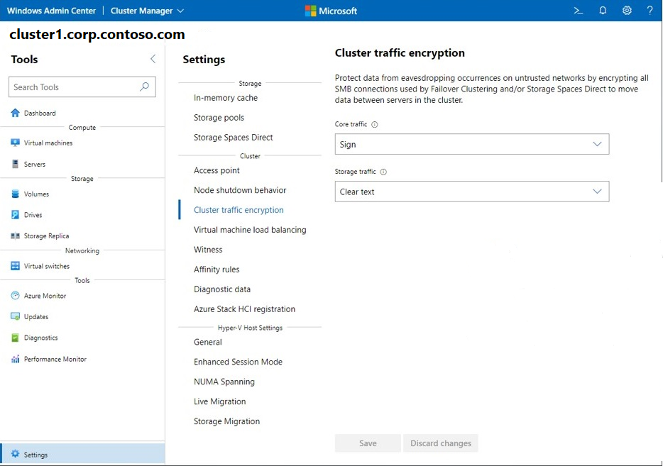
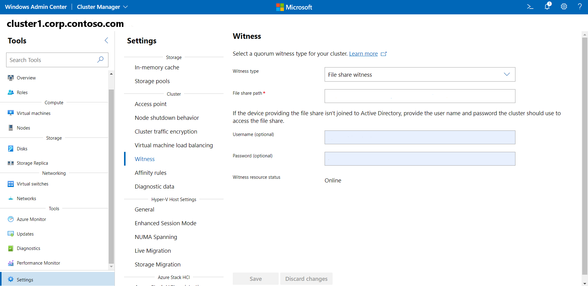
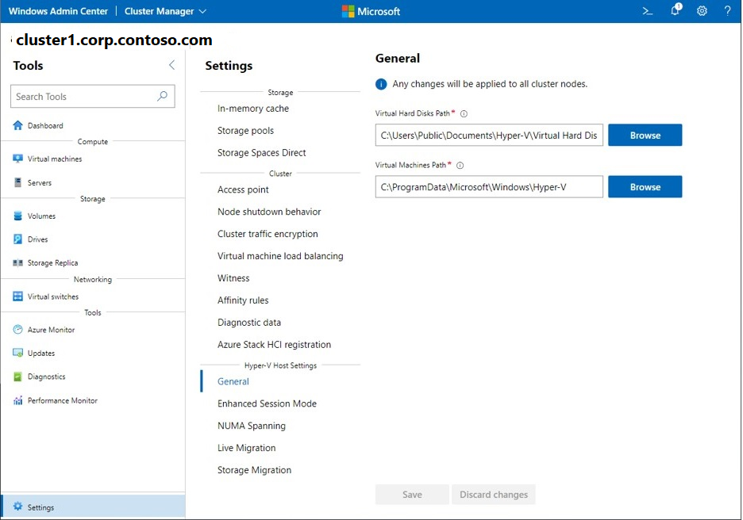
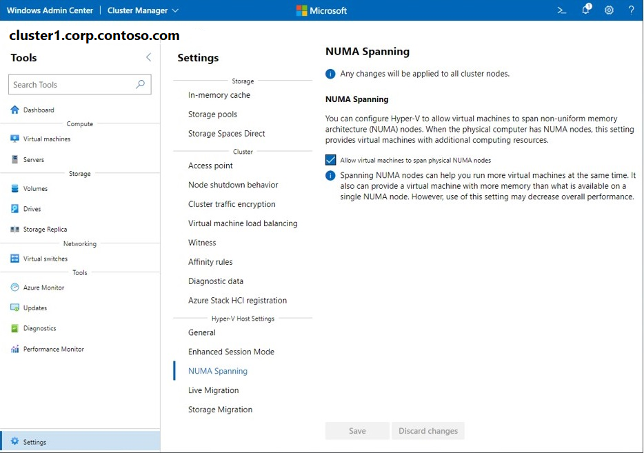

# Manage Azure Stack HCI clusters

>Applies to: Azure Stack HCI

Windows Admin Center can be used to manage your clusters in Azure Stack HCI. Specifically, you will be using the Cluster Manager extension in Windows Admin Center to manage your clusters.

## View the cluster dashboard ##

1. In Windows Admin Center, click the Windows Server Cluster name under **All connections**.
1. Under **Tools** on the left, click **Dashboard**. You can view the following:
    - Cluster event alerts
    - List of the servers joined to the cluster
    - List of virtual machines running on the cluster
    - List of disk drives available on the cluster
    - List of disk volumes available on the cluster
    - Total cluster CPU usage for the cluster
    - Total cluster memory usage for the cluster
    - Total cluster storage usage for the cluster
    - Total cluster input/output operations/second (IOPS)
    - Average cluster latency in milliseconds

## Change cluster general settings ##

There are five general settings that can be applied to your cluster.

1. In Windows Admin Center, click **Cluster Manager** from the top drop-down arrow.
1. Under **Tools**, click **Settings**.
1. In the **Cluster** section, select **Access point**.

4. Make the following changes as needed:

 - change the cluster name
5. Select **Node shutdown behavior**.

6. Make the following changes as needed:

 - enable virtual machine move upon shutdown

7. Select **Cluster traffic encryption**.

8. Make the following changes as needed:

 - encrypt all SMB connections between servers for core traffic (NetFT on port 3343) and for storage traffic (CSV and SBL) 

9. Select **Virtual machine load balancing**.

10. Make the following changes as needed:

 - automatically redistribute VMs to less busy nodes

11. Select **Witness**.

12. Make the following changes as needed:

 - select a quorum witness type for your cluster

## Change cluster Hyper-V settings ##

There are five Hyper-v host settings that can be applied to your cluster.

1. In Windows Admin Center, click **Cluster Manager** from the top drop-down arrow.
1. Under **Tools**, click **Settings**.
1. In the **Hyper-V Host Settings** section, select **General**.

4. Make the following changes as needed:

 - default paths for Virtual Hard Disks and Virtual Machines Paths and Hypervisor Scheduler Type for virtual processes.

5. Select **Enhanced Session Mode**.

6. Make the following changes as needed:

 - allow enhanced session mode connections to VMs running on each server node.

7. Select **NUMA Spanning**.

8. Make the following changes as needed:

 - allow VMs to span non-uniform memory architecture (NUMA) nodes for additional computing resources.

9. Select **Live Migration**.

10. Make the following changes as needed:

 - enable incoming and outgoing live migrations, and specify authentication and performance options.

 11. Select **Storage Migration**.

 

12. Make the following changes as needed:

  - specify how many storage migrations can be performed at the same time.

## Change cluster storage settings ##

There are two settings you can change related to Storage Spaces Direct that can be applied to your cluster.

1. In Windows Admin Center, click **Cluster Manager** from the top drop-down arrow.
1. Under **Tools**, click **Settings** at the bottom.
1. In the **Storage** section, select **Storage Spaces Direct**.

4. Make the following changes as needed:

 - to specify cache persistence, cache mode for HDD/SSD, cache page size, and cache metadata reserve.

5. In the **Storage** section, select **In-memory cache**.

6. To the right, make the following changes as needed:

  - to specify maximum memory per server used to boost performance.

## Next Steps ##

- To add or remove a server node from a cluster, see [Add or remove servers on an Azure HCI cluster].