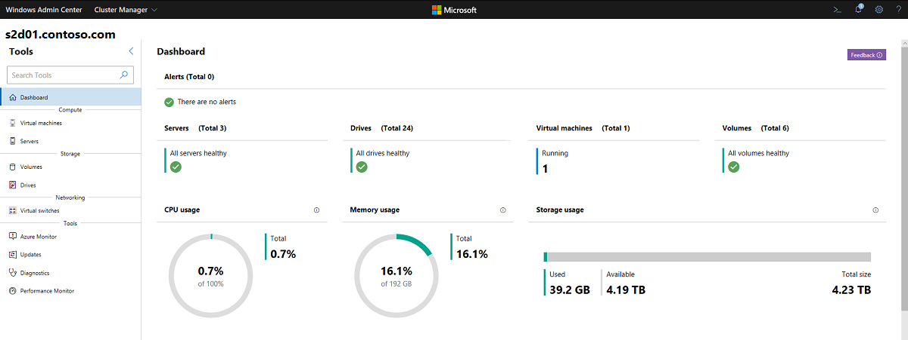

# Quickstart: Monitor Azure Stack HCI clusters with Windows Admin Center

> Applies to: Azure Stack HCI, Windows Server 2019

This topic provides instructions for monitoring the performance of an Azure Stack HCI cluster at a glance by using Windows Admin Center, a locally deployed, browser-based app for managing Azure Stack HCI.

## Install Windows Admin Center

The simplest way to install Windows Admin Center is on a local Windows 10 PC, although you must be a member of the local administrator's group to do so.

1. Download [Windows Admin Center](https://www.microsoft.com/evalcenter/evaluate-windows-admin-center) from the Microsoft Evaluation Center. Even though it says "Start your evaluation," this is the generally available version for production use, included as part of your Windows Server license.
2. Run the WindowsAdminCenter.msi file to install.
3. When you start Windows Admin Center for the first time, you'll see an icon in the notification area of your desktop. Right-click this icon and choose Open to open the tool in your default browser. Make sure to select the Windows Admin Center Client certificate when prompted to select a certificate.

## Add and connect to an Azure Stack HCI cluster

After you have completed the installation of Windows Admin Center, you can add a cluster to manage from the main overview page.

1. Click **+ Add** under **All Connections**.

    > [!div class="mx-imgBorder"]
    > 

2. Choose to add a Windows Server cluster:
    
    > [!div class="mx-imgBorder"]
    > 

3. Type the name of the cluster to manage and click **Add**. The cluster will be added to your connection list on the overview page.

## Monitor performance with the Windows Admin Center dashboard

The Windows Admin Center dashboard provides alerts and health information about servers, drives, and volumes, as well as details about CPU, memory, and storage usage.

> [!div class="mx-imgBorder"]
> 

You can scroll down to view cluster performance information such as IOPS and latency by hour, day, week, month, or year.

> [!div class="mx-imgBorder"]
> 

## Using the Performance Monitor tool

Use the Performance Monitor tool to view and compare performance counters for Windows, apps, or devices in real-time.

1. Select **Performance Monitor** from the **Tools** menu on the left.
2. Click **blank workspace** to start a new workspace, or **restore previous** to restore a previous workspace.
    > [!div class="mx-imgBorder"]
    > 
3. If creating a new workspace, click the **Add counter** button and select one or more source servers to monitor, or select the entire cluster.
4. Select the object and instance you wish to monitor, as well as the counter and graph type to view dynamic performance information.
5. Save the workspace by choosing **Save > Save As** from the top menu.

## Next steps

For a deeper dive into performance monitoring, see also:

- [Performance history for Storage Spaces Direct](/windows-server/storage/storage-spaces/performance-history)
- [Monitor with Azure Monitor](monitor.md)
