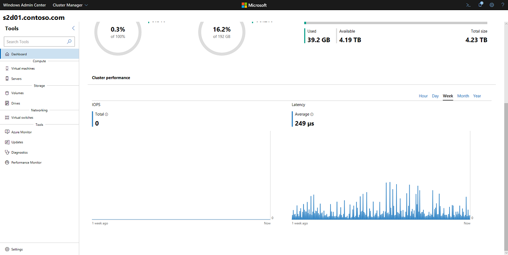

# Quickstart: Monitor Azure Stack HCI clusters with Windows Admin Center

> Applies to: Windows Server 2019

This topic provides instructions for monitoring the performance of an Azure Stack HCI cluster at a glance by using Windows Admin Center.

## Connect to a cluster using Windows Admin Center

1. In Windows Admin Center, connect to an Azure Stack HCI cluster. The Dashboard will appear, providing alerts and health information about servers, drives and volumes, as well as details about CPU, memory, and storage usage.

> [!div class="mx-imgBorder"]
> 

2. Scroll down to view cluster performance information such as IOPS and latency by hour, day, week, month, or year.

> [!div class="mx-imgBorder"]
> 

## Using the Performance Monitor tool

Use the Performance Monitor tool to view and compare performance counters for Windows, apps, or devices in real-time.

1. Select **Performance Monitor** from the **Tools** menu on the left.
2. Click "blank workspace" to start a new workspace, or "restore previous" to restore a previous workspace.
3. If creating a new workspace, click the **Add counter** button and select or more source servers to monitor, or select the entire cluster.
4. Select the object and instance you wish to monitor, as well as the counter and graph type to view dynamic performance information.
5. Save the workspace by choosing Save > Save As from the top menu.

## Next steps

For a deeper dive into performance monitoring, see also:

- [Performance history for Storage Spaces Direct](/windows-server/storage/storage-spaces/performance-history)
- [Monitor with Azure Monitor](monitor.md)
