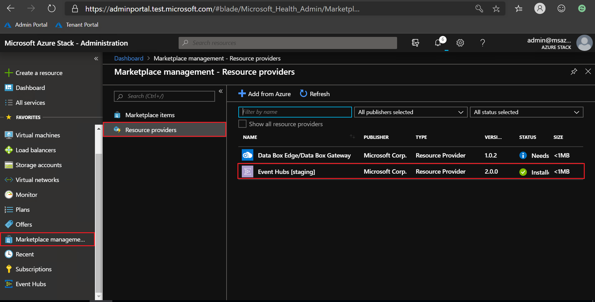

Complete the following steps to rotate your resource provider's secrets:

1. Using [Connect to Azure Stack Hub with PowerShell](azure-stack-powershell-configure-admin.md), sign in to your Azure Stack Hub environment. Be sure to replace the placeholder values such as endpoints and directory tenant name, before running the appropriate script for your environment.

2. After connecting to your Azure Stack Hub, use the `Set-AzsProductSecret` cmdlet to upload your new certificate to Key Vault. Replace the variable placeholder values accordingly before running the script:

| Variable | Description | Example value |
| -------- | ----------- | --------------|
| `$certName` | The subject name of your new certificate. | `'aseh-ssl-gateway-pfx'` |
| `$PackageId` | The resource provider package name in the format `'Microsoft.<resource-provider>.<installed-version>'`, where `<resource-provider>` is one of the following values:<br>- `Eventhub`. | `'Microsoft.Eventhub.1.2003.0.0'` |
| `$pfxPassword` | The password given to your certificate .PFX file. | `'strong@CertSecret6'` |
| `$sslCertPath` | The path to your certificate PFX file. | `'\\machine\dir\cert-file.pfx'` |

```powershell
$certName = '<cert-subject-name>' 
$pfxPassword = ConvertTo-SecureString '<pfxpassword>' -AsPlainText -Force   
$PackageId = 'Microsoft.<resource-provider>.<installed-version>'
$sslCertPath = '<cert-pfx-file-path>'
Set-AzsProductSecret -PackageId $PackageId -SecretName $certName -PfxFileName $sslCertPath -PfxPassword $pfxPassword -Force
```
3. Finally, use the `Invoke-AzsProductRotateSecretsAction` cmdlet to rotate the internal and external secrets:

```powershell
$ProductId = 'Microsoft.Eventhub'
Invoke-AzsProductRotateSecretsAction -ProductId $ProductId
```

> [!NOTE]
> It takes approximately 3.5 - 4 hours to complete the rotation process.


4. Select **Event Hubs** from the list of resource providers. You may want to filter the list by entering "Event Hubs" in the search text box provided.

   [](media/event-hubs-rp-remove/1-uninstall.png#lightbox)

