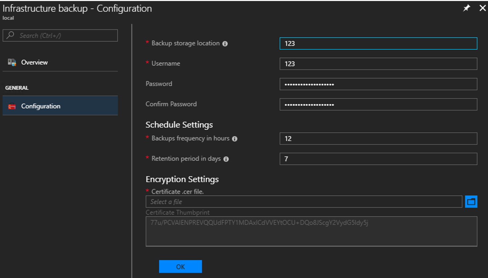

# Configure backup for Azure Stack Hub from the administrator portal - Modular Data Center (MDC)

*Applies to: Modular Data Center, Azure Stack Hub ruggedized*

You can configure the Infrastructure Backup Service from the administrator portal to export infrastructure backups to an external storage location. Infrastructure backups can be used by support to fix degraded services.

## Configure backup

1. Open the [Azure Stack administrator portal](../../operator/azure-stack-manage-portals.md).

2. Select **All services**, and then under the **Administration** category select **Infrastructure backup**. Choose **Configuration** in the **Infrastructure backup** blade.

3. Type the path to the **Backup storage location**. Use a Universal Naming Convention (UNC) string for the path to a file share hosted on a separate device. A UNC string specifies the location of resources such as shared files or devices. For the service, you can use an IP address. To ensure availability of the backup data after a disaster, the device should be in a separate location.

    > [!NOTE]  
    > If your environment supports name resolution from the Azure Stack infrastructure network to your enterprise environment, you can use a Fully Qualified Domain Name (FQDN) rather than the IP.

4. Type the **Username** using the domain and username with sufficient access to read and write files; for example, **Contoso\backupshareuser**.

5. Type the **Password** for the user.

6. Type the password again to **Confirm Password**.

7. The **frequency in hours** determines how often backups are created. The default value is 12. The scheduler supports a minimum of 4 and a maximum of 12.

8. The **retention period in days** determines how many days of backups are preserved on the external location. The default value is 7. Scheduler supports a a minimum of 2 and a maximum of 14. Backups older than the retention period are automatically deleted from the external location.

   > [!NOTE]
   > If you want to archive backups older than the retention period, make sure to back up the files before the scheduler deletes the backups. If you reduce the backup retention period (for example, from 7 days to 5 days), the scheduler will delete all backups older than the new retention period. Make sure you're OK with the backups getting deleted before you update this value.

9. In **Encryption Settings**, the public certificate thumbprint is for the certificate provided during deployment. There is no need to update the existing certificate.

10. Select **OK** to save your backup controller settings.

    

## Enable or disable automatic backups

Backups are automatically enabled during deployment. After configuring the storage location, automatic backups export the backups to an external storage location on a schedule, based on the frequency setting. You can check the next scheduled backup time in the **Essentials** blade.

If you need to disable future scheduled backups, select **Disable Automatic Backups**. Disabling automatic backups keeps backup settings configured and retains the backup schedule. This action tells the scheduler to skip future backups.

Confirm that future scheduled backups have been disabled in **Essentials**:

Select **Enable Automatic Backups** to inform the scheduler to start future backups at the scheduled time.

## Update backup settings

To update the certificate used to encrypt backup data, upload a new .CER file with the public key portion and select OK to save settings.

New backups will start to use the public key in the new certificate. There is no impact to all existing backups created with the previous certificate. Make sure to keep the older certificate in a secure location in case you need it for cloud recovery.

## Next steps

To verify that your backup ran, see [Confirm backup completed in administrator portal](../../operator/azure-stack-backup-back-up-azure-stack.md).
