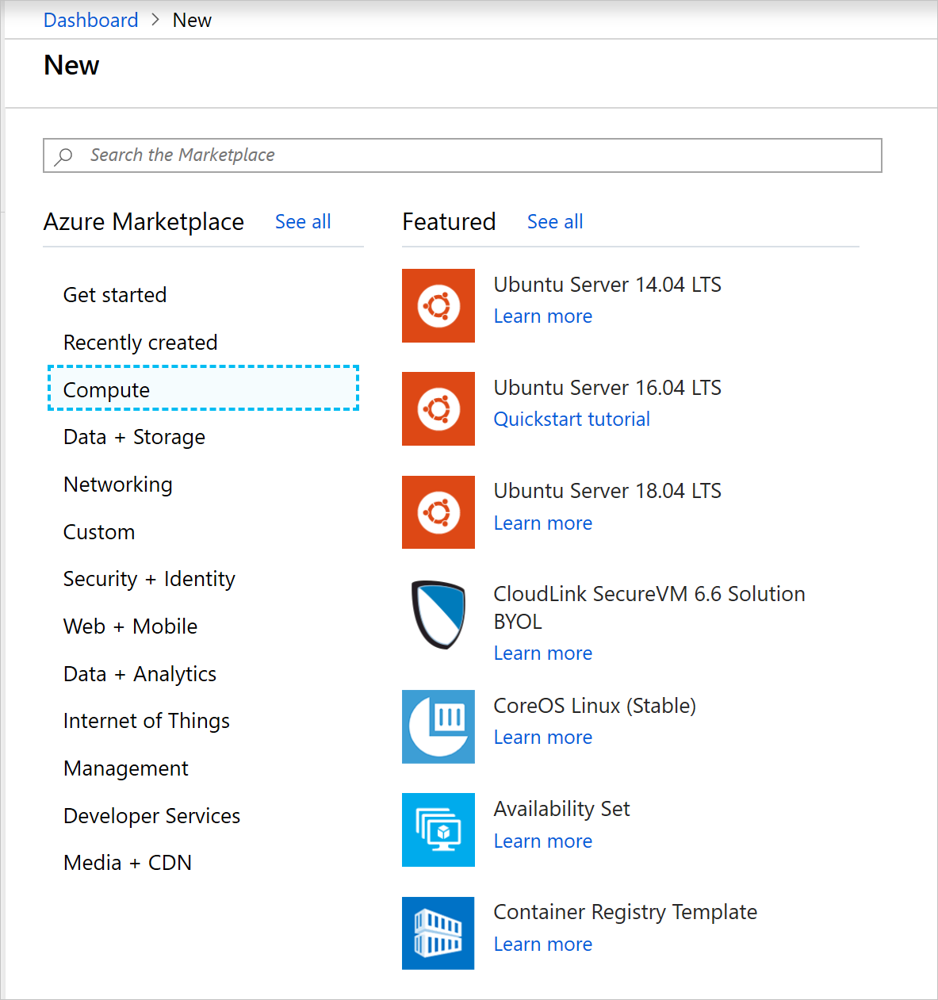
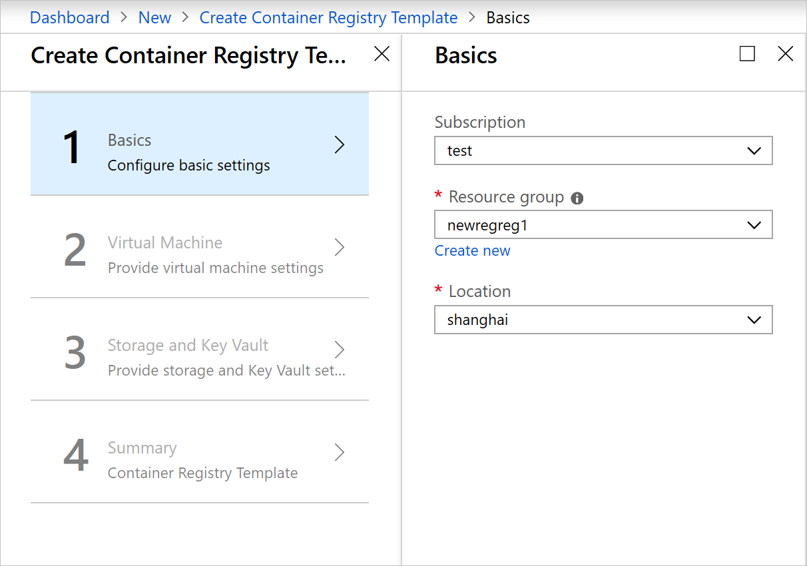
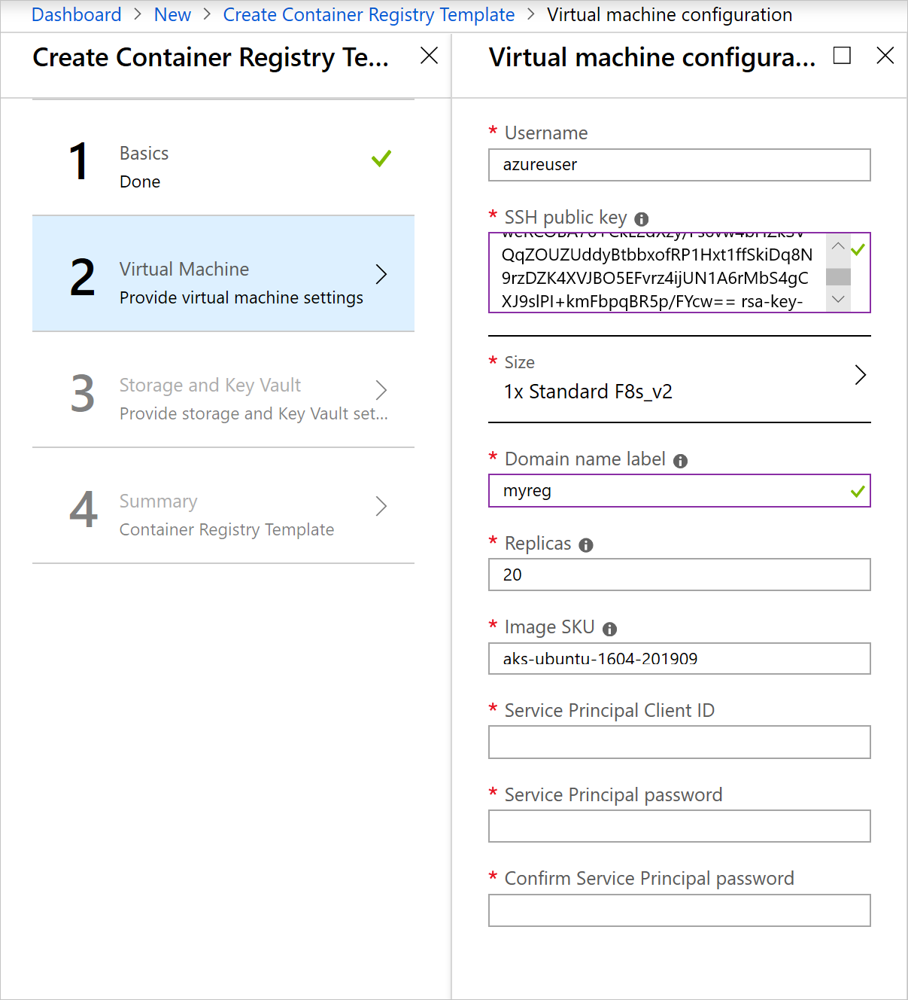
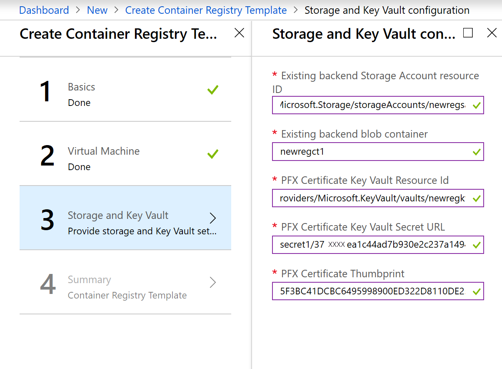
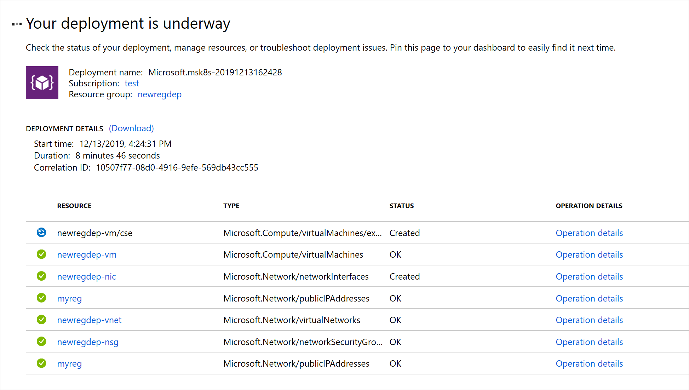

# Add a container registry to Azure Stack Hub

You can add the container registry to your Azure Stack Hub Marketplace so that your users can deploy and maintain their own container registry. This solution template installs and configures the open-source Docker Container Registry in a user subscription running on the AKS Base Ubuntu 16.04-LTS Image. The template supports both connected and disconnected (air-gapped) deployments and supports both Azure Active Directory (AAD) and Active Directory Federated Services (AD FS) deployed Azure Stack Hubs.

## Get the Marketplace item

You can find the **Container Registry Template** Marketplace item in the following GitHub repository: https://github.com/msazurestackworkloads/azurestack-gallery/releases/download/registry-v1.0.2/Microsoft.AzureStackContainerRegistry.1.0.2.azpkg. The Marketplace item is available from the portal in select subscriptions.

You can also add the item (side load) to your Marketplace using the Microsoft.AzureStackDockerContainerRegistry.1.0.2.azpkg. The scripts in this article can be accessed by downloading the git repository as a (zip) package from https://github.com/msazurestackworkloads/azurestack-gallery/archive/master.zip, and extracting the files. You can find the script in the `azurestack-gallery-master\registry\scripts` folder.

## Prerequisites

You will need to have the following items before adding the Container Registry Marketplace item on Azure Stack Hub.

| Item | Type | Details |
| --- | --- | --- |
| Azure Stack Hub PowerShell modules (Azs.Gallery.Admin) | PowerShell Modules | Only required if side loading the container registry template gallery item, the Azure Stack Hub PowerShell Modules are used to add and remove gallery items.<br>[Install Azure Stack PowerShell modules](../../operator/azure-stack-powershell-install.md) |
| Container Registry Template | Marketplace item | In order to deploy the container registry as an Azure Stack Hub user, the Container registry template Marketplace item must be available in your subscription, or manually added (side loaded), into your Azure Stack Hub Marketplace. If side loading, follow the instructions to side load the package in the `readme.md` in the [GitHub repository](https://github.com/msazurestackworkloads/azurestack-gallery/releases/tag/registry-v1.0.1). |
| AKS Base Ubuntu 16.04-LTS Image, September 2019 minimum release version | Marketplace item | For your Azure Stack Hub users to deploy the container registry, you must make the AKS Base Image available in the Marketplace. The Container registry template uses the image when an Ubuntu VM that hosts the Docker container registry binaries. |
| Linux Custom Script Extension 2.0 | Marketplace item | For your Azure Stack Hub users to deploy the container registry, you must make the Linux Custom Script Extension available in the Marketplace. The Container registry template deployment uses the extension to configure the registry. |
| SSL Certificate | Certificate | Users deploying the Container registry template need to provide a PFX certificate used when configuring SSL encryption for the registry service. If you are using the  script, you will need to run the PowerShell session from an elevated prompt. This should not be run on the DVM or HLH.<br>For general guidance on PKI certificate requirements for Azure Stack Hub using public or private/enterprise certificates view this documentation, see [Azure Stack Hub public key infrastructure (PKI) certificate requirements](../../operator/azure-stack-pki-certs.md)<br>The FQDN for the certificate should follow this pattern `<vmname>.<location>.cloudapp.<fqdn>` unless using a custom domain/dns entry for the endpoint. The name should start with a letter and contain at least two letters, only use lowercase letters, and at least three characters long. |
| Service Principle (SPN) | App Registration | To deploy and configure the container registry an Application Registration, also referred to as a Service Principal (SPN), must be created. This SPN is used during configuration of the VM and registry to access Microsoft Azure Key Vault and Storage Account resources created prior to deploying the Marketplace item.<br>The SPN should be created in AAD within the tenant you are logging into in the user portal of Azure Stack Hub. If using AD FS, it will be created within the local directory.<br>For details on how to create an SPN for both AAD and AD FS authentication methods please review [the following guidance](../../operator/azure-stack-create-service-principals.md).<br> **Important**: You will need to save the SPN App ID and Secret for deploying any updates.<br> |
| Registry username and password | Credentials | The open-source docker container registry is deployed and configured with basic authentication enabled. To access the registry using docker commands to push and pull images, a username and password is required. The username and password are securely stored in a Key Vault store.<br>**Important**: You will need to save the Registry Username and Password to sign in to the registry and push/pull images. |
| SSH Public / Private Key | Credentials | To troubleshoot issues with the deployment or runtime issues with the VM, an SSH public key needs to be provided for the deployment and the corresponding private key accessible. It is recommended to use openssh format, ssh-keygen, to generate the private/public key pair as the diagnostic scripts to collect logs require this format.<br>**Important**: You will need to have access to the public and private keys in order to access the deployed VM for troubleshooting. |
| Access to admin and user portals and management endpoints | Connectivity | This guide assumes you are deploying and configuring the registry from a system with connectivity to the Azure Stack Hub system. |

The script `Pre-reqs` creates the other inputs required to deploy the Marketplace item.

## Installation steps

Installation of the Container registry template requires several resources to be created before deployment.

1. Connect to Azure Stack Hub as a user using PowerShell and select a subscription using the cmdlet `Select-AzureRmSubscription –Subscription <subscription guid>`. For more information on connecting as a user to Azure Stack Hub PowerShell, see [Connect to Azure Stack with PowerShell as a user](../../user/azure-stack-powershell-configure-user.md).

2. Run `Import-Modules .\\pre-reqs.ps1` to import the modules within the `pre-reqs.ps1` script. The script will create a resource group, storage account, blob container, Key Vault store, assign access permissions to the SPN, and copy certificates and username and password for the registry to Key Vault store.

3. Run the following cmdlet from an elevated prompt using the values for your environment for the parameters:

    ```powershell  
         Set-ContainerRegistryPrerequisites -Location Shanghai `
         -ServicePrincipalId <spn app id> `
         -ResourceGroupName newregreq1 `
         -StorageAccountName newregsa1 `
         -StorageAccountBlobContainer newregct1 `
         -KeyVaultName newregkv1 `
         -CertificateSecretName containersecret2 `
         -CertificateFilePath C:\crinstall\shanghairegcert.pfx `
         -CertificatePassword <cert password> `
         -RegistryUserName admin `
         -RegistryUserPassword <password> 
    ```

    | Parameter | Details |
    | --- | --- |
    | $Location | This is sometimes referred to as the region name. |
    | $ResourceGroupName | Specify the name of the resource group you want the storage Account and Key Vault store to be created. You will specify a different resource group when deploying the Marketplace item. |
    | $StorageAccountName | Specify the name of the storage account to create for the container registry to use when storing images that have been pushed. |
    | $StorageAccountBlobContainer | Specify the name of the blob container to create which is used for image storage. |
    | $KeyVaultName | Specify the name of the Key Vault store to create for storing the certificate and username and password value. |
    | $CertificateSecretName | Provide the name of the secret created in Key Vault to store the PFX certificate. |
    | $CertificateFilePath | Provide the path to the PFX certificate. |
    | $CertificatePassword | Provide the password for the PFX certificate. |
    | $ServicePrincipalId | Provide the AppID of the SPN. |
    | $RegistryUserName | Provide the username for accessing the registry service using basic authorization. |
    | $RegistryUserPassword | Provide the password for the registry user. |

1. Once the script completes, note the end of the script includes parameters to be used in the template deployment. When copying and pasting these values, there may be a space introduced if the value wraps.

    ```powershell  
    ----------------------------------------------------------------
    PFX KeyVaultResourceId       : /subscriptions/<subcription id>/resourceGroups/newr
    egreg1/providers/Microsoft.KeyVault/vaults/newregkv1
    PFX KeyVaultSecretUrl        : https://newregkv1.vault.shanghai.azurestack.corp.microsoft.com:443/secr
    ets/containersecret1/37cc2f7ea1c44ad7b930e2c237a14949
    PFX Certificate Thumbprint   : 64BD5F3BC41DCBC6495998900ED322D8110DE25E
    ----------------------------------------------------------------
    StorageAccountResourceId     : /subscriptions/<subcription id>/resourcegroups/newr
    egreg1/providers/Microsoft.Storage/storageAccounts/newregsa1
    Blob Container               : newregct1
    ----------------------------------------------------------------
    
    Skus : aks-ubuntu-1604-201909
    
    
    Skus : aks-ubuntu-1604-201910
    
    ---------------------------------------------------------------- 
    
    ```

1. Open the Azure Stack Hub user portal.

2. Select **Create** > **Compute** > **Container Registry Template**.

    

3. Select the subscription, resource group, and location to deploy the container registry template.

    

4. Complete the virtual machine configuration details. The image SKU defaults to **aks-ubuntu-1604-201909**; however, the output of the `Set-ContainerRegistryPrerequisites` function includes a list of available SKUs to use for deployment. If more than one SKU exists choose the most recent SKU for deployment.

    

    | Parameter | Details |
    | --- | --- |
    | Username | Provide the username for logging into the VM. |
    | SSH Public Key | Provide the SSH public key used to authenticate with the VM using SSH protocol. |
    | Size | Select the size of the VM to deploy. |
    | Public IP Address | Specify the name and type of IP address (Dynamic or Static) for this VM. The domain name is invalid. It can contain only lowercase letters, numbers and hyphens. The  first character must be a letter. The last character must be a letter or number. The value must  be between three and 63 characters long.  |
    | Domain name label | Specify the DNS prefix for your registry. The entire FQDN should match the CN value for the PFX certificate created for the registry. |
    | Replicas | Specify the number of container replicas to start. |
    | Image SKU | Specify the Image SKU to be used for the deployment. The available SKUs for the AKS Base Image are listed by the `Set-ContainerRegistryPrerequisites` script. |
    | SPN Client ID | Specify the SPN App ID. |
    | SPN Password / Confirm Password | Specify the SPN App ID secret. |

1. Complete the Storage and Key Vault configuration.

    

    | Parameter | Details |
    | --- | --- |
    | Existing extended storage account resource ID | Specify the storage account resource ID as returned by the `pre-reqs` script. |
    | Existing backend blob container | Specify the blob container name, listed in the pre-reqs script output. |
    | PFX Certificate Key Vault Resource ID | Specify the Key Vault resource ID as returned by the `pre-reqs` script. |
    | PFX Certificate Key Vault Secret URL | Specify the certificate URL as returned by the pre-reqs script. |
    | PFX Certificate Thumbprint | Specify the certificate thumbprint as returned by the pre-reqs script. |

1. Once all values are provided and the deployment of the solution template begins it will take 10-15 minutes for the VM to deploy and configure the registry service.

    

2. To test out the registry open a docker CLI instance from a machine / VM with access to the registry URL.

    > [!Note]
    >  If you used a self-signed certificate or certificate not known to the VM you are using to access the registry you will need to install that certificate on the VM and restart Docker.

## Pushing and pulling images from container registry

1. Sign in using `docker login –u \<username> -p \<password>`.
2. Pull and image from a known registry.
3. Tag the image to target the newly deployed docker container registry.
4. Push the image to the new target registry.

For example:

```powershell  
PS C:\> docker pull mcr.microsoft.com/azureiotedge-simulated-temperature-sensor:1.0
1.0: Pulling from azureiotedge-simulated-temperature-sensor
5d20c808ce19: Already exists
656de8e592c3: Already exists
1e1868d1f676: Already exists
f3fb1b0d620f: Pulling fs layer
26224c4fc11a: Pulling fs layer
c459a69d65b2: Pulling fs layer
c459a69d65b2: Verifying Checksum
c459a69d65b2: Download complete
f3fb1b0d620f: Download complete
f3fb1b0d620f: Pull complete
26224c4fc11a: Verifying Checksum
26224c4fc11a: Pull complete
c459a69d65b2: Pull complete
Digest: sha256:dd64ff0918459184574e840ee97aa9f1bacd40aa37c972984ea10f0ecd719d5f
Status: Downloaded newer image for mcr.microsoft.com/azureiotedge-simulated-temperature-sensor:1.0
mcr.microsoft.com/azureiotedge-simulated-temperature-sensor:1.0

PS C:\> docker tag mcr.microsoft.com/azureiotedge-simulated-temperature-sensor:1.0    myreg.orlando.cloudapp.azurestack.corp.microsoft.com/azureiotedge-simulated-temperature-sensor:1.0

PS C:\> docker login -u admin -p admin myreg.orlando.cloudapp.azurestack.corp.microsoft.com
docker : WARNING! Using --password via the CLI is insecure. Use --password-stdin.
At line:1 char:1
+ docker login -u admin -p admin myreg.orlando.cloudapp.azurestack.corp ...
+ ~~~~~~~~~~~~~~~~~~~~~~~~~~~~~~~~~~~~~~~~~~~~~~~~~~~~~~~~~~~~~~~~~~~~~
    + CategoryInfo          : NotSpecified: (WARNING! Using ...password-stdin.:String) [], RemoteException
    + FullyQualifiedErrorId : NativeCommandError
 
Login Succeeded

PS C:\> docker push myreg.orlando.cloudapp.azurestack.corp.microsoft.com/azureiotedge-simulated-temperature-sensor:1.0
The push refers to repository [myreg.orlando.cloudapp.azurestack.corp.microsoft.com/azureiotedge-simulated-temperature-sensor]
d377c212e567: Preparing
0481685b758f: Preparing
15474c03a0b6: Preparing
8cdec5be5964: Preparing
79116d3fb0bf: Preparing
3fc64803ca2d: Preparing
3fc64803ca2d: Waiting
79116d3fb0bf: Mounted from azureiotedge-agent
8cdec5be5964: Mounted from azureiotedge-agent
15474c03a0b6: Pushed
d377c212e567: Pushed
3fc64803ca2d: Mounted from azureiotedge-agent
0481685b758f: Pushed
1.0: digest: sha256:f5fbc4a5c6806e12cafe1c363fea2b6cbd98a211b8153c5b19aca1386bfa6ecb size: 1576 

```

## Known issues

The version of the Docker Container Registry service deployed by this template is 2.7. This version has a known issue that prevents pushing and pulling Windows Container images. The issue is tracked with the following GitHub item [https://github.com/docker/distribution-library-image/issues/89](https://github.com/docker/distribution-library-image/issues/89).

## Next steps

[Azure Stack Marketplace overview](../../operator/azure-stack-marketplace.md)
