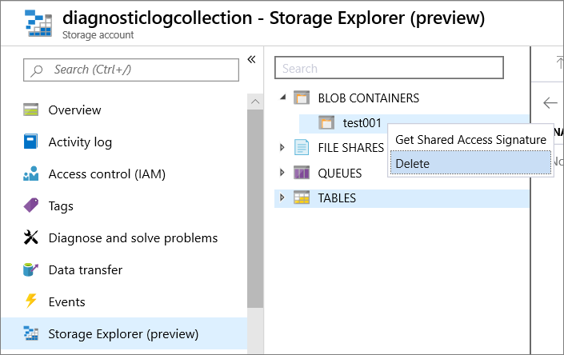
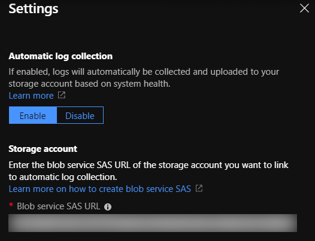

# Configure automatic Azure Stack diagnostic log collection

*Applies to: Azure Stack integrated systems*

We recommend configuring the automatic diagnostic log collection feature to streamline your log collection and customer support experience. 
If system health conditions need to be investigated, the logs can be uploaded automatically for analysis by Microsoft Customer Support Services (CSS). 

## Create an Azure blob container SAS URL 

Before you can configure automatic log collection, you'll need to get a shared access signature (SAS) for a blob container. A SAS lets you grant access to resources in your storage account without sharing your account keys. 
You can save Azure Stack log files to a blob container in Azure, and then provide the SAS URL where CSS can collect the logs. 

### Prerequisites

You can use a new or existing blob container in Azure. 
To create a blob container in Azure, you need at least the [storage blob contributor role](https://docs.microsoft.com/azure/role-based-access-control/built-in-roles#storage-blob-data-contributor) or the [specific permission](https://docs.microsoft.com/rest/api/storageservices/authenticate-with-azure-active-directory#permissions-for-calling-blob-and-queue-data-operations). 
Global administrators also have the necessary permission. 

For best practices about choosing parameters for the automatic log collection storage account, see [Best practices for automatic Azure Stack log collection](azure-stack-best-practices-automatic-diagnostic-log-collection.md). For more information about types of storage accounts, see [Azure storage account overview](https://docs.microsoft.com/azure/storage/common/storage-account-overview)

### Create a blob storage account
 
1. Sign in to the [Azure portal](https://portal.azure.com).
1. Click **Storage accounts** > **Add**. 
1. Create a blob container with these settings:
   - **Subscription**: Choose your Azure subscription.
   - **Resource group**: Specify a resource group.
   - **Storage account name**: Specify a unique storage account name.
   - **Location**: Choose a datacenter in accordance with your company policy.
   - **Performance**: Choose Standard.
   - **Account kind** Choose StorageV2 (general purpose v2). 
   - **Replication**: Choose Locally-redundant storage (LRS)
   - **Access tier**: Choose Cool

   

1. Click **Review + create** and then click **Create**.  

### Create a blob container 

1. After the deployment succeeds, click **Go to resource**. You can also pin the storage account to the Dashboard for easy access. 
1. Click **Storage Explorer (preview)**, right-click **Blob containers**, and click **Create blob container**. 
1. Enter a name for the new container and click **OK**.

## Create a SAS URL

1. Right-click the container, click **Get Shared Access Signature**. 
   
   

1. Choose these properties:
   - Start time: You can optionally move the start time back 
   - Expiry time: Two years
   - Time zone: UTC
   - Permissions: Read, Write, and List

    

1. Click **Create**.  

Copy the URL and enter it when you [configure automatic log collection](azure-stack-configure-automatic-diagnostic-log-collection.md). 
For more information about SAS URLs, see [Using shared access signatures (SAS)](https://docs.microsoft.com/azure/storage/common/storage-dotnet-shared-access-signature-part-1). 

## Steps to configure automatic log collection

Follow these steps to add the SAS URL to the log collection UI: 

1. Sign in to the Azure Stack administrator portal.
1. Open **Help and support Overview**.
1. Click **Automatic collection settings**.

   

1. Set Automatic log collection to **Enabled**.
1. Enter the shared access signature (SAS) URL of the storage account blob container.

   

>[!NOTE]
>Automatic log collection can be disabled and re-enabled anytime. The SAS URL configuration won't change. If automatic log collection is re-enabled, the previously entered SAS URL will undergo the same validation checks, and an expired SAS URL will be rejected. 

## View log collection

You can see logs that were previously collected on the **Log collection** page in Help and Support. 
The **Collection time** refers to when the log collection operation began. 
The **From Date** is the start of the time period for which you want to collect logs and the **To Date** is the end of the time period.

<!---view log collection status from Azure Stacck, we have now... the other is view collected logs within the Azure storage account,m so they can make sure logs got uploiaded--->

If diagnostic log collection fails multiple times, call Microsoft CSS for help. 

