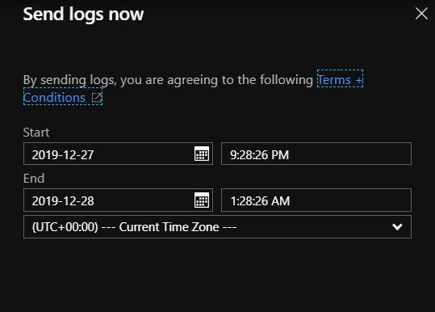

# Send Azure Stack Hub diagnostic logs now

Azure Stack operators can send diagnostics logs on-demand to Microsoft Customer Support Services (CSS), before requesting support, by using the Administrator portal or PowerShell. If Azure Stack Hub is connected to the Azure, the **Send logs now** option in the Administrator portal is recommended because it sends the logs directly to Microsoft simply. If the portal is unavailable, operators should use the PowerShell script included in this topic to send the logs directly to Microsoft.

If you are disconnected from the internet or want to only save logs locally, use [Get-AzureStackLog](azure-stack-get-azurestacklog.md) method to send logs.

>[!Note]
>As an alternative to collecting logs on demand, you can streamline the troubleshooting process by [proactively collecting diagnostic logs](azure-stack-configure-automatic-diagnostic-log-collection-tzl.md). If system health conditions need to be investigated, the logs are uploaded automatically for analysis before opening a case with CSS. 

## Using the Administrator portal

Specify the start time and end time for log collection and click **Collect and Upload**. 



>[!NOTE]
>If proactive log collection is enabled, **Help and Support** shows when log collection is in progress. If you click **Send logs now** to collect logs from a specific time while proactive log collection is in progress, on-demand collection begins after proactive log collection is complete.

## Using the privileged endpoint (PEP) 

You do not have to provide any target storage location when using this method. If **fromDate** and **toDate** parameters are not provided, then it defaults to last 4 hours from the time of execution. 

You can optionally specify **FilterByRole** or **FilterByResourceProvider** parameter to include only specific role or value-add RP logs. 

Here's an example script you can run using the PEP to collect logs on an integrated system. 


```powershell
$ipAddress = "<IP ADDRESS OF THE PEP VM>" # You can also use the machine name instead of IP here. 
 
$password = ConvertTo-SecureString "<CLOUD ADMIN PASSWORD>" -AsPlainText -Force 
$cred = New-Object -TypeName System.Management.Automation.PSCredential ("<DOMAIN NAME>\CloudAdmin", $password) 
 
$session = New-PSSession -ComputerName $ipAddress -ConfigurationName PrivilegedEndpoint -Credential $cred 
 
$fromDate = (Get-Date).AddHours(-8) # Optional. 
$toDate = (Get-Date).AddHours(-2) # Optional. Provide the time that includes the period for your issue 
 
Invoke-Command -Session $session {Send-AzureStackDiagnosticLog -FromDate $using:fromDate -ToDate $using:toDate} 
 
if ($session) { 
    Remove-PSSession -Session $session 
} 
```

## Next steps

[Use the privileged endpoint (PEP) to send Azure Stack Hub diagnostic logs](azure-stack-get-azurestacklog.md)
