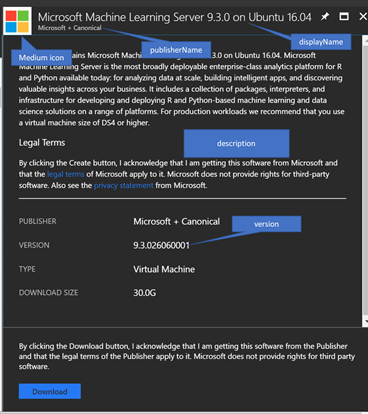
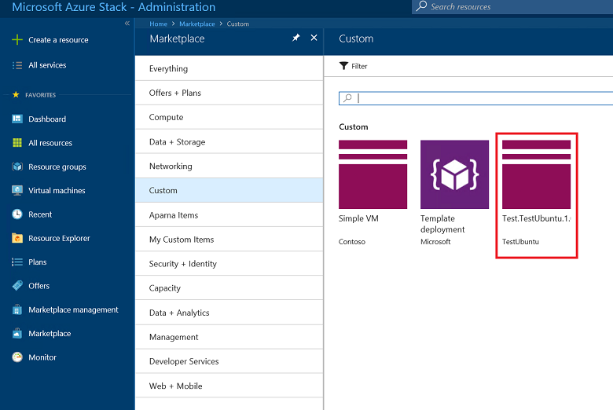

# Create a custom Azure Stack Marketplace package

Every item published to the Azure Stack Marketplace uses the Azure Gallery Package (.azpkg) format. The *Azure Gallery Packager* tool enables you to create a custom package that you can deploy to the Azure Stack marketplace, which can then be downloaded by users. The deployment process uses an Azure Resource Manager template.

## Marketplace items

There are different types of gallery items on the Azure Stack Marketplace:

- Single Virtual Machine (single VM).
- Multiple Virtual Machines (multi-VM), also called *Solution templates*.
- Virtual Machine extensions.

This article uses single VMs of type Windows or Linux as an example.

## Create a package

1. Download the [Azure Gallery Packager tool](https://www.aka.ms/azurestackmarketplaceitem) and a sample gallery package before starting the azpkg creation process. Extract the .zip file and rename the folder SimpleVMTemplate with the name of the item that you will show on your Azure Stack Portal. 

2. Create an Azure Resource Manager template or use our custom templates for Windows/Linux. These templates are provided later in this article. You can either use the template and change the text fields, or you can download a pre-configured template from GitHub. For more information about Azure Resource Manager templates, see [Azure Resource Manager templates](/azure/azure-resource-manager/resource-group-authoring-templates).

3. Replace the following highlighted values in the Manifest.json template with the value that you provided when [uploading your custom image](azure-stack-add-vm-image.md#add-a-custom-vm-image-to-the-marketplace-using-the-portal). The following template example uses a custom Ubuntu VHD:

    ```json
    {
       "$schema": "https://gallery.azure.com/schemas/2015-10-01/manifest.json#",
       "name": "Test", (1)
       "publisher": "TestUbuntu", (2)
       "version": "1.0.0", (3)
       "displayName": "ms-resource:displayName", (4)
       "publisherDisplayName": "ms-resource:publisherDisplayName", (5)
       "publisherLegalName": "ms-resource:publisherDisplayName", (6)
       "summary": "ms-resource:summary",
       "longSummary": "ms-resource:longSummary",
       "description": "ms-resource:description",
       "longDescription": "ms-resource:description",
       "uiDefinition": {
          "path": "UIDefinition.json" (7)
          },
       "links": [
        { "displayName": "ms-resource:documentationLink", "uri": "http://go.microsoft.com/fwlink/?LinkId=532898" }
        ],
       "artifacts": [
          {
             "name": "LinuxTemplate",
             "type": "Template",
             "path": "DeploymentTemplates\\LinuxTemplate.json", (8)
             "isDefault": true
          }
       ],
       "categories":[ (9)
          "Custom",
          "My Marketplace Items"
          ],
       "images": [{
          "context": "ibiza",
          "items": [{
             "id": "small",
             "path": "icons\\Small.png", (10)
             "type": "icon"
             },
             {
                "id": "medium",
                "path": "icons\\Medium.png",
                "type": "icon"
             },
             {
                "id": "large",
                "path": "icons\\Large.png",
                "type": "icon"
             },
             {
                "id": "wide",
                "path": "icons\\Wide.png",
                "type": "icon"
             }]
        }]
    }
    ```

    The following list explains the preceding numbered values in the example template:

    - (1) – The name of the offer.
    - (2) – The name of the publisher, without a space.
    - (3) – The version of your template, without a space.
    - (4) – The name that customers see.
    - (5) – The publisher name that customers see.
    - (6) – The publisher legal name.
    - (7) – The path to where your **UIDefinition.json** file is stored.  
    - (8) – The path and the name of your JSON main template file.
    - (9) – The names of the categories in which this template is displayed.
    - (10) – The path and name for each icon.

4. For all fields referring to **ms-resource**, you must change the appropriate values inside the **strings/resources.resjson** file:

    ```json
    {
    "displayName": "Test.TestUbuntu.1.0.0",
    "publisherDisplayName": "TestUbuntu",
    "summary": "Create a simple VM",
    "longSummary": "Create a simple VM and use it",
    "description": "<p>This is just a sample of the type of description you could create for your gallery item!</p><p>This is a second paragraph.</p>",
    "documentationLink": "Documentation"
    }
    ```

    
    

5. When you finish modifying your files, convert it to an azpkg. You perform the conversion using the AzureGalleryPackager.exe tool and the sample gallery package you downloaded prior to this step. Run the following command:

    ```shell
    .\AzureGalleryPackager.exe package –m c:\<path to your file>\<name of your azpkg file without the extension>\manifest.json –o c:\Temp
    ```

    The output path can be any oath you choose, and does not have to be under the C: drive.

## Import an azpkg to Azure Stack

To import the gallery package into Azure Stack, the first step is to remotely connect (RDP) to the client VM, in order to copy the file you just created to your Azure Stack.

1. Add a context:

    ```powershell
    $ArmEndpoint = "https://adminmanagement.local.azurestack.external"
    Add-AzureRMEnvironment -Name "AzureStackAdmin" -ArmEndpoint $ArmEndpoint
    Add-AzureRmAccount -EnvironmentName "AzureStackAdmin"
    ```

2. Run the following script to import the resource into your gallery:

    ```powershell
    Add-AzsGalleryItem -GalleryItemUri `
    https://sample.blob.core.windows.net/gallerypackages/*offer.publisher.version*.azpkg –Verbose
    ```

3. Verify that you have a valid Storage account that is available to store your item. The `name` parameter is the name of your gallery package, without the extension .azpkg. For the path, provide the path to the .azpkg file:

    [](media/azure-stack-create-azpkg/pkg4.png#lightbox)

4. Alternatively, you can just run the following cmdlet, which prompts you for the Gallery package URI:

    ```powershell
    Add-AzsGalleryItem
    ```

    

    The `GalleryItemURI` value can be found in the Azure Stack admin portal. Select **Storage account -> Blob Properties -> URL**, with the extension .azpkg.

After completing your gallery package and uploading it using **Add-AzsGalleryItem**, your custom VM should now appear on the Marketplace.

[](media/azure-stack-create-azpkg/pkg6.png#lightbox)

## Next steps

- [Create and publish a Marketplace item](azure-stack-create-and-publish-marketplace-item.md)
- [Format and structure of Azure Resource Manager templates](/azure/azure-resource-manager/resource-group-authoring-templates)
