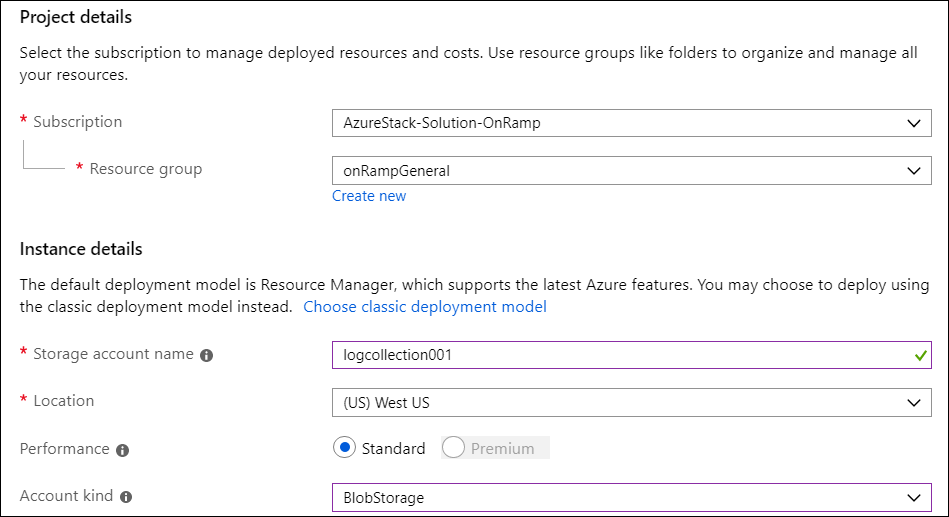

# Create a blob container SAS URL 

*Applies to: Azure Stack integrated systems*

You'll need the shared access signature (SAS) URL of a blob container in Azure to save Azure Stack log files that will be collected for analysis by Microsoft Customer Support Services (CSS). 
The SAS URL is prerequisite for [configuring automatic log collection for Azure Stack](azure-stack-configure-automatic-log-collection.md).
You can use an existing blob container or complete the following steps to create a new one.

>[!NOTE]
>To create a blob container in Azure, you need at least the [storage blob contributor role](https://docs.microsoft.com/azure/role-based-access-control/built-in-roles#storage-blob-data-contributor) or the [specific permission](https://docs.microsoft.com/rest/api/storageservices/authenticate-with-azure-active-directory#permissions-for-calling-blob-and-queue-data-operations). Global administrators also have the necessary permission. 

## Create a blob container
 
1. Create a blob container using any [blob storage account](https://docs.microsoft.com/azure/storage/common/storage-account-overview#types-of-storage-accounts). 
1. Choose these settings:
   - **Subscription**: Choose your Azure subscription.
   - **Resource group**: Specify a resource group
   - **Storage account name**: Specify a unique storgae account name
   - **Location**: Choose a datacenter near your Azure Stack deployment
   - **Performance**: Standard
   - **Account kind** Choose any storage account type (for example: BlobStorage, StorageV2)
1. Click **Review and Create**.  
1. After the deployment succeeds, click **Go to resource**. You can also pin the storage account to the Dashboard for easy access. 

   

1. Click **Storage Explorer (preview)**, right-click **Blob containers**, and click **Create new blob container**. 
1. Enter a name for the new container and click **OK**.

## Copy the SAS URL

1. Right-click the new container, click **Get Shared Access Signature**, and choose these properties:
   - Start time: You can optionally move the start time back. 
   - Expiry time: Increase to two weeks or longer to avoid related alerts about upcoming expiration.
   - Time zone: UTC
   - Permissions: Read, Write, and List
1. Click **Save**.  

<!--- add screenshot with Read, Write, and List. I did not have perms to do it--->

Copy the URL and enter it when you [configure automatic log collection](azure-stack-configure-automatic-log-collection.md). 
For more information about SAS URLs, see [Using shared access signatures (SAS)](https://docs.microsoft.com/azure/storage/common/storage-dotnet-shared-access-signature-part-1). 

## Next step

[Configure automatic Azure Stack log collection](azure-stack-configure-automatic-log-collection.md)