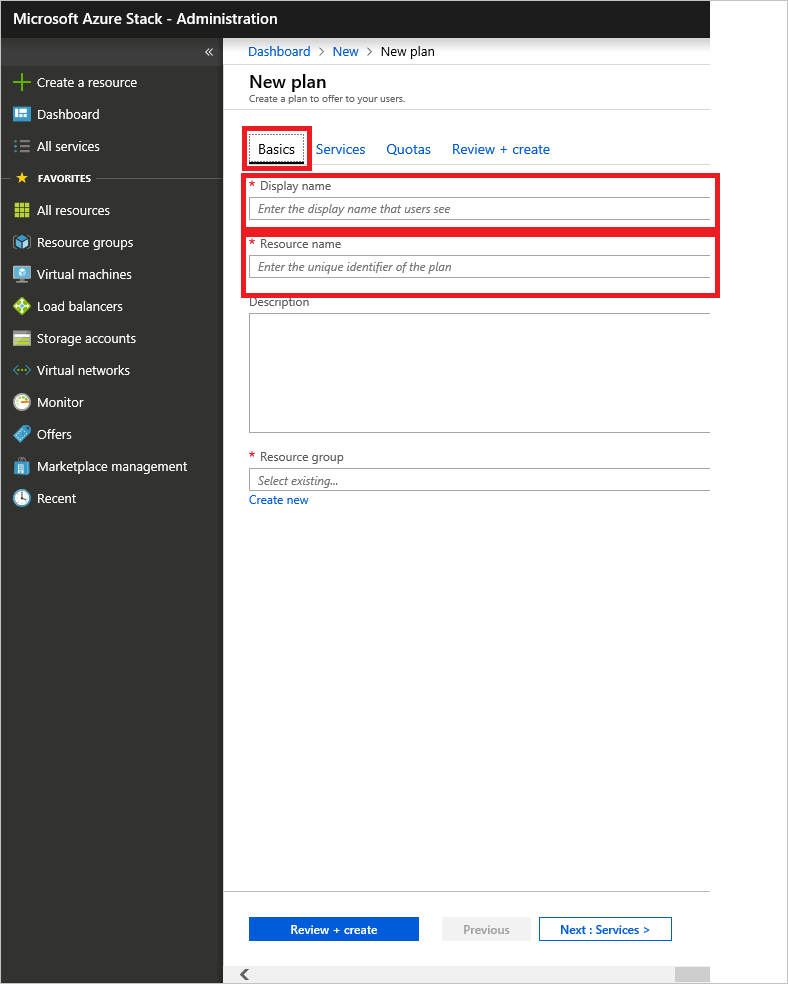
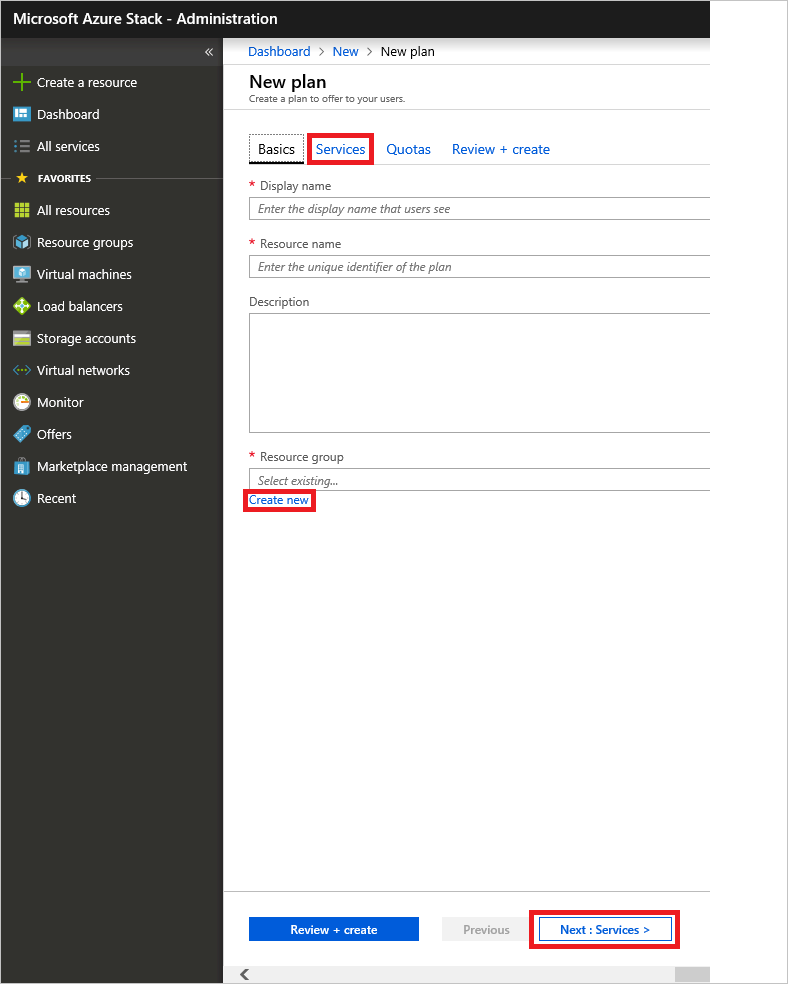

# Create a plan in Azure Stack

*Applies to: Azure Stack integrated systems and Azure Stack Development Kit*

[Azure Stack plans](azure-stack-overview.md) are groupings of one or more services and their quotas. As a provider, you can create plans to offer to your users. In turn your users subscribe to your offers to use the plans, services, and quotas they include. This example shows you how to create a plan that includes the compute, network, and storage resource providers. This plan gives subscribers the ability to provision virtual machines.

::: moniker range=">=azs-1902"
## Create a plan (1902 and later)

1. Sign in to the [Azure Stack administrator portal](https://adminportal.local.azurestack.external).

2. To create a plan and offer that users can subscribe to, select **+ Create a resource**, then **Offers + Plans**, then **Plan**.
  
   

3. A tabbed user interface appears that enables you to specify the plan name, add services, and define quotas for each of the selected services. Most importantly, you can review the details of the offer you create before you decide to create it.

   Under the **Basics** tab of the **New plan** window, enter a **Display name** and a **Resource name**. The display name is the plan's friendly name that operators can see. In the administrator portal, plan details are only visible to operators.

   

4. Create a new **Resource Group**, or select an existing one, as a container for the plan.

   

5. Select the **Services** tab, or click the **Next : Services >** button, and then select the checkbox for **Microsoft.Compute**, **Microsoft.Network**, and **Microsoft.Storage**.
  
   

6. Select the **Quotas** tab, or click the **Next : Quotas >** button. Next to **Microsoft.Storage**, choose either the default quota from the dropdown box, or select **Create New** to create a customized quota.
  
   

7. If you're creating a new quota, enter a **Name** for the quota, and then specify the quota values. Select **OK** to create the quota.

   

8. Repeat steps 6 and 7 to create and assign quotas for **Microsoft.Network** and **Microsoft.Compute**. When all three services have quotas assigned, they'll look like the next example.

   

9. Select **Review + create** to review the plan. Review all values and quotas to ensure they're correct. The interface enables you to expand the quotas in the chosen plans one at a time to view the details of each quota in a plan. You can also go back to make any necessary edits.

   

10. When you're ready, select **Create** to create the plan.

11. To see the new plan, on the left-hand side click **All services**, select **Plans**, and then search for the plan and select its name. If your list of resources is long, use **Search** to locate your plan by name.
::: moniker-end

::: moniker range="<=azs-1901"
## Create a plan (1901 and earlier)

1. Sign in to the [Azure Stack administrator portal](https://adminportal.local.azurestack.external).

2. To create a plan and offer that users can subscribe to, select **+ New**, then **Offers + Plans**, then **Plan**.
  
   

3. Under **New plan**, enter a **Display name** and a **Resource name**. The display name is the plan's friendly name that users can see. Only the admin can see the resource name, which admins use to work with the plan as an Azure Resource Manager resource.

   

4. Create a new **Resource Group**, or select an existing one, as a container for the plan.

   

5. Select **Services** and then select the checkbox for **Microsoft.Compute**, **Microsoft.Network**, and **Microsoft.Storage**. Next, choose **Select** to save the configuration. Checkboxes appear when the mouse hovers over each option.
  
   

6. Select **Quotas**, **Microsoft.Storage (local)**, and then choose either the default quota or select **Create new quota** to create a customized quota.
  
   

7. If you're creating a new quota, enter a **Name** for the quota > specify the quota values > select **OK**. The **Create quota** dialog closes.

   

   You then select the new quota you created. Selecting the quota assigns it and closes the selection dialog.
  
   

8. Repeat steps 6 and 7 to create and assign quotas for **Microsoft.Network (local)** and **Microsoft.Compute (local)**. When all three services have quotas assigned, they'll look like the next example.

   

9. Under **Quotas**, choose **OK**, and then under **New plan**, choose **Create** to create the plan.

    

10. To see your new plan, select **All resources**, then search for the plan and select its name. If your list of resources is long, use **Search** to locate your plan by name.

    
::: moniker-end

## Next steps

* [Create an offer](azure-stack-create-offer.md)
