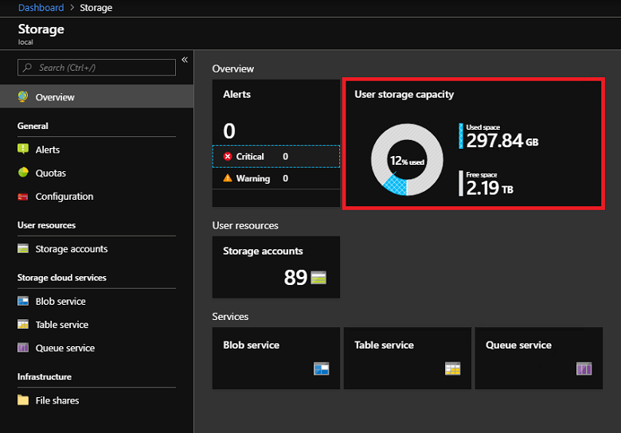
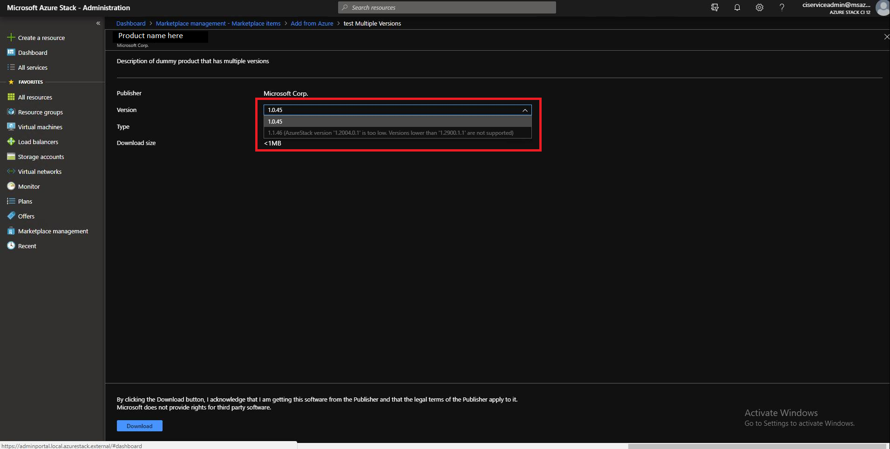
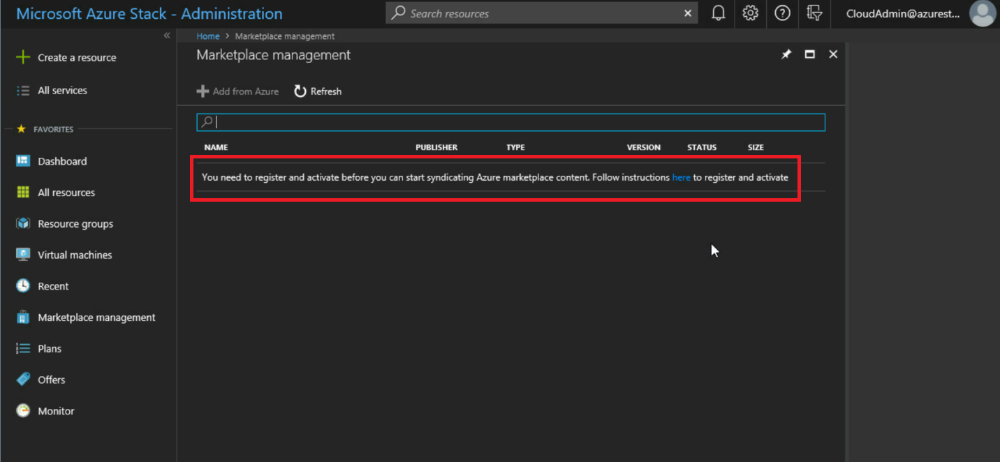

# Download Marketplace items to Azure Stack Hub 

As a cloud operator, you can download items to Azure Stack Hub from the Marketplace and make them available to all users using the Azure Stack Hub environment. The items you can choose are from a curated list of Azure Marketplace items that are pre-tested and supported to work with Azure Stack Hub. Additional items are frequently added to this list, so continue to check back for new content.

There are two scenarios for downloading Marketplace products:

- **Connected scenario**: Requires your Azure Stack Hub environment to be connected to the internet. You use the Azure Stack Hub administrator portal to locate and download items.
- **Disconnected or partially connected scenario**: Requires you to access the internet using the Marketplace syndication tool to download Marketplace items. Then, you transfer your downloads to your disconnected Azure Stack Hub installation. This scenario uses PowerShell.

See [Azure Marketplace items for Azure Stack Hub](azure-stack-marketplace-azure-items.md) for a complete list of the marketplace items you can download. See the [Azure Stack Hub Marketplace changes](azure-stack-marketplace-changes.md) article for a list of recent additions, deletions, and updates to Azure Stack Hub Marketplace.

> [!NOTE]
> The catalog will be different based on the cloud your Azure Stack Hub system is connected to. The cloud environment is determined by the Azure subscription you use for registering your Azure Stack Hub.

## Connected scenario

If Azure Stack Hub connects to the internet, you can use the administrator portal to download marketplace items.

### Prerequisites

Your Azure Stack Hub deployment must have internet connectivity and be registered with Azure.

### Use the portal to download marketplace items

1. Sign into the Azure Stack Hub administrator portal.

2. Review the available storage space before downloading marketplace items. Later, when you select items for download, you can compare the download size to your available storage capacity. If capacity is limited, consider options for [managing available space](azure-stack-manage-storage-shares.md#manage-available-space).

   To review available space: in **Region management**, select the region you want to explore and then go to **Resource Providers** > **Storage**:

   

3. Open Azure Stack Hub Marketplace and connect to Azure. To do so, select the **Marketplace management** service, select **Marketplace items**, and then select **Add from Azure**:

   

4. Each line item also shows the currently available version. If more than one version of a Marketplace item is available, the **Version** column shows **Multiple**. You can click on each item to view its description and additional information, including its download size:

   

5. If the version of an item is shown as **Multiple**, you can select that item and then choose a specific version from the resulting version selector dropdown:

   

6. Select the item you want, and then select **Download**. Download times vary and depends on the network connectivity. After the download completes, you can deploy the new marketplace item as either an Azure Stack Hub operator or a user.

7. To deploy the downloaded item, select **+ Create a resource**, and then search among the categories for the new marketplace item. Next, select the item to begin the deployment process. The process varies for different marketplace items.

## Disconnected or a partially connected scenario

If Azure Stack Hub has limited or no internet connectivity, you can use PowerShell and the *marketplace syndication tool* to download the marketplace items to a machine with internet connectivity. You then transfer the items to your Azure Stack Hub environment. In a disconnected environment, you can't download marketplace items by using the Azure Stack Hub portal.

The marketplace syndication tool can also be used in a connected scenario.

There are two parts to this scenario:

- **Part 1**: Download from Marketplace items. On the computer with internet access, you configure PowerShell, download the syndication tool, and then download items from Azure Marketplace.
- **Part 2**: Upload and publish to Azure Stack Hub Marketplace. You move the files you downloaded to your Azure Stack Hub environment, import them to Azure Stack Hub, and then publish them to Azure Stack Hub Marketplace.

### Prerequisites

- A connected environment (does not have to be Azure Stack Hub). You need connectivity to get the list of products from Azure with their details, and to download everything locally. Once this is done, the rest of the procedure does not require internet connectivity. It creates a catalog of items you've previously downloaded for you to use in your disconnected environment.

- Removable media to connect to your disconnected environment and transfer all the necessary artifacts.

- A disconnected Azure Stack Hub environment with the following prerequisites:

  - Your Azure Stack Hub deployment must be registered with Azure.

  - The computer that has internet connectivity must have **Azure Stack Hub PowerShell Module version 1.2.11** or later. If not already present, [install Azure Stack Hub-specific PowerShell modules](azure-stack-powershell-install.md).

  - To enable import of a downloaded marketplace item, the [PowerShell environment for the Azure Stack Hub operator](azure-stack-powershell-configure-admin.md) must be configured.

  - Clone the [Azure Stack Hub tools](https://github.com/Azure/AzureStack-Tools) GitHub repo.

- You must have a [storage account](azure-stack-manage-storage-accounts.md) in Azure Stack Hub that has a publicly accessible container (which is a storage blob). You use the container as temporary storage for the marketplace items gallery files. If you're not familiar with storage accounts and containers, see [Work with blobs - Azure portal](/azure/storage/blobs/storage-quickstart-blobs-portal) in the Azure documentation.

- The marketplace syndication tool is downloaded during the first procedure.

- You can install [AzCopy](/azure/storage/common/storage-use-azcopy) for optimal download performance, but it's not required.

Once you have registered, you can disregard the following message that appears on the Marketplace management blade, as this is not relevant for the disconnected use case:



### Use the marketplace syndication tool to download marketplace items

> [!IMPORTANT]
> Be sure to download the marketplace syndication tool each time you download marketplace items in a disconnected scenario. Frequent changes are made to this script and the most current version should be used for each download.

1. On a computer with an Internet connection, open a PowerShell console as an administrator.

2. Add the Azure account that you've used to register Azure Stack Hub. To add the account, in PowerShell run **Add-AzureRmAccount** without any parameters. You are prompted to enter your Azure account credentials and you might have to use two-factor authentication, depending on your account configuration.

   > [!NOTE]
   > If your session expires, your password has changed, or you simply wish to switch accounts, run the following cmdlet before you sign in using **Add-AzureRmAccount**: **Remove-AzureRmAccount-Scope Process**.

3. If you have multiple subscriptions, run the following command to select the one you've used for registration:

   ```powershell  
   Get-AzureRmSubscription -SubscriptionID 'Your Azure Subscription GUID' | Select-AzureRmSubscription
   $AzureContext = Get-AzureRmContext
   ```

4. Download the latest version of the marketplace syndication tool by using the following script:

   ```powershell
   # Download the tools archive.
   [Net.ServicePointManager]::SecurityProtocol = [Net.SecurityProtocolType]::Tls12
   invoke-webrequest https://github.com/Azure/AzureStack-Tools/archive/master.zip `
     -OutFile master.zip

   # Expand the downloaded files.
   expand-archive master.zip `
     -DestinationPath `
     -Force

   # Change to the tools directory.
   cd .\AzureStack-Tools-master
   ```

5. Import the syndication module and then launch the tool by running the following command:

   ```powershell  
   Import-Module .\Syndication\AzureStack.MarketplaceSyndication.psm1
   ```

6. To export Marketplace items such as VM images, extensions, or solution templates, run the following command. Replace the destination folder path with a location to store the files you download from Azure Marketplace:

   ```powershell
   Export-AzSOfflineMarketplaceItem -Destination "Destination folder path in quotes" -azCopyDownloadThreads "[optional - AzCopy threads number]" -azureContext $AzureContext
   ```

   To export resource providers or PaaS services, run the following command:

   ```powershell
   Export-AzSOfflineResourceProvider -destination "Destination folder path" -azCopyDownloadThreads "AzCopy threads number" -azureContext $AzureContext
   ```

   The `-azCopyDownloadThreads` parameter is optional. It should only be used when you have a low-bandwidth network, and you are using premium download. This option specifies the number of concurrent operations in AzCopy. If you are running a low-bandwidth network, you can specify a lower number to avoid failure caused by resource competition. You can see more details in [this Azure article](/previous-versions/azure/storage/storage-use-azcopy#specify-the-number-of-concurrent-operations-to-start).

   The `-azureContext` parameter is also optional. If you do not specify the Azure context, then the cmdlet will use the default Azure context.

7. When the tool runs, you should see a screen similar to the following image, with the list of available Azure Marketplace items:

   

8. If more than one version of a Marketplace item is available, the **Version** column shows **Multiple versions**. If the version of an item is shown as **Multiple versions**, you can select that item and then choose a specific version from the resulting version selector window.

9. Select the item that you want to download and make a note of the **Version**. You can hold the **Ctrl** key to select multiple images. You reference the *version* when you import the item in the next procedure.

    You can also filter the list of images by using the **Add criteria** option.

10. If you have not installed the Azure Storage tools, you will get the following message. In order to install these tools, make sure you download [AzCopy](/azure/storage/common/storage-use-azcopy#download-azcopy):

    

11. Select **OK**, and then review and accept the legal terms.

12. The time that the download takes depends on the size of the item. After the download completes, the item is available in the folder that you specified in the script. The download includes a VHD file (for virtual machines), or a .zip file (for virtual machine extensions and resource providers). It might also include a gallery package in the *.azpkg* format, which is simply a .zip file.

13. If the download fails, you can try again by re-running the following PowerShell cmdlet:

   ```powershell
   # for Marketplace items
   Export-AzSOfflineMarketplaceItem -Destination "Destination folder path in quotes"

   # for Resource providers
   Export-AzSOfflineResourceProvider -Destination "Destination folder path in quotes"
   ```

   Before retrying, remove the product folder in which the download failed. For example, if the download script fails when downloading to **D:\downloadFolder\microsoft.customscriptextension-arm-1.9.1**, remove the **D:\downloadFolder\microsoft.customscriptextension-arm-1.9.1** folder, then rerun the cmdlet.

### Import the download and publish to Azure Stack Hub Marketplace using PowerShell

1. You must move the files that you have [previously downloaded](#use-the-marketplace-syndication-tool-to-download-marketplace-items) locally so that they are available to your Azure Stack Hub environment. The marketplace syndication tool must also be available to your Azure Stack Hub environment because you need to use the tool to perform the import operation.

   The following image shows a folder structure example. **D:\downloadfolder** contains all the downloaded marketplace items. Each subfolder is a marketplace item (for example, **microsoft.custom-script-linux-arm-2.0.3**), named by the product ID. Inside each subfolder is the marketplace item's downloaded content.

   

2. Follow the instructions in [this article](azure-stack-powershell-configure-admin.md) to configure the Azure Stack Hub Operator PowerShell session.

3. Import the syndication module and then launch the marketplace syndication tool by running the following script:

   ```powershell
   $credential = Get-Credential -Message "Enter the Azure Stack Hub operator credential:"
   Import-AzSOfflineMarketplaceItem -origin "marketplace content folder" -AzsCredential $credential
   ```

   The `-origin` parameter specifies the top-level folder that contains all the downloaded products; for example, `"D:\downloadfolder"`.

   The `-AzsCredential` parameter is optional. It's used to renew the access token, if it has expired. If the `-AzsCredential` parameter isn't specified and the token expires, you receive a prompt to enter the operator credentials.

   > [!NOTE]
   > AD FS only supports interactive authentication with user identities. If a credential object is required, you must use a service principal (SPN). For more information about setting up a service principal with Azure Stack Hub and AD FS as your identity management service, see [Manage an AD FS service principal](azure-stack-create-service-principals.md#manage-an-ad-fs-service-principal).

4. After the script successfully completes, the item should be available in Azure Stack Hub Marketplace.
