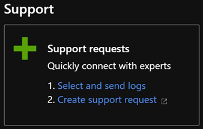

# Microsoft Azure Stack Portal Help and Support

Beginning with the 1905 release, **Help + support** improvements in the Azure Stack portal make it easier for operators to check their support options, get expert help, and learn more about Azure Stack. 

## Documentation, Billing, and Support

At the top of **Help + support** are links to places you might try first, like read up about a new concept, understand how billing works, or see which support options are available. 

- **Documentation**. [Azure Stack Operator Documentation](index.yml) includes concepts, how-to topics and tutorials that show how to offer Azure Stack services such as virtual machines, SQL databases, web apps, and more. 

- **Learn about billing**. Get tips on [usage and billing](azure-stack-billing-and-chargeback.md).

- **Support options**. Azure Stack operators can choose from a range of [Azure support options](https://aka.ms/azstacksupport) that can fit the needs of any enterprise. 

## Get expert help 

For an integrated system, there is a coordinated escalation and resolution process between Microsoft and our original equipment manufacturer (OEM) hardware partners.

If there is a cloud services issue, support is offered through Microsoft Customer Support Services (CSS). 
You can click **Help** (question mark) in the upper-right corner of the administrator portal and then click **Help + support** to open the Help + Support overview page and submit a new support request.

If there is an issue with deployment, patch and update, hardware (including field replaceable units), and any hardware-branded software, such as software running on the hardware lifecycle host, contact your OEM hardware vendor first.

For anything else, contact Microsoft CSS.

For the Azure Stack Development Kit (ASDK), you can ask support-related questions in the [Azure Stack MSDN Forum](https://social.msdn.microsoft.com/Forums/azure/home?forum=azurestack). 
If you click **Help** (question mark) in the upper-right corner of the administrator portal, and then click **Help + support**, this opens the forums site directly. 
These forums are regularly monitored. 
Because the development kit is an evaluation environment, there is no official support offered through Microsoft CSS.

You can also reach out to the MSDN Forums to discuss an issue, or take online training and improve your own skills. 

## Get up to speed with Azure Stack

This set of tutorials is customized depending on whether you're running the ASDK or integrated systems so you can quickly get up to speed with your environment. 

## Help and Support for earlier releases Azure Stack (pre-1905)

Previous Azure Stack releases also have a link to **Help + support** that redirects to the [Azure Stack Operator Documentation](https://aka.ms/adminportaldocs).

If there is a cloud services issue, support is offered through Microsoft Customer Support Services (CSS). 
If you click **Help and Support** (question mark) in the upper-right corner of the administrator portal, and then click **New support request**, you can directly submit a new support request with CSS.

For an integrated system, there is a coordinated escalation and resolution process between Microsoft and our OEM partners. 
If there is a cloud services issue, support is offered through Microsoft CSS. 

If there is an issue with deployment, patch and update, hardware (including field replaceable units), and any hardware-branded software, such as software running on the hardware lifecycle host, contact your OEM hardware vendor first. 
For anything else, contact Microsoft CSS.

For the development kit, you can ask support-related questions in the Microsoft forums. 
If you click **Help and Support** (question mark) in the upper-right corner of the administrator portal, and then click **MSDN forums**, you'll be redirected to the forum where you can get help from the Azure Stack community.
Because the development kit is an evaluation environment, there is no official support offered through Microsoft CSS.