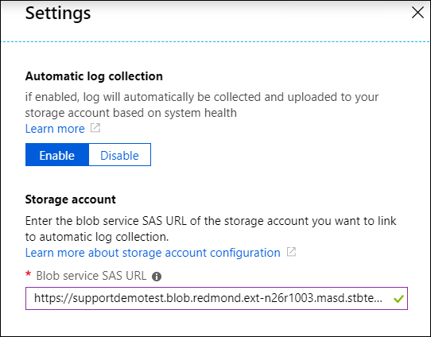

# Microsoft Azure Stack storage account for automatic log collection

You can create a [storage account in Azure](https://docs.microsoft.com/azure-stack/operator/azure-stack-manage-storage-accounts) to save Azure Stack log files that will be collected for analysis by Microsoft Customer Support Services (CSS). 
You need to provide the shared access signature (SAS) URL for the storage account blob container. 
You can use an existing blob container or complete the following steps to create a new one.

## Prerequisites

<!--- Do they need storage blog contrbutor role?  --->

## Create a storage account for automatic log collection

1. Sign in to the Azure portal.
2. You can use an existing storage account or create a new one. To create a new one, click **Storage accounts** > **Add**.
3. Configure these properties:  
   - Subscription: Choose a subscription. 
   - Resource group: Choose a resource group or create a new one.
   - Storage account name: Specify a globally unique name. 
   - Location: Choose a location that is close to your Azure Stack deployment.
   - Performance: Standard
   - Account kind: Blob storage
   - Replication: Locally redundant storage (LRS) 
   - Access geo default: Hot
   {!}
4. After the deployment succeeds, click **Go to resource**. You can also pin the storage account to the Dashboard for easy access. 
5. Click **Storage Explorer (preview)**, right-click **Blob containers**, and click **Create new blob container**. 
6. Enter a name for the new container and click **OK**.
7. Right-click the new container and click **Get Shared Access Signature**.
   - Start time: You can optionally move the start time back. That can help prevent collection from starting later than you expect. <!--- ask Lloyd how to say this---> 
   - Expiry time: Increase to at least one week for automatic log collection or longer to avoid related alerts about upcoming expiration.
   - Time zone: UTC
   - Permissions: Read, Write, and List
8. Click **Create**.  
9. Copy the URL. The URL is constructed by using the storage account name, the blog container name, and an access token. 
   {!}
10. Paste the URL into the Blob servic SAS URL when you [configure Azure Stack log collection](azure-stack-automatic-log-collection.md).  

After an alert is triggered, there is a predefined pause to filter out transient alerts before the logs begin to appear in the storage account. 

## Configure a storage account for on-demand log collection

For on-demand collection, CSS might provide its own blob service SAS URL. 
Click **Collect logs now** and paste that SAS URL.

