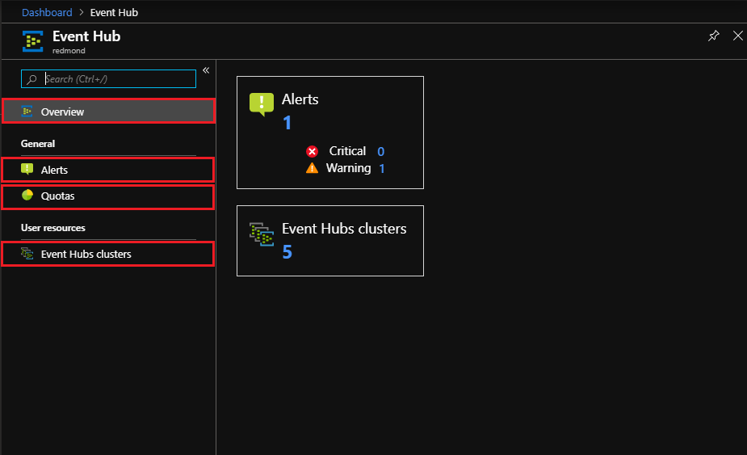

# How to manage Event Hubs on Azure Stack Hub

The Event Hubs management experience allows you to control the service and visualize its status and alerts. You can access it through [Region Management](azure-stack-region-management.md), or use the following steps.

1. Sign in to the Azure Stack Hub administrator portal.
2. Select **All Services** from the pane on the left.
3. Search for "Event Hubs" and select the service.
4. The Event Hubs management page displays. You'll find four sections in the left pane:
   - **Overview**: provides a general view and access to specific management areas.
   - **Quotas**: allows you to create, update, and delete quotas. It also provides the associated plans using the quotas. For more information on quota types defined for Event Hubs, see [Quota Types](azure-stack-quota-types.md#event-hubs-quota-types).
   - **Alerts**: displays all critical and warning alerts for Event Hubs. See the [Alerts section](#alerts) section for details.
   - **Event Hubs clusters**: displays a list of all clusters configured. See the [Event Hubs clusters](#event-hubs-clusters) section for details.

   

## Alerts

   Currently, the Event Hubs resource provider supports the following alerts:
   
| Category | Alert | Type | Condition |
|----------|-------|------|-----------|
| Performance | | | |
| | EventHub-CpuUsage | Warning | The average of % CPU usage of event hub cluster in the last 6 hours is larger than 50%. |
| | EventHub-MemoryUsage | Warning | The average of % Data Disk(E:) usage of Event Hubs cluster in the last 6 hours is larger than 50%. |
| | EventHub-DiskUsage | Warning | The average of % free memory space of Event Hubs cluster in the last 6 hours is smaller than 50%. |
| Usage/Quota | | | |
| | EventHub-QuotaExceeded | Warning | A quota exceeded error occurred within the last six hours. |
| | EventHub-NamespaceCreditUsage | Warning | The sum of namespace credit usages in the last six hours is larger than 10000.0. |
| Service degraded | | | |
| | EventHub-InternalServerError | Warning | An internal server error occurred within the last six hours. |
| | EventHub-ServerBusy | Warning | A server busy error occurred in the last six hours. |
| Client | | | |
| | EventHub-ClientError | Warning | A client error occurred in the last six hours. |
| Resource | | | |
| | EventHub-PendingDeletingResources | Warning | The sum of pending deleting resources in the last six hours is larger than 100. |
| | EventHub-ProvisioningQueueLength | Warning | The average of provisioning queue length in the last six hours is larger than 30. |

For more information on Azure Stack Hub monitoring capability, including alerting, see [Monitor Health and Alerts](azure-stack-monitor-health.md). For details on collecting logs, see [Overview of Azure Stack diagnostic log collection](azure-stack-diagnostic-log-collection-overview.md).

## Event Hubs clusters

Selecting **Event Hubs clusters** on the main page displays a list of available user clusters. The list includes the following for each cluster:

- high-level configuration information
- service health
- backup status

Selecting a link under **Health** or **Backup** will display detailed information on the state of Event Hubs health and backup status, respectively.

Selecting a link under **Name** displays a list of service limits for the cluster, along with status information across the top. 

Service limits are configuration parameters that define the operational boundaries of Event Hubs. The service limits available are similar to the ones offered for Azure Event Hubs Dedicated. By selecting the link(s) under **Config value**, you can change the assigned value.

> [!IMPORTANT]
> You should spend time analyzing the full implications before changing service limits. Service limit changes may impact the behavior of your solution that consumes and produces events. Changes may also impact the resource consumption from your Azure Stack capacity.

## Next steps

For more information on:

- The quota types defined for Event Hubs, consult [Quota Types](azure-stack-quota-types.md#event-hubs-quota-types).
- Azure Stack Hub monitoring capabilities, including alerting, refer to [Monitor Health and Alerts](azure-stack-monitor-health.md). 
- Azure Stack Hub log collection, see [Overview of Azure Stack diagnostic log collection](azure-stack-diagnostic-log-collection-overview.md).

