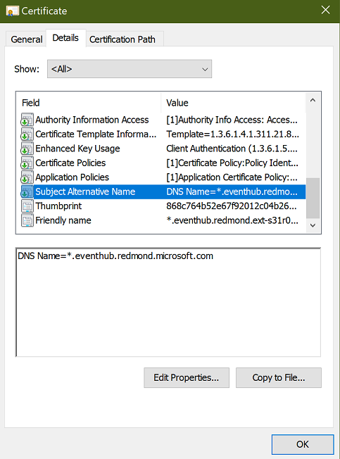

# Prerequisites for installing Event Hubs on Azure Stack Hub

The following prerequisites must be completed, before you can install Event Hubs on Azure Stack Hub. **Several days or weeks of lead time may be required**, to complete all steps.

> [!IMPORTANT]
> These prerequisites assume that you've already deployed at least a 4-node Azure Stack Hub integrated system. The Event Hubs resource provider is not supported on the Azure Stack Hub Development Kit (ASDK).

> [!IMPORTANT]
> **Private Preview Only**. Azure Stack Hub 1910 build version or higher is required by Event Hubs. Please note that Azure Stack Hub builds are incremental. For example, if you have [version 1907](/azure-stack/operator/release-notes?view=azs-1907#1907-build-reference) installed, you must first upgrade to [1908](/azure-stack/operator/release-notes?view=azs-1908#1908-build-reference), and then to 1910, in order to participate in the private preview. That is, you cannot skip builds in-between.

## Prerequisites

1. If you haven't already, complete the steps outlined in [Prerequisites for installing Azure Stack Hub resource providers from Marketplace](marketplace-resource-provider-prerequisites.md).

2. Procure public key infrastructure (PKI) SSL certificates for Event Hubs. 

   Please adhere to the naming pattern shown below for the certificate `Alternate Subject Name`. See [PKI certificate requirements](azure-stack-pki-certs.md) for the full list of detailed requirements.  

   | Subject name | Alternative subject name |
   |--------------|--------------------------|
   | \<user-defined\> | `CN=*.eventhub.<region>.<fqdn>`|

   

> [!NOTE] **PFX files must be password protected**. The password will be requested later during installation.

3. Be sure to review [Validate your certificate](/azure-stack/operator/azure-stack-validate-pki-certs.mdperform-platform-as-a-service-certificate-validation). The article shows you how to prepare and validate the certificates you use for the Event Hubs resource provider. 

## Next steps

Next, [install the Event Hubs resource provider](event-hubs-rp-install.md).