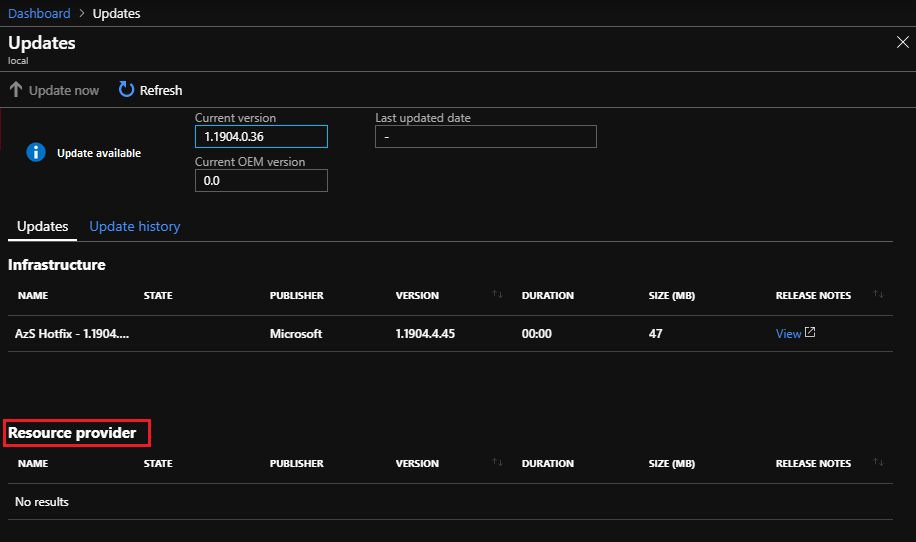

# How to update Event Hubs on Azure Stack Hub

The Event Hubs resource provider will require regular servicing. Servicing is done by applying service updates, provided by Microsoft on a regular basis. Updates can include both new features and fixes.  

## Check for updates

Resource providers are updated using the same update feature on the administrator Dashboard, as used to apply Azure Stack Hub updates.

1. Sign in to the Azure Stack Hub administrator portal.
2. Select **Dashboard** on the left. [TODO- change to All Services > Updates]
3. Select the **Update** tile on the Dashboard page.

   

4. On the **Updates** page, you find updates for the Event Hubs resource provider, under the **Resource Provider** section.

   

## Apply an update [TODO - update after I get screenshots from Shankar]

If an update is available for the Event Hubs resource provider:

1. Select the row of the resource provider update.
2. Install the update.

For detailed release notes that accompany updates, refer to the [Event Hubs on Azure Stack Hub service updates](https://azure.microsoft.com/updates/?product=azure-stack) feed.

## Next steps

Learn more about the [administrator dashboard updates feature](azure-stack-apply-updates.md).
