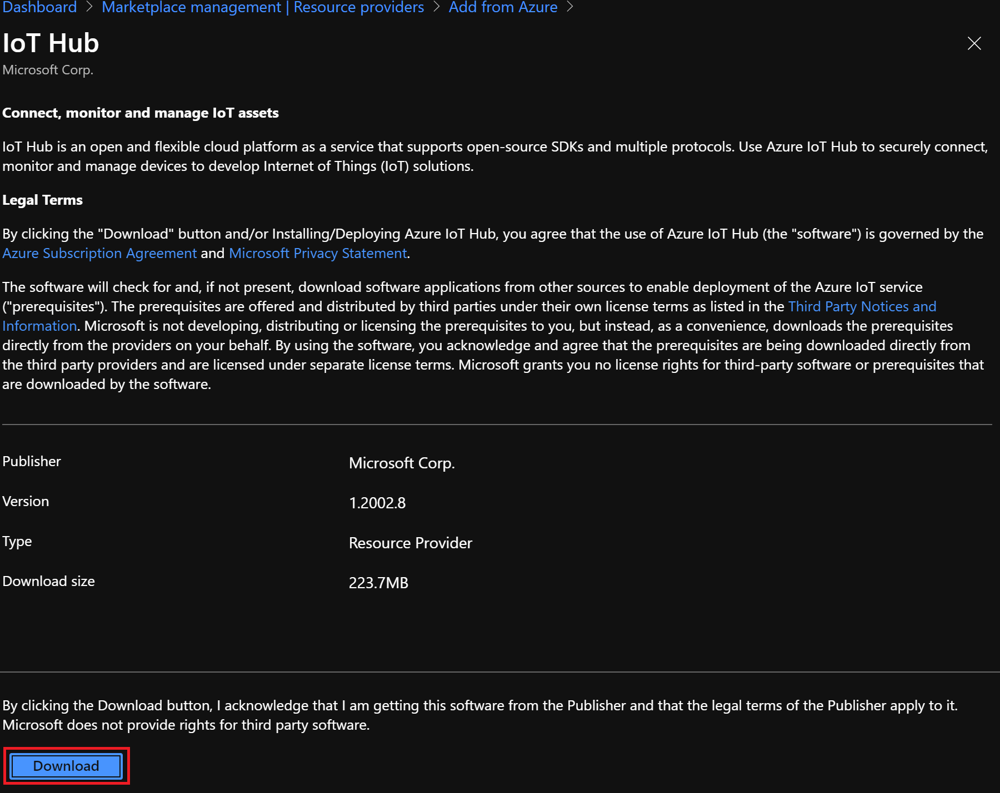
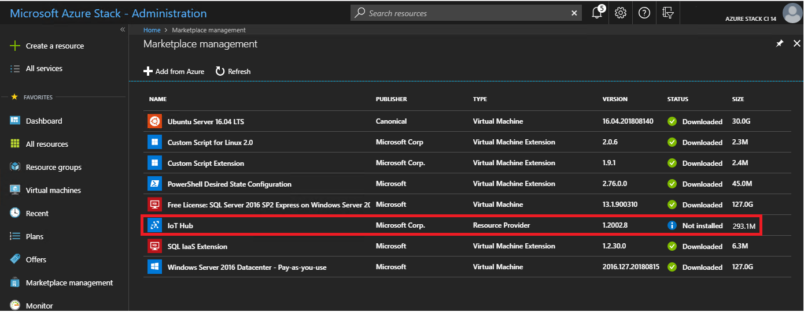
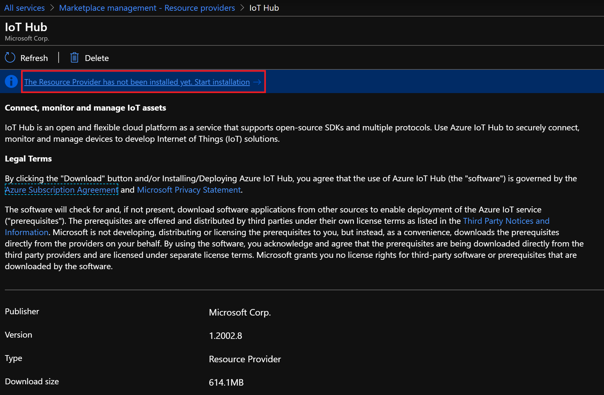
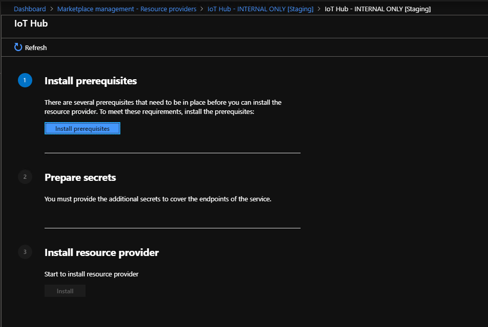
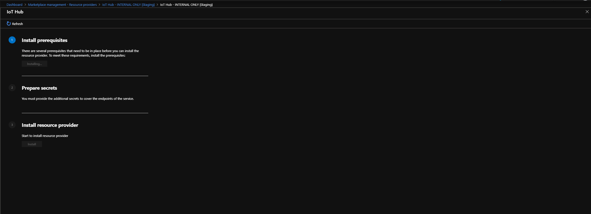
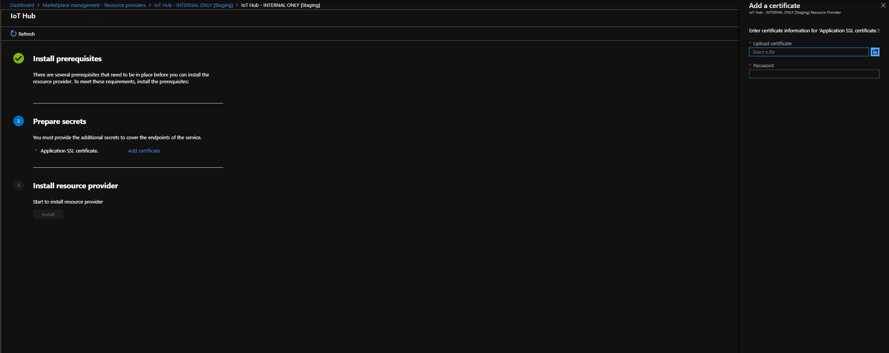
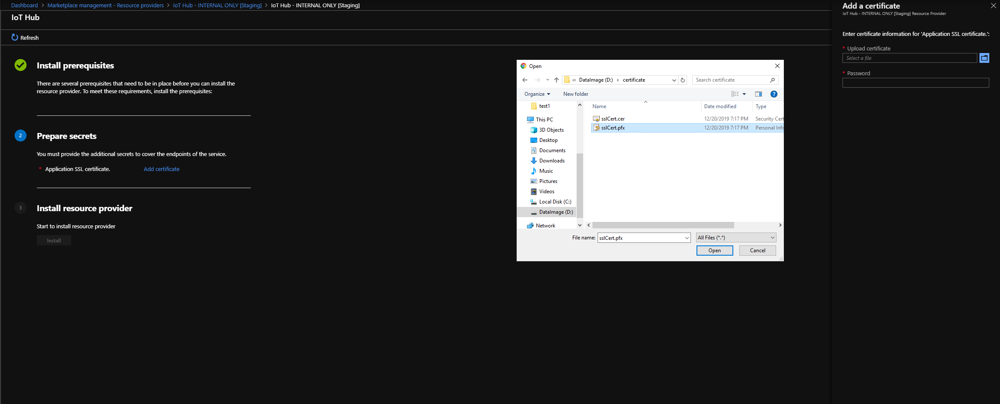
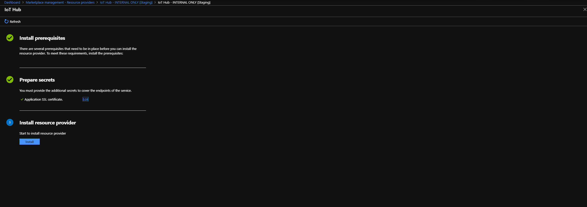
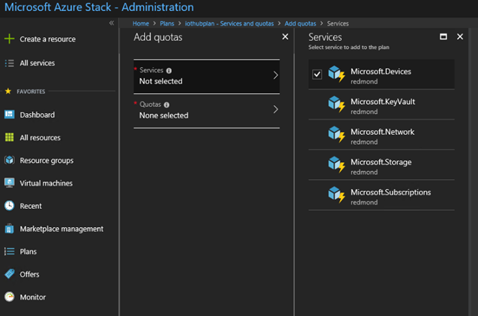

# How to install IoT Hub on Connected Azure Stack Hub

This article shows you how to download and install the IoT Hub resource provider, making it available to offer to customers for subscription. The installation process of IoT Hub takes about 2 hours.

## Download IoT Hub

### Connected Scenario

If your Azure Stack can access the Azure Marketplace, follow the steps in this section to download and install IoT Hub and its dependencies. 

To download IoT Hub, complete the following steps:

1. Sign in to Azure Stack Hub administrator portal. Click on **+ Add from Azure** and search for IoT.

    

2. Select the **IoT Hub** package.

    

3. Click **Download**. Wait for the package to be downloaded. This step might take up to 10 minutes.

    

4. Once the package is downloaded, the status will show up as **Not installed** in the Marketplace.

    

### Download IoT Hub - disconnected or partially connected scenario

First you download the packages to your local machine, then you import them into your Azure Stack Hub instance.

1. If you haven't already, follow the instructions in [Download Marketplace items - Disconnected or partially connected scenarios](azure-stack-download-azure-marketplace-item.md#disconnected-or-a-partially-connected-scenario). Here you download and run the Marketplace Syndication tool, which allows you to download the IoT Hub packages.
2. After the syndication tool's "Azure Marketplace Items" window opens, find and select "IoT Hub" to download the required packages to your local machine.
3. Once the download finishes, you import the packages to your Azure Stack Hub instance and publish to Marketplace.

## Install IoT Hub

Follow these steps to install the IoT Hub package:

1. Click on **IoT Hub** and **Start Installation**.

    

2. Click on **Install Prerequisites**.

    

3. The status of the installation can be tracked in the notification pane. This step will take about 10 minutes.

    

4. Wait for the installation of the prerequisites to complete. This step usually takes somewhere between 5-10 minutes depending on the environment.

    

5. Click on **Add Certificates** under **Prepare Secrets**. Provide the pfx certificate created in prerequisites.

    

6. Browse and provide the pfx that was created and the password (the input to the script)

    

    

7. Click on **Install** under **Install Resource Provider**.

    

8. Once the installation starts, deployment status can be found in the Marketplace or in the notification pane.

    

9. Installation can take between 90 – 120 minutes. Wait for the installation to complete.

    

    

Your IoT hub is installed successfully! To get started, complete the following steps:

1. If necessary, follow the instruction to [create a plan, offers, and subscription](https://docs.microsoft.com/azure/azure-stack/azure-stack-plan-offer-quota-overview).

2. If a subscription already exists, update the associated offer/ plan to include **Microsoft.Devices** service. Go to **Plan** -> **Choose the plan to update** -> **Add Service and quota**.

3. Add **Microsoft.Devices Service** and click **Save**.

    

4. You are all set! IoT hubs can now be created.

## Using IoT Hub

To learn how to use IoT Hub, refer to documentation of IoT Hub on Azure Cloud: https://docs.microsoft.com/azure/iot-hub/.

## Next steps

To learn more about managing IoT Hub on Azure Stack Hub, see [How to manage IoT Hub on Azure Stack Hub](iot-hub-rp-manage.md).
