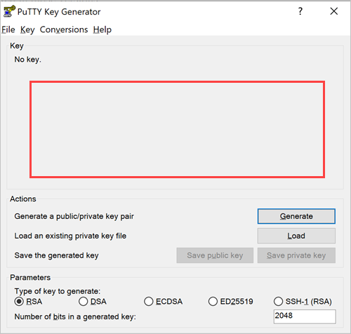
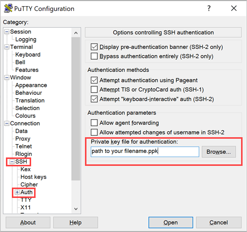

# Use an SSH key pair with Azure Stack Hub

To use an open SSH connection from your development machine to the server VM in your Azure Stack Hub instance that hosts your web app, you might need to create a Secure Shell (SSH) public and private key pair. 

In this article, you create your keys and then use them to connect to your server. You can use an SSH client to get a bash prompt on the Linux server or use a Secure FTP (SFTP) client to move files to and from the server.

## Create an SSH public key on Windows

In this section, you use PuTTY Key Generator to create a public SSH key and private key pair to use when you create a secure connection to Linux machines in your Azure Stack Hub instance. PuTTY is a free terminal emulator that can allow you to connect to a server via SSH and Telnet.

1. [Download and install PuTTY for your machine.](https://www.chiark.greenend.org.uk/~sgtatham/putty/latest.html)

1. Open PuTTY Key Generator.

    

1. Under **Parameters**, select **RSA**.

1. In the **Number of bits in a generated key** box, enter **2048**.  

1. Select **Generate**.

1. In the **Key** area, generate some random characters by moving the cursor over the blank area.

    

1. Enter a **Key passphrase** and confirm it in the **Confirm passphrase** box. Note your passphrase for later use.

1. Select **Save public key**, and save it to a location where you can access it.

1. Select **Save private key**, and save it to a location where you can access it. Remember that it belongs with the public key.

Your public key is stored in the text file you saved. The text looks like the following:

```text  
---- BEGIN SSH2 PUBLIC KEY ----
Comment: "rsa-key-20190330"
THISISANEXAMPLEDONOTUSE AAAAB3NzaC1yc2EAAAABJQAAAQEAthW2CinpqhXq
9uSa8/lSH7tLelMXnFljSrJIcpxp3MlHlYVbjHHoKfpvQek8DwKdOUcFIEzuStfT
Z8eUI1s5ZXkACudML68qQT8R0cmcFBGNY20K9ZMz/kZkCEbN80DJ+UnWgjdXKLvD
Dwl9aQwNc7W/WCuZtWPazee95PzAShPefGZ87Jp0OCxKaGYZ7UXMrCethwfVumvU
aj+aPsSThXncgVQUhSf/1IoRtnGOiZoktVvt0TIlhxDrHKHU/aZueaFXYqpxDLIs
BvpmONCSR3YnyUtgWV27N6zC7U1OBdmv7TN6M7g01uOYQKI/GQ==
---- END SSH2 PUBLIC KEY ----
```

When an application requests the key, you copy and paste the entire contents of the text file.

## Connect with SSH by using PuTTY

When you install PuTTY, you have both the PuTTY Key Generator and an SSH client. In this section, you open the SSH client, PuTTY, and configure your connection values and SSH key. If you're on the same network as your Azure Stack Hub instance, you connect to your VM.

Before you connect, you will need:
- PuTTY
- The IP address and username for the Linux machine in your Azure Stack Hub instance that uses an SSH public key as the Authentication type.
- Port 22 to be open for the machine.
- The private SSH key that paired with the public key.
- The client machine that runs PuTTY to be on the same network as your Azure Stack Hub instance.

1. Open PuTTY.

    

2. In the **Host Name (or IP address)** box, enter the username and public IP address of the machine (for example, **username@192.XXX.XXX.XX**). 
3. Validate that the **Port** is **22** and the **Connection type** is **SSH**.
4. In the **Category** tree, expand **SSH** and **Auth**.

    

5. Next to the **Private key file for authentication** box, select **Browse**, and then search for the private key file (*\<filename>.ppk*) of your public and private key pair.
6. In the **Category** tree, select **Session**.

    

7. Under **Saved Sessions**, enter a name for the session, and then select **Save**.
8. In the **Saved Sessions** list, select the name of your session, and then select **Load**.
9. Select **Open**. The SSH session opens.

## Connect with SFTP with FileZilla

To move files to and from your Linux machine, you can use FileZilla, an FTP client that supports Secure FTP (SFTP). FileZilla runs on Windows 10, Linux, and macOS. The FileZilla client supports FTP, FTP over TLS (FTPS), and SFTP. It is open-source software that's distributed free of charge under the terms of the GNU General Public License.

### Set your connection

1. [Download and install FileZilla](https://filezilla-project.org/download.php).
1. Open FileZilla.
1. Select **File** > **Site Manager**.

    

1. In the **Protocol** drop-down list, select **SFTP - SSH File Transfer Protocol**.
1. In the **Host** box, enter the public IP address for your machine.
1. In the **Logon Type** box, select **Normal**.
1. Enter your username and password.
1. Select **OK**.
1. Select **Edit** > **Settings**.

    

1. In the **Select page** tree, expand **Connection**, and then select **SFTP**.
1. Select **Add key file**, and then enter your private key file (for example, *\<filename>.ppk*).
1. Select **OK**.

### Open your connection

1. Open FileZilla.
1. Select **File** > **Site Manager**.
1. Select the name of your site, and then select **Connect**.

## Next steps

Learn how to [Set up a development environment in Azure Stack Hub](azure-stack-dev-start.md).
