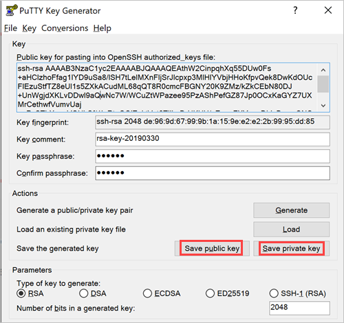
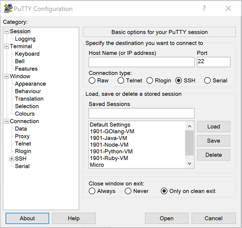
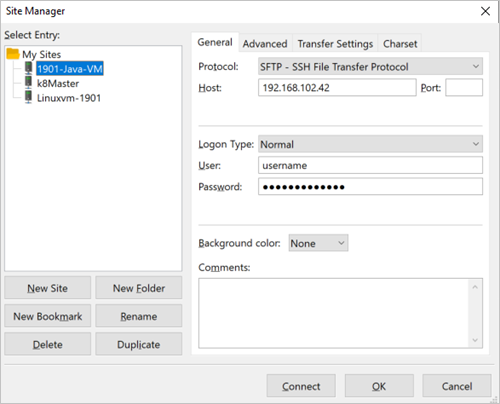
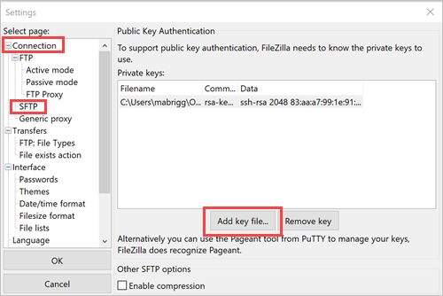

# How to use an SSH public key

You may need to create an SSH public and private key pair to use an open SSH connection from your development machine and the server VM in Azure Stack hosting your web app. This article walks you through the steps of getting your keys and using the keys to connect to your server. You can use an SSH client to get a bash prompt on the Linux server, or an SFTP client to move files to and from the server.

## Create an SSH public key on Windows

In this section, you will use PuTTY's key generator to create a public SSH key and private key pair to use when creating a secure connection to Linux machines on your Azure Stack. PuTTY is a free terminal emulator that can allow you to connect to a server via SSH and Telnet.

1. [Download and install PuTTY for your machine.](https://www.chiark.greenend.org.uk/~sgtatham/putty/latest.html)

1. Open the PuTTY Key Generator.

1. Set the **Parameters** to **RSA**.

1. Set the number of bits in a generated key to `2048`.  

    

1. Select **Generate**. In the **Key** area, generate some randomness by moving the cursor over the blank area.

1. Add a **Key passphrase** and confirm it in the **Confirm** box. Make note of your passphrase.
    

1. Select **Save the public key** and save to a location where you can access it.

1. Select **Save private key** and save to a location where you can access it and remember that it belongs with the public key.

Your public key is stored in the text file you saved. If you open it, it will contain text that looks like:

```text  
---- BEGIN SSH2 PUBLIC KEY ----
Comment: "rsa-key-20190330"
THISISANEXAMPLEDONOTUSE AAAAB3NzaC1yc2EAAAABJQAAAQEAthW2CinpqhXq
9uSa8/lSH7tLelMXnFljSrJIcpxp3MlHlYVbjHHoKfpvQek8DwKdOUcFIEzuStfT
Z8eUI1s5ZXkACudML68qQT8R0cmcFBGNY20K9ZMz/kZkCEbN80DJ+UnWgjdXKLvD
Dwl9aQwNc7W/WCuZtWPazee95PzAShPefGZ87Jp0OCxKaGYZ7UXMrCethwfVumvU
aj+aPsSThXncgVQUhSf/1IoRtnGOiZoktVvt0TIlhxDrHKHU/aZueaFXYqpxDLIs
BvpmONCSR3YnyUtgWV27N6zC7U1OBdmv7TN6M7g01uOYQKI/GQ==
---- END SSH2 PUBLIC KEY ----
```

When using the public key, you copy and paste the entire contexts of the text box as the value when an application asks for the key.

## Connect with SSH using PuTTY

If you have installed PuTTY, you have both the key generator and an SSH client. Open the SSH client, PuTTY, configure your connection values and SSH key, and if you are on the same network as your Azure Stack, connect to your VM.

Before you connect, you will need:
- PuTTY
- The IP address and username for the Linux machine in your Azure Stack that uses an SSH Public key as the Authentication type.
- Port 22 needs to be open for the machine.
- The public SSH key that you used when creating the machine.
- Your client machine running PuTTY to be on the same network as your Azure Stack.

### Connect via SSH with PuTTy

1. Open Putty.

    

2. Add the username and public IP address of the machine. For example, `username@192.XXX.XXX.XX` for the **Host Name**. 
3. Validate that **Port** `22` is set and **Connection type** is set to `SSH`.
4. Expand **SSH** > **Auth** in the **Category** tree.

    

5. Select **Browse** and find your private key file (filename.ppk) of your public and private key pair.
6. Select Session in the Category tree.

    

7. Type a name for the session under **Saved Sessions** and Select **Save**.
8. Select the name of the session and **Load**.
9. Select **Open**. The SSH session will open.

## Connect with SFTP with FileZilla

You can use Filezilla as an FTP client that supports SFTP to move files to and from your Linux machine. FileZilla runs on Windows 10, Linux, and macOS. The FileZilla Client supports FTP, but also FTP over TLS (FTPS) and SFTP. It is open-source software distributed free of charge under the terms of the GNU General Public License.

### Set your connection

1. [Download and install FileZilla](https://filezilla-project.org/download.php).
1. Open FileZilla.
1. Select **File** > **Site Manager**.

    

1. Select **SFTP - SSH File Transfer Protocol** for **Protocol**.
1. Add the public IP address for your machine in the **Host** box.
1. Select **Normal** for **sign in Type**.
1. Add your user name and password.
1. Select **OK**.
1. Select **Edit** > **Settings**.

    

1. Expand **Connection** in the **Select page** tree. Select **SFTP**.
1. Select **Add key file** and add your private key file, such as filename.ppk.
1. Select **OK**.

### Open your connection

1. Open FileZilla.
1. Select **File** > **Site Manager**.
1. Select the name of your site, and select **Connect**.

## Next steps

Learn more about how to [Develop for Azure Stack](azure-stack-dev-start.md)