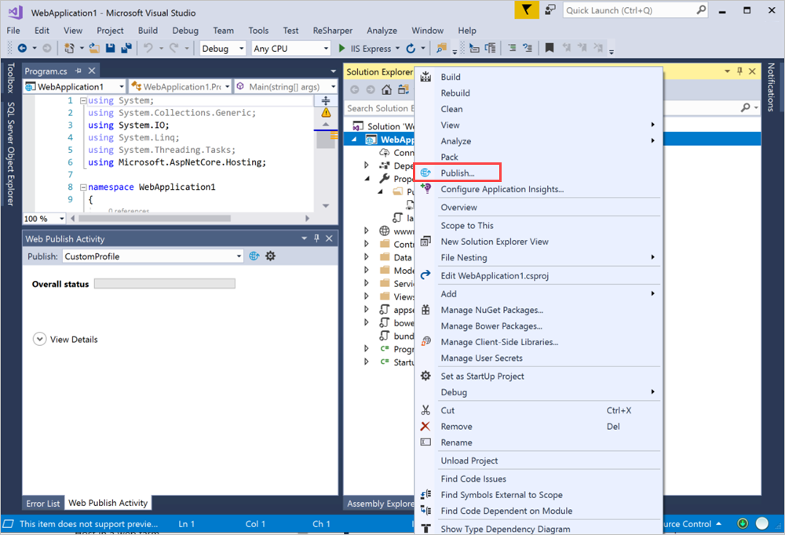

# How to deploy a C# ASP.net web app to a VM in Azure Stack

You can create a VM to host your C# (ASP.NET) Web app in Azure Stack. This article looks at the steps you will follow in setting up server, configuring the server to host your C# (ASP.NET) web app, and then deploying your app right from Visual Studio.

C# is a general-purpose, multi-paradigm programming language encompassing strong typing, lexically scoped, imperative, declarative, functional, generic, object-oriented, and component-oriented programming disciplines. To learn the C# programming language and find additional resources for C#, see the [C# Guide](https://docs.microsoft.com/dotnet/csharp/).

This article will use a C# 6.0 app using ASP.NET Core 2.2 running on a Windows 2016 server.

## Create a VM

1. Create a [Windows Server VM](azure-stack-quick-windows-portal.md).

2. Run the following script to install the components on your VM. The script:
      - Install IIS (with Management Console).
      - Install ASP.NET 4.6.

        ```PowerShell  
        # Install IIS (with Management Console)
        Install-WindowsFeature -name Web-Server -IncludeManagementTools
        
        # Install ASP.NET 4.6
        Install-WindowsFeature Web-Asp-Net45
        
        # Install Web Management Service
        Install-WindowsFeature -Name Web-Mgmt-Service
        ```

3. Download the [MSI for Web deployment 3.6](https://www.microsoft.com/download/details.aspx?id=43717). Install from the MSI and then enable on all of the features.

4. Install the .NET Core Hosting Bundle for 2.2 on your server. For the steps, see [.NET Core Installer](https://dotnet.microsoft.com/download/dotnet-core/2.2). Make sure you are using the same version of .NET Core on both your development machine and your target server.

5. Return to the Azure Stack portal, and open the ports in the network settings for your VM.

    1. Open the Azure Stack portal for your tenant.
    2. Find your VM. You may have pinned the VM to your dashboard, or you can search for the VM in the **Search resources** box.
    3. Select **Networking**.
    4. Select **Add inbound port rule** under VM.
    1. Add an inbound security rule for the following ports:

    | Port | Protocol | Description |
    | --- | --- | --- |
    | 80 | HTTP | Hypertext Transfer Protocol (HTTP) is an application protocol for distributed, collaborative, hypermedia information systems. Clients will connect to your web app with either the public IP or DNS name of your VM. |
    | 443 | HTTPS | Hypertext Transfer Protocol Secure (HTTPS) is an extension of the Hypertext Transfer Protocol (HTTP). It is used for secure communication over a computer network. Clients will connect to your web app with the either the public IP or DNS name of your VM. |
    | 22 | SSH | Secure Shell (SSH) is a cryptographic network protocol for operating network services securely over an unsecured network. You will use this connection with an SSH client to configure the VM and deploy the app. |
    | 3389 | RDP | Optional. The Remote Desktop Protocol allows for a remote desktop connection to use a graphic user interface your machine.   |

    For each port:

    1. Select **Any** for Source.
    1. Type `*` for Source port range.
    1. Select **Any** for **Destination**.
    1. Add the port you would like to open for **Destination port range**.
    1. Select **Any** for **Protocol**.
    1. Select **Allow** for **Action**.
    1. Leave the default for **Priority**.
    1. **Name** and provide a **Description** so that you can make a note of why you opened the port.
    1. Select Add.

5.  In the **Networking** settings for your VM in Azure Stack, create a DNS name for your server. Users can connect to your web site using the URL.

    1. Open the Azure Stack portal for your tenant.
    1. Find your VM. You may have pinned the VM to your dashboard, or you can search for the VM in the **Search resources** box.
    1. Select **Overview**.
    1. Select **Configure** under VM.
    1. Select **Dynamic** for **Assignment**.
    1. Type the DNS name label such as `mywebapp` so that your full URL will something like: `mywebapp.local.cloudapp.azurestack.external`.

## Create an app 

You can either use your own Web app or use the example at [Publish an ASP.NET Core app to Azure with Visual Studio](https://docs.microsoft.com/aspnet/core/tutorials/razor-pages/razor-pages-start?view=aspnetcore-2.2&tabs=visual-studio
).

The article describes how to create and publish an ASP.NET web application to an Azure virtual machine (VM) using the Microsoft Azure Virtual Machines publishing feature in Visual Studio 2017. After you have installed and made sure your app is running locally, you will update your publishing target to the Windows VM in your Azure Sack.

## Deploy and run the app

Create a publish target to your VM in Azure Stack.

1. Right-click on the project in the Solution Explorer and select **Publish**.

    

2.  In the Publish window, select New Profile.
3. Select IIS, FTP, etc.
4. Select Publish.

5.  Select **Web Deploy** for the **Publish method**.
6.  For **Server** enter the DNS name you defined earlier, such as `w21902.local.cloudapp.azurestack.external`
7.  For **Site name** type `Default Web Site`.
8.  For **User name** type the user name for the machine.
9.  For **Password**, type the password for the machine.
10. For **Destination URL** type the URL for the site, such as `mywebapp.local.cloudapp.azurestack.external`.

    

9. Select **Validate connection** to validate your web deploy configuration. And then click **Next**.
10. Set your **Configuration** as **Release**.
11. Set **Target Framework** as **netcoreapp2.2**.
12. Set **Target Runtime** as **Portable**.
13. Select **Save**.
14. Select **Publish**.
15. Navigate to your new server. You should see your running web application.

```HTTP  
    mywebapp.local.cloudapp.azurestack.external
```

## Next steps

- Learn more about how to [Develop for Azure Stack](azure-stack-dev-start.md)
- Learn about [common deployments for Azure Stack as IaaS](azure-stack-dev-start-deploy-app.md).