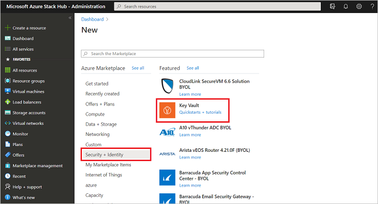

# Manage Key Vault in Azure Stack using the portal

This article describes how to create and manage a key vault in Azure Stack using the Azure Stack portal.

## Prerequisites

You must subscribe to an offer that includes the Azure Key Vault service.

## Create a key vault

1. Sign in to the [user portal](https://portal.local.azurestack.external).

2. From the dashboard, select **+ Create a resource**, then **Security + Identity**, then **Key Vault**.

    

3. In the **Create Key Vault** pane, assign a **Name** for your vault. Vault names can contain only alphanumeric characters and the hyphen (-) character. They shouldn't start with a number.

4. Choose a **Subscription** from the list of available subscriptions. All subscriptions that offer the Key Vault service are displayed in the drop-down list.

5. Select an existing **Resource Group**, or create a new one.

6. Select the **Pricing tier**. In the Azure Stack Development Kit (ASDK), key vaults support **Standard** SKUs only.

7. Choose one of the existing **Access policies** or create a new one. An access policy allows you to grant permissions for a user, an app, or a security group to perform operations with this vault.

8. Optionally, choose an **Advanced access policy** to enable access to features. For example: virtual machines (VMs) for deployment, Resource Manager for template deployment, and access to Azure Disk Encryption for volume encryption.

9. After you configure the settings, select **OK**, and then select **Create**. This starts the key vault deployment.

## Manage keys and secrets

After you create a key vault, use the following procedure to create and manage keys and secrets within the vault:

### Create a key

1. Sign in to the [user portal](https://portal.local.azurestack.external).

2. From the dashboard, select **All resources**, select the key vault that you created earlier, and then select the **Keys** tile.

3. In the **Keys** pane, select **Add**.

4. In the **Create a key** pane, from the list of **Options**, choose the method that you want to use to create a key. You can **Generate** a new key, **Upload** an existing key, or use **Restore Backup** to select a backup of a key.

5. Enter a **Name** for your key. The key name can contain only alphanumeric characters and the hyphen (-) character.

6. Optionally, configure the **Set activation date** and **Set expiration date** values for your key.

7. Select **Create** to start the deployment.

After the key is successfully created, you can select it under **Keys** and view or modify its properties. The properties section contains the **Key Identifier**, which is a Uniform Resource Identifier (URI) that external apps use to access this key. To limit operations on this key, configure the settings under **Permitted operations**.

### Create a secret

1. Sign in to the [user portal](https://portal.local.azurestack.external).

2. From the dashboard, select **All resources**, select the key vault that you created earlier, and then select the **Secrets** tile.

3. Under **Secrets**, select **Add**.

4. Under **Create a secret**, from the list of **Upload options**, choose an option with which you want to create a secret. You can create a secret **Manually** if you enter a value for the secret, or upload a **Certificate** from your local machine.

5. Enter a **Name** for the secret. The secret name can contain only alphanumeric characters and the hyphen (-) character.

6. Optionally, specify the **Content type**, and configure values for **Set activation date** and **Set expiration date** for the secret.

7. Select **Create** to start the deployment.

After the secret is successfully created, you can select it under **Secrets** and view or modify its properties. The **Secret Identifier** is a URI that external apps can use to access this secret.

## Next steps

* [Deploy a VM by retrieving the password stored in Key Vault](azure-stack-key-vault-deploy-vm-with-secret.md)
* [Deploy a VM with certificate stored in Key Vault](azure-stack-key-vault-push-secret-into-vm.md)
