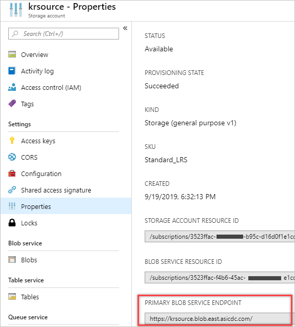
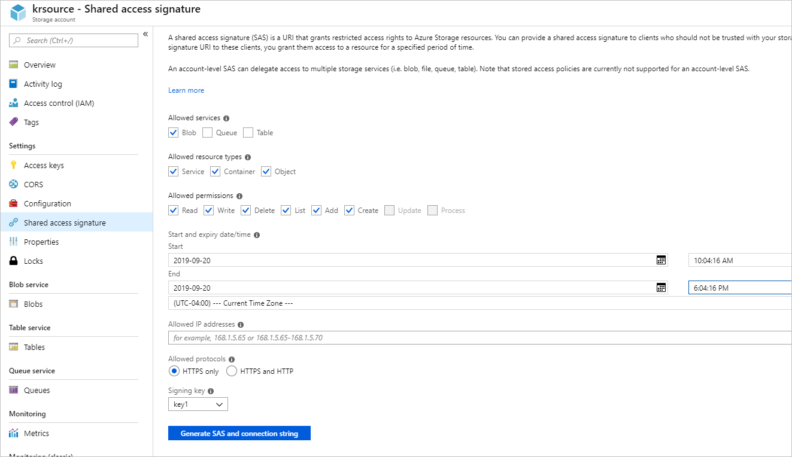

# Back up your storage accounts on Azure Stack Hub

This article looks at protection and recovery of storage accounts within an Azure Storage accounts on Azure Stack Hub.

## Elements of the solution

This section looks at the overall structure of the solution and major parts.


### Application layer

Data can be replicated between storage accounts on separate Azure Stack Hub scale units by issuing multiple [PUT Blob](https://docs.microsoft.com/rest/api/storageservices/put-blob) or [Put Block](https://docs.microsoft.com/rest/api/storageservices/put-block) operations to write objects to multiple locations. Alternatively, the application can issue the [Copy Blob](https://docs.microsoft.com/rest/api/storageservices/copy-blob) operation to copy the Blob to a storage account hosted on a separate scale unit after the Put operation to the primary account completes.

### Scheduled copy task

AzCopy is an excellent tool that can be utilized to copy data from local filesystems, Azure Cloud Storage, Azure Stack Hub Storage, and s3. Currently, AzCopy cannot copy data between two Azure Stack Hub Storage Accounts. Copying objects from a source Azure Stack Hub Storage account to a target Azure Stack Hub Storage account requires an intermediary local filesystem.

For more information, see the AzCopy in the [Use data transfer tools in Azure Stack Hub Storage](https://docs.microsoft.com/azure-stack/user/azure-stack-storage-transfer?view=azs-1908#azcopy) article.

### Azure Stack Hub (source)

This is the source of the storage account data you would like to back up.

You will need to the Source Storage Account URL and SAS Token. For instruction on working with a storage account, see [Get started with Azure Stack Hub storage development tools](azure-stack-storage-dev.md).

### Azure Stack Hub (target)

This is the target that will store the account data you would like to back up. The target Azure Stack Hub instance must be in a different location from your target Azure Stack Hub. And the source will need to be able to connect to the target.

You will need to the Source Storage Account URL and SAS Token. For instruction on working with a storage account, see [Get started with Azure Stack Hub storage development tools](azure-stack-storage-dev.md).

### Intermediary local filesystem

You will need a place to run AzCopy and to store data when copying from your source and then writing to your target Azure Stack Hub. This is an intermediate server in your source Azure Stack Hub.

You can create a Linux or Windows server as your intermediate server. The server will need to have enough space to store all of the objects in the source Storage account containers.
- For instruction on setting up a Linux Server, see [Create a Linux server VM by using the Azure Stack Hub portal](azure-stack-quick-linux-portal.md).  
- For instruction on setting a Windows Server, see [Create a Windows server VM with the Azure Stack Hub portal](azure-stack-quick-windows-portal.md).  

Once you have set up your Windows Server, you will need to install [Azure Stack Hub PowerShell](https://docs.microsoft.com/azure-stack/operator/azure-stack-powershell-install?toc=https%3A%2F%2Fdocs.microsoft.com%2FFazure-stack%2Fuser%2FTOC.json&bc=https%3A%2F%2Fdocs.microsoft.com%2FFazure-stack%2Fbreadcrumb%2Ftoc.json) and [Azure Stack Hub Tools](https://docs.microsoft.com/azure-stack/operator/azure-stack-powershell-download?toc=https%3A%2F%2Fdocs.microsoft.com%2FFazure-stack%2Fuser%2FTOC.json&bc=https%3A%2F%2Fdocs.microsoft.com%2FFazure-stack%2Fbreadcrumb%2Ftoc.json).

## Set up backup for storage accounts

1. Retrieve the Blob Endpoint for the source and target storage accounts.

    

2. Create and record SAS Tokens for the source and target storage accounts.

    

3. Install [AzCopy](https://github.com/Azure/azure-storage-azcopy) on the intermediary server and set the API Version to account for Azure Stack Hub Storage Accounts.

    - For a Windows server:

    ```PowerShell  
    set AZCOPY_DEFAULT_SERVICE_API_VERSION=2017-11-09 PowerShell use: $env:AZCOPY_DEFAULT_SERVICE_API_VERSION="2017-11-09"
    ```

    - For a Linux (Ubuntu) server:

    ```bash  
    export AZCOPY_DEFAULT_SERVICE_API_VERSION=2017-11-09
    ```

4. On your intermediate server, create script. Update this command with your **storage account**, **SAS key**, and **local directory path**. You'll run the script to copy data incrementally from the **source** storage account.

    ```
    azcopy sync "https:/<storagaccount>/<container>?<SAS Key>" "C:\\myFolder" --recursive=true --delete-destination=true
    ```

5.  Enter the **storage account**,** SAS key**, and **local directory path.  You'll will use this to copy data incrementally to the **target** storage account
    
    ```
    azcopy sync "C:\\myFolder" "https:// <storagaccount>/<container>?<SAS Key>" --recursive=true --delete-destination=true
    ```

6.  Use Cron or Windows Task Scheduler to schedule the copy from the source Azure Stack Hub storage account to Local Storage on the intermediate server. Then copy from local storage in the intermediate server to the target Azure Stack Hub storage account.

    The RPO you can achieve with this solution will be determined by the /MO parameter value and the network bandwidth between the source account and the intermediary server and the intermediary server and the target account.

    - For a Linux (Ubuntu) server:

    ```bash  
    schtasks /CREATE /SC minute /MO 5 /TN "AzCopy Script" /TR C:\\&lt;script name>.bat
    ```

    | Parameter | Note | 
    | ---- | ---- |
    | /SC | Use a minute schedule. |
    | /MO | An interval of *XX* minutes. |
    | /TN | The task name. |
    | /TR | The path to the `script.bat` file. |


    - For a Windows server:

    For information on using the Windows Task schedule, see [Task Scheduler for developers](https://docs.microsoft.com/windows/win32/taskschd/task-scheduler-start-page)
    

## Use your storage account in a disaster

Each Azure Stack Hub Storage account possesses a unique DNS name derived from the name of the Azure Stack Hub region itself, for example, `https://krsource.blob.east.asicdc.com/`. Applications writing to and reading from this DNS Name will need to accommodate the storage account DNS name change when the target account, for example, `https://krtarget.blob.west.asicdc.com/` needs to be used during a disaster.

Application connection strings can be modified after a disaster is declared to account for the relocation of the objects or, if a CNAME record is used in front of a load balancer front-ending the source and target storage accounts, the load balancer can be configured with a manual failover algorithm that will allow the administrator to declare the target

If SAS is used by the application rather than AAD or AD FS, the above method will not work and application connection strings will need to be updated with the target storage account URL and the SAS key(s) generated for the target storage account.

## Next steps

[Get started with Azure Stack Hub storage development tools](azure-stack-storage-dev.md)