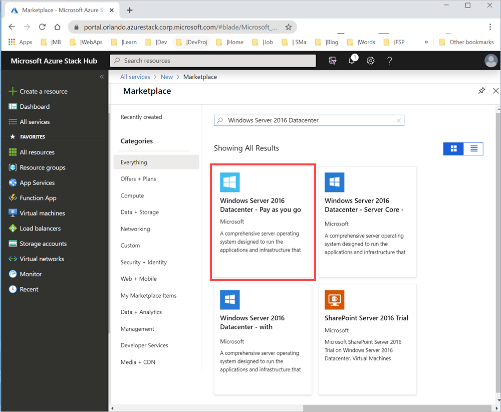
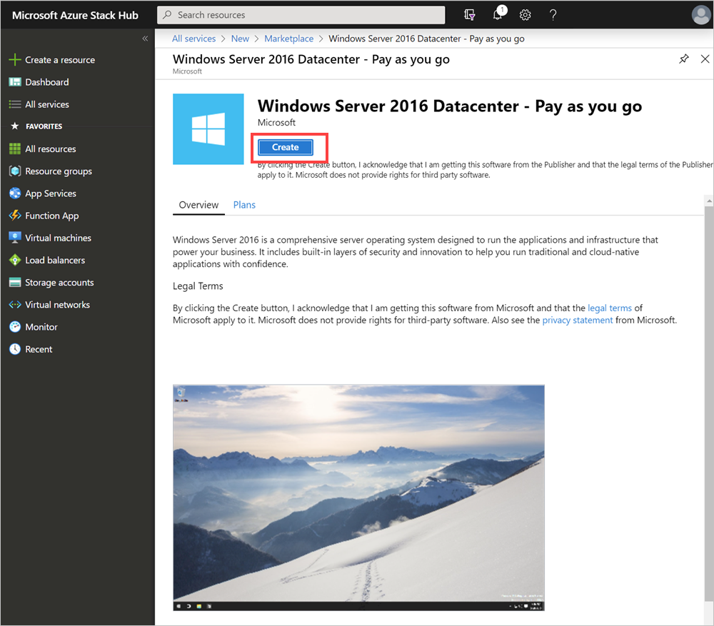
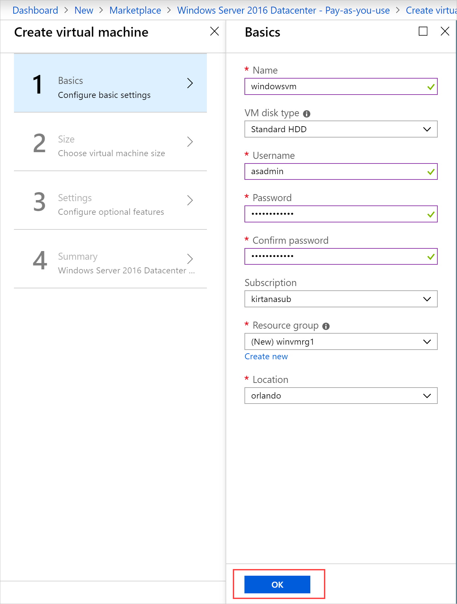
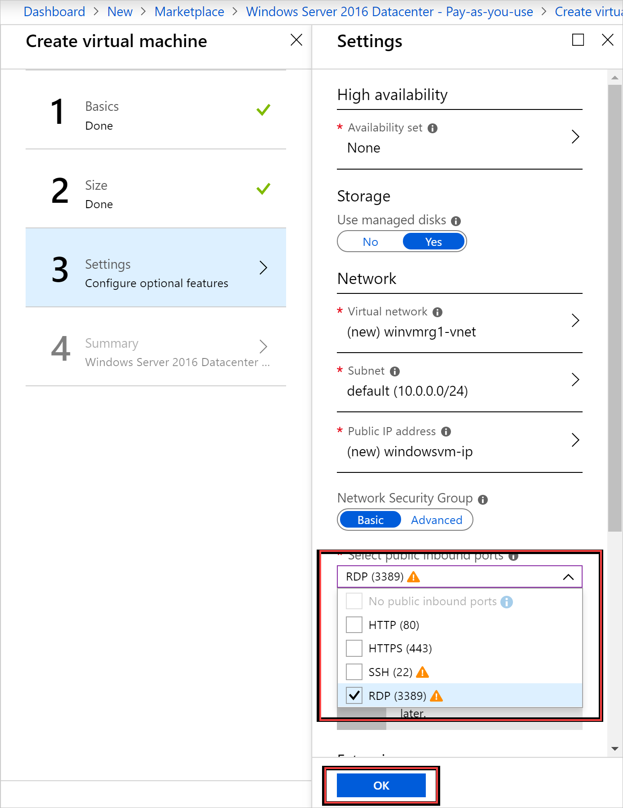
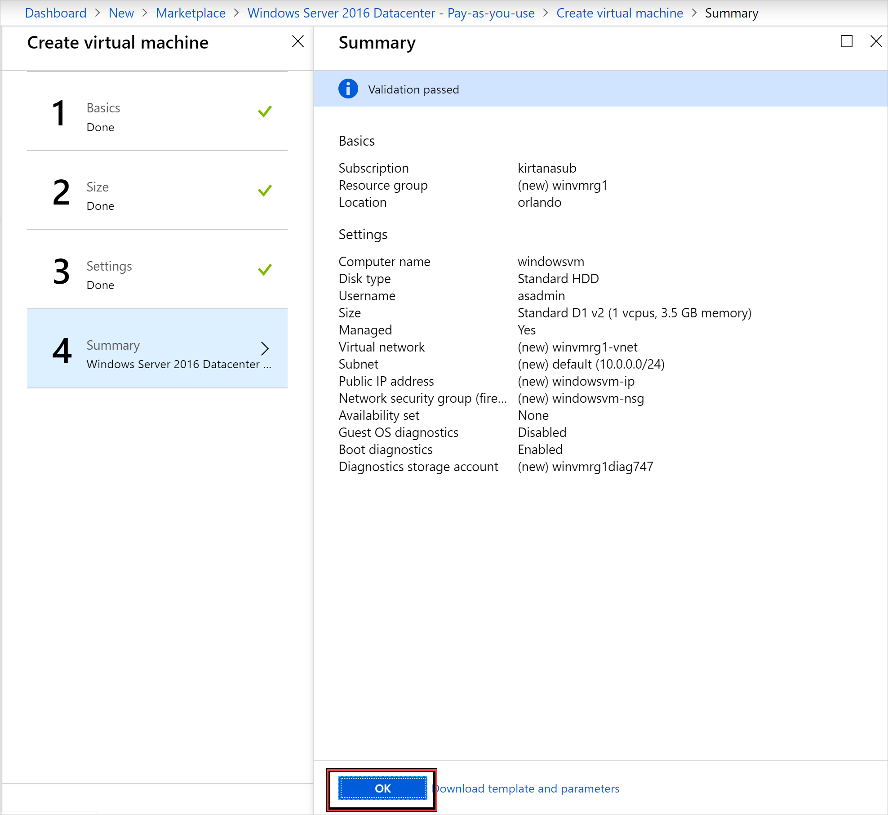

# Quickstart: Create a Windows server VM with the Azure Stack Hub portal

Learn how to create a Windows Server 2016 virtual machine (VM) by using the Azure Stack Hub portal.

> [!NOTE]
> If you are looking for instructions to create a Windows VM in global Azure rather than
Azure Stack Hub, see [Quickstart: Create a Windows virtual machine in the Azure portal](/azure/virtual-machines/windows/quick-create-portal).

## Sign in to the Azure Stack Hub portal

Sign in to the Azure Stack Hub user portal. The address of the Azure Stack Hub portal depends on which Azure Stack Hub product you're connecting to:

* For the Azure Stack Development Kit (ASDK), go to: `https://portal.local.azurestack.external`.
* For an Azure Stack Hub integrated system, go to the URL that your Azure Stack Hub operator provided.
* For more information about working with the Azure Stack Hub user portal, see [Use the Azure Stack Hub user portal](https://docs.microsoft.com/azure-stack/user/azure-stack-use-portal).

## Create a VM

1. Select **Create a resource** > **Compute**. Search for` Windows Server 2016 Datacenter - Pay as you use`.
    If you don't see the **Windows Server 2016 Datacenter - Pay-as-you-use** entry, contact your Azure Stack Hub cloud operator and ask for the image to be added to the Azure Stack Hub Marketplace. For instructions, your cloud operator can refer to [Create and publish a custom Azure Stack Hub Marketplace item](../operator/azure-stack-create-and-publish-marketplace-item.md).

    

1. Select **Create**.

    

1. Enter a **Name**, **Disk Type**, **User name**, and **Password** under **Basics**. Choose a **Subscription**. Create a **Resource group**, or select an existing one, select a **Location**, and then select **OK**.

    

1. Select **D1_v2** under **Size**,  and then choose on **Select**.

    

1. On the **Settings** page, change the defaults to match your configuration. Configure the public inbound ports from the related drop-down. Then,select **OK**.

    

1. Select **OK** under **Summary** to create the VM.

    

1. Select **Virtual Machines** to review your new VM. Search for the VM name, and then select the VM in the search results.

## Clean up resources

When you're finished using the VM, delete the VM and its resources. To do so, select the resource group on the VM page and select **Delete**.

## Next steps

In this quickstart, you deployed a basic Windows Server VM. To learn more about Azure Stack Hub VMs, continue to [Considerations for VMs in Azure Stack Hub](azure-stack-vm-considerations.md).
