# Deploy apps to Azure and Azure Stack

*Applies to: Azure Stack integrated systems and Azure Stack Development Kit*

This solution shows you how to deploy apps to Azure and Azure Stack by using Azure Pipelines hybrid continuous integration and continuous delivery (CI/CD).

After you set up Azure Stack, Azure DevOps, and web apps according to the [Prerequisites](#prerequisites), you can:

> [!div class="checklist"]
> - Register your web app and set up Azure Pipelines access in Azure Active Directory (Azure AD). 
> - Create Azure Pipelines endpoints for Azure AD and Active Directory Federation Services (AD FS). 
> - Install the Azure Pipelines build agent on the Azure Stack build server. 
> - Configure self-contained app deployment to Azure and Azure Stack.
> - Create a build pipeline that runs automatic builds based on code commits to your project.
> - Create a release pipeline that automatically deploys your builds to both Azure AD and Azure Stack. 
> - Manually create and deploy releases, and view release summaries and logs. 

To learn more about CI/CD, see the following articles:

* [What is Continuous Integration?](https://www.visualstudio.com/learn/what-is-continuous-integration/)
* [What is Continuous Delivery?](https://www.visualstudio.com/learn/what-is-continuous-delivery/)

## Azure Stack and hybrid CI/CD

Microsoft Azure Stack is an extension of Azure that brings the agility and innovation of cloud computing to your on-premises environment. It's the only hybrid cloud that lets you build and deploy hybrid apps in on-premises as well as public cloud environments. You can build an app on Azure Stack and then deploy it to Azure Stack, to Azure, or to your Azure hybrid cloud. 

App deployment continuity, security, and reliability are critical elements for your organization and development team. The Azure Pipelines hybrid CI/CD delivery model lets you consolidate your build pipelines across your on-premises environment and the public cloud, and change deployment locations without changing your app. Other benefits of using the hybrid approach are:

- You can maintain a consistent set of development tools across your on-premises Azure Stack environment and the Azure public cloud.  A common tool set makes it easier to implement CI/CD patterns and practices.
- Apps and services deployed in Azure or Azure Stack are interchangeable, and the same code can run in either location. You can take advantage of on-premises and public cloud features and capabilities.

> [!TIP]
>   
> The article [Hybrid cloud design patterns for Azure Stack](azure-stack-edge-pattern-overview.md) reviews software quality pillars for designing, deploying, and operating hybrid applications. The quality criteria include placement, scalability, availability, resiliency, manageability, and security. These design considerations assist in optimizing hybrid app design, minimizing challenges in production environments.

## Prerequisites

- Basic knowledge of Azure and Azure Stack. To learn more before deploying this solution, read the following articles:
  
  - [Introduction to Azure](https://azure.microsoft.com/overview/what-is-azure/)
  - [Azure Stack overview](../operator/azure-stack-overview.md)
  
- An Azure subscription. If you don't have one, [create a free account](https://azure.microsoft.com/free/?WT.mc_id=A261C142F) before you begin.
  
- A web app created in Azure. Use an [Azure Resource Manager template](https://azure.microsoft.com/resources/templates/) to create a web app you can deploy both on-premises and to the public cloud. Make a note of the app URI to use later. 
  
- Visual Studio 2019 [installed](/visualstudio/install/install-visual-studio).
  
- Admin access to an [Azure DevOps](https://www.visualstudio.com/docs/setup-admin/team-services/connect-to-visual-studio-team-services) organization that can create pipelines, and a DevOps [project](/azure/devops/organizations/projects/create-project) or [workspace](/azure/devops/repos/tfvc/create-work-workspaces). 
  
- A Windows Server 2016 image with .NET 3.5 for the private build agent virtual machine (VM) Azure Pipelines builds on your Azure Stack.
  
- An Azure Stack integrated system, or the Azure Stack Development Kit (ASDK) deployed and configured according to the following instructions. 
  
  
  The Azure Stack Development Kit (ASDK) is a single-node deployment of Azure Stack you can download and use for free. The ASDK lets you evaluate Azure Stack and use Azure APIs and tooling in a non-production environment.
  
  Any user with Azure AD or Active Directory Federation Services (AD FS) admin credentials can deploy the ASDK. An Azure OEM/hardware partner can deploy a production Azure Stack. You must be an Azure Stack operator to do the following Azure Stack configuration tasks: 
  
  - Deploy Azure App Service
  - Create plans and offers
  - Create a tenant subscription
  - Apply a Windows Server 2016 image
  
  > [!Note]
  > The ASDK installation takes approximately seven hours, so plan accordingly.
    
  To deploy and configure the ASDK:
  
  1. Follow the detailed deployment instructions in [Deploy the ASDK using the installer](../asdk/asdk-install.md).
     
  1. Use the [ConfigASDK.ps1](https://github.com/mattmcspirit/azurestack/blob/master/deployment/ConfigASDK.ps1) PowerShell script to automate ASDK post-deployment steps.
     
  1. Deploy [Azure App Service](../operator/azure-stack-app-service-deploy.md) PaaS services to Azure Stack.
     
  1. Create a [plan and offer](../operator/azure-stack-plan-offer-quota-overview.md) in Azure Stack.
     
  1. Create a [tenant subscription](../operator/azure-stack-subscribe-plan-provision-vm.md) to the offer in Azure Stack. 
     
  1. Create a web app in the tenant subscription. Make note of the new web app URL for later use.
     
  1. Deploy a Windows Server 2016 VM with .NET 3.5 in the tenant subscription, to be the build server that runs Azure Pipelines.
  
  > [!Note]
  > Your Azure Stack environment needs the correct images to run Windows Server and SQL Server. It must also have App Service deployed.

## Register your web app and give it access to resources 

In Azure Active Directory (Azure AD), Azure Pipelines authenticates against Azure Resource Manager using a *service principal*. To provision resources for Azure Pipelines, the service principal must have the **Contributor** role in the Azure subscription. 

You can use the Azure portal to configure authentication for your app. 

1. Register your app to create a service principal.
1. Use *role-based access control (RBAC)* to give the Service Principal Name (SPN) the **Contributor** role.
1. Copy and save the Application ID and Tenant ID values you need to create endpoints for Azure Pipelines. 
1. Create and save an application secret key value.

You can also [use a PowerShell script](https://github.com/Microsoft/vsts-rm-extensions/blob/master/TaskModules/powershell/Azure/SPNCreation.ps1#L5) to create a Service Principal and endpoints. The article [Create an Azure Resource Manager service connection with an existing service principal](/vsts/pipelines/library/connect-to-azure?view=vsts#create-an-azure-resource-manager-service-connection-with-an-existing-service-principal) explains this process.

 > [!Note]  
 > If you use the PowerShell script to create an Azure Stack Azure Resource Manager endpoint, you need to pass the **-azureStackManagementURL** parameter and **-environmentName** parameter. For example:  
 > `-azureStackManagementURL https://management.local.azurestack.external -environmentName AzureStack`

### Register your app in Azure AD 

1. In the [Azure portal](https://portal.azure.com), select **Azure Active Directory**, and then select **App registrations** in the left navigation.
   
1. Select **New registration**.
   
1. On the **Register an application** page
   1. Enter your web app's name.
   1. Select a supported account type. 
   1. Under **Redirect URI**, select **Web** for the type of application you want to create, and enter your web app's URI. 
   1. Select **Register**.
      
      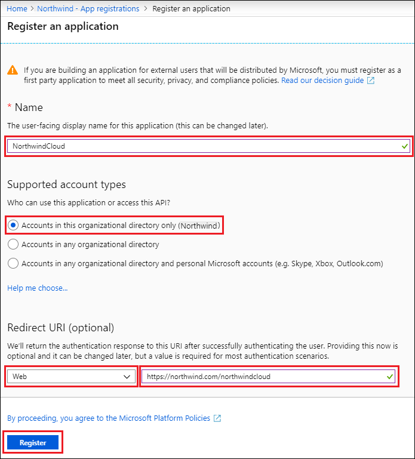 

### Assign the app to a role

You must assign your application to a role for it to access resources in your subscription. Azure RBAC lets you control the level of access that users need to do their jobs. For more information about RBAC, see [Manage access to Azure subscription resources](/azure/role-based-access-control/role-assignments-portal?toc=%252fazure%252factive-directory%252ftoc.json). To learn about the available roles, see [RBAC: Built-in roles](/azure/role-based-access-control/built-in-roles).

Azure Pipelines must have the **Contributor** role to be able to provision resources in an Azure Stack subscription. 

You can set the role scope at the subscription, resource group, or resource level. Permissions are inherited to lower levels of scope. For example, adding an app to the **Reader** role for a resource group means the app can read the resource group and any of its resources.

To assign your application to the **Contributor** role:

1. In the Azure portal, navigate to the level of scope you want. For example, to assign a role at the subscription scope, select **All services** and **Subscriptions**.
   
   
   
1. Select the subscription to assign the application to.
   
1. In the left navigation, select **Access control (IAM)**.
   
1. Select **Add a role assignment**.
   
1. In the **Add role assignment** dialog, select the **Contributor** role. By default, Azure AD applications aren't displayed in the available options. To find your application, search for the name and select it.
   
   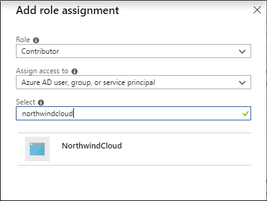
   
1. Select **Save** to finish assigning the role. You can see your application in the list of users assigned to a role for that scope.

Your service principal is set up. The next section shows how to get the values that Azure Pipelines needs to sign in programmatically.

### Get values for signing in

When creating endpoints for Azure Pipelines, you need to enter the tenant ID and the application ID. To get those values:

1. In the Azure portal, select **Azure Active Directory**.
   
1. In the left navigation, select **App registrations**, and then select your application.
   
1. Copy and save the **Directory (tenant) ID** and the **Application (client) ID** to use for creating endpoints.
   
   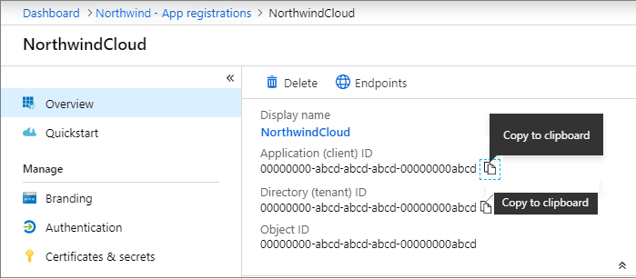

### Create a new application secret

When creating endpoints for Azure Pipelines, the app needs to authenticate. It can [use a certificate](/azure/active-directory/develop/howto-create-service-principal-portal#certificates-and-secrets) or an application secret. If you deployed Azure Stack with AD FS as the identity provider, you must use a certificate.

Follow the steps in [Certificates and secrets](/azure/active-directory/develop/howto-create-service-principal-portal#certificates-and-secrets) to create and upload a new certificate. 

Or, to create a new application secret:

1. In the Azure portal, select **Azure Active Directory**.
   
1. In the left navigation, select **App registrations**, and then select your application.
   
1. In the left navigation, select **Certificates & secrets**.
   
1. Under **Client secrets**, select **New client secret**.
   
1. In **Add a client secret**, type a description, select an expiration, and select **Add**.
   
1. Copy the **VALUE** of the new secret. You need to provide the value to sign in as the app. It's important to save this value now, because it won't be displayed again after you leave this page.
   
   

## Create endpoints

By creating endpoints, an Azure Pipelines build can deploy Azure AD apps to Azure Stack. Azure Pipelines connects to the build agent, which connects to Azure Stack.

After setting endpoint creation permissions, you can create endpoints for Azure AD or AD FS. 

- If you deployed Azure Stack with Azure AD as the identity provider, you can use a certificate or application secret to create an Azure Resource Manager service connection for Azure deployments. 
  
- If you used Active Directory Federation Services (AD FS) as the identity provider for Azure Stack, you must create the service connection using a certificate rather than a client secret for authentication. 

### Set endpoint creation permissions

1. In your Azure DevOps organization and project, select **Project settings**. 
   
1. Select **Security**, and under **Azure DevOps Groups**, select **Endpoint Administrators**.
   
1. On the **Members** tab, select **Add**.
   
1. In **Add users and groups**, select user names from the list, including yourself, and then select **Save changes**.
   
   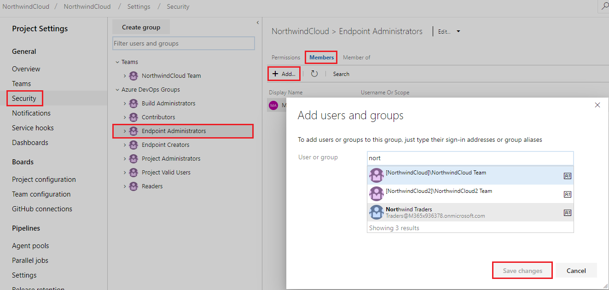
   
1. In the **Azure DevOps Groups** list, select **Endpoint Creators**, and repeat the previous steps to add users to the **Endpoint Creators** group. 

### Create an endpoint for Azure AD or AD FS deployments

Follow the instructions in [Create an Azure Resource Manager service connection with an existing service principal](/azure/devops/pipelines/library/connect-to-azure#create-an-azure-resource-manager-service-connection-with-an-existing-service-principal) to create the service connection endpoint.  

Use the following values to fill out the form: 

- **Connection name**: Enter a user-friendly name to use when referring to this service connection.
  
- **Environment**: Select the environment name, such as **AzureCloud** or **AzureStack**. If you don't see AzureStack in the dropdown, see [Connect to Azure Stack](/azure/devops/pipelines/library/connect-to-azure?view=azure-devops#connect-to-azure-stack).
  
- **Environment URL**: If you didn't select **AzureCloud**, enter your environment URL, such as *https:\//management.local.azurestack.external*.
  
- **Scope level**: Select the scope level you need, such as **Subscription**. 
  
- **Subscription ID**: Enter your Subscription ID.
  
- **Subscription name**: Enter your user name from Azure Stack.
  
- **Service principal client ID**: Enter the **Application (client) ID** you saved previously. 
  
- **Service principal key** or **Certificate**: Select one or the other option. 
  
  > [!NOTE]
  > To create an AD FS endpoint, you must use a Certificate for authentication. 
  
  - For **Service principal key**, enter the client secret value you saved earlier.
  - If you choose **Certificate**, enter the contents of both the certificate and private key sections of the *.pem* certificate file. 
    
    > [!NOTE]
    > To convert a *.pfx* to a *.pem* certificate file, run `openssl pkcs12 -in file.pfx -out file.pem -nodes -password pass:<password_here>`.
  
- **Tenant ID**: Enter the **Directory (tenant) ID** you saved previously.
  
- **Connection: Not verified**: Select **Verify connection** to validate your connection settings to the service principal.
  
  > [!NOTE]
  > If your Azure Resource Manager endpoint isn't exposed to the internet, the connection validation will fail. This is expected, and you can validate your connection by creating a release pipeline with a simple task.

## Install and configure the build agent 

Using a hosted build agent in Azure Pipelines is a convenient option for building and deploying web apps. Azure automatically performs agent maintenance and upgrades, which enable a continuous and uninterrupted development cycle.

In Azure DevOps, create a personal access token (PAT) to use for Azure Stack. Then use the PAT to deploy and configure the build agent on the Azure Stack build server VM. 
   
### Create a personal access token

1. Sign in to Azure DevOps and select **My profile** in the upper right corner. 
   
1. On your profile page, expand the dropdown next to your Azure Stack organization name, and select **Manage security**. 
   
   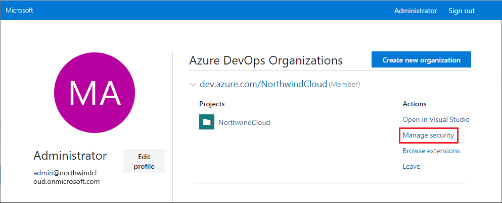
   
1. On the **Personal Access Tokens** page, select **New Token**.
   
   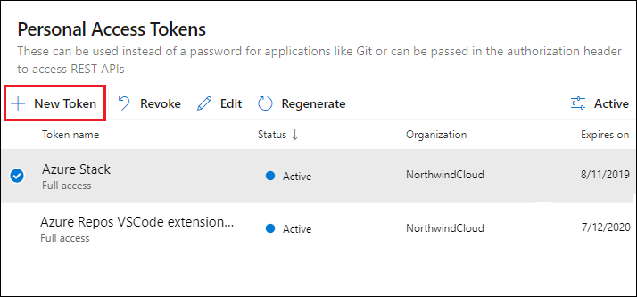
   
1. On the **Create a new personal access token** page, fill out the token information and select **Create**. 
   
   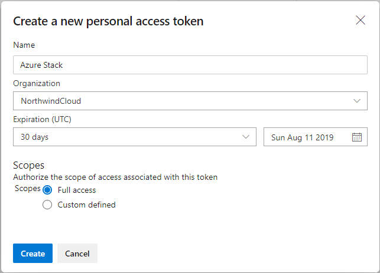
   
1. Copy and save the token. It won't be shown again after you leave the web page.
   
   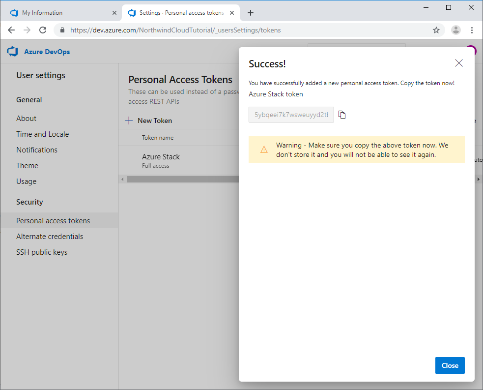
   
### Install and configure the agent on the build server

1. Connect to the build server VM you deployed on the Azure Stack host.
   
1. Download the build agent image. 
   
1. In an administrator command prompt, deploy the agent as a service using your PAT, and run it.
   
1. Navigate to the folder for the extracted build agent, and run the *config.cmd* file. The *config.cmd* updates the build agent folder with additional files.
   
   

Now that you created the endpoint and installed the Azure Pipelines build agent on the build server, the Azure Pipelines to Azure Stack connection is ready to use. The build agent in Azure Stack gets instructions from Azure Pipelines, and then the agent conveys endpoint information for communication with Azure Stack.

‎‎Instead of managing each agent separately, you can organize agents into *agent pools*. An agent pool defines the sharing boundary for all agents in that pool. Agent pools are scoped to the Azure DevOps organization, which means that you can share an agent pool across projects. To learn more about agent pools, see [Create agent pools and queues](/azure/devops/pipelines/agents/pools-queues).

## Create build and release pipelines 

Azure Pipelines provides a highly configurable and manageable pipeline for releases to multiple environments such as development, staging, quality assurance (QA), and production. The release process can include requiring approvals at specific stages of the application life cycle.

In this part of the solution, you:

- Clone, connect, and add code to your Azure DevOps project in Visual Studio.
- Create a self-contained web app deployment.
- Configure the CI/CD build and release pipelines.

Hybrid CI/CD can apply to both app code and infrastructure code. You can use [Azure Resource Manager hybrid templates](https://azure.microsoft.com/resources/templates/) to deploy your Azure web app code to on-premises and public clouds.

### Clone your project

1. In Visual Studio **Team Explorer**, select the **Connect** icon and sign in to your Azure DevOps organization. 
   
1. Select **Manage Connections** > **Connect to a project**. 
   
   

1. In the **Connect to a Project** dialog, select your web app project, set a local path, and then select **Clone** to clone the repository locally.
   
   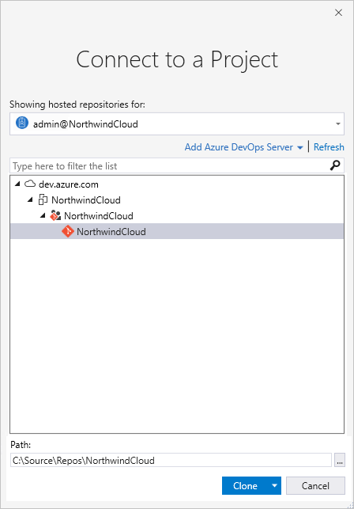

### Create a self-contained web app deployment for App Services in both clouds

1. In Visual Studio **Solution Explorer**, open your *WebApplication.csproj* file and add `<RuntimeIdentifier>win10-x64</RuntimeIdentifier>`. For more information about this step, see [Self-contained deployment](/dotnet/core/deploying/#self-contained-deployments-scd).
   
   
   
1. Save your work, and use **Team Explorer** to check the code into your project.

### Create a build pipeline and run a build

1. In your web browser, open your Azure DevOps organization and project.
   
1. Select **Pipelines** in the left navigation, and then select **New pipeline**. 

1. If necessary, select your code repository, and under **Configure your pipeline**, select **Starter pipeline**. You then see the starter *azure-pipelines.yml* file. 
   
1. On the **Review your pipeline YAML** page, select **Show assistant**.
   
   
   
1. Under **Tasks**, select **.NET Core**. 
   
1. In the **.NET Core** configuration pane, under **Command**, drop down and select **publish**.
   
1. Under **Arguments**, enter *-r win10-x64*. 

1. Make sure **Publish Web Projects**, **Zip Published Projects**, and **Add project name to publish path** are selected.
   
   
   
1. Select **Add**. The `DotNetCoreCLI@2` task is added to the pipeline.
   
   
   
1. Select **Save and run**, add a commit message and optional description, and select **Save and run** again. 
   
The [self-contained deployment build](/dotnet/core/deploying/#self-contained-deployments-scd) publishes artifacts that can run on both Azure and Azure Stack.

### Create a release pipeline

Creating a release pipeline is the final step in your hybrid CI/CD configuration process. You use the release pipeline to create a release and deploy your build.

1. In your Azure DevOps project, select **Pipelines** > **Releases** in the left navigation, and then select **New pipeline**. 
   
1. On the **Select a template** page, select **Azure App Service Deployment**, and then select **Apply**.
   
   
   
1. On the **Pipeline** tab, select **Add an artifact** in the left pane. In the right pane, select the web app build you just created from the **Source (build pipeline)** drop-down menu, and select **Add**.
   
   
   
1. On the **Pipeline** tab, under **Stages**, select the hyperlink in **Stage 1** to **View stage tasks**.
   
   
   
1. On the **Tasks** tab, enter *Azure* as the **Stage name**. 
   
1. Under **Parameters**, select your subscription from the **Azure subscription** drop-down list, and enter your **App service name**.
   
   
   
1. In the left pane, select **Run on agent**. In the right pane, select **Azure Pipelines** from the **Agent pool** drop-down list, and then select **vs2017-win2016** from the **Agent Specification** drop-down list.
   
   
   
1. In the left pane, select **Deploy Azure App Service**. In the right pane, scroll down and select the ellipsis **...** next to **Package or folder**.
   
1. In the **Select a file or folder** dialog, browse to the location of your Azure web app build, and then select **OK**.
   
   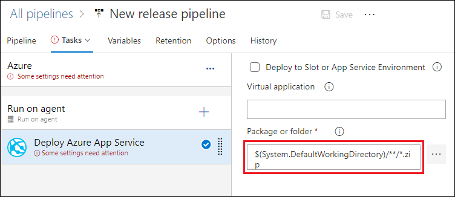
   
1. On the **New release pipeline** page, select **Save** at upper right 
   
1. On the **Pipeline** tab, select **Add an artifact**. Select your project, and then select your Azure Stack build from the **Source (build pipeline)** drop-down menu. Select **Add**. 
   
1. Under **Stages**, hover over the **Azure** stage until the **+** appears, and then select **Add**.
   
1. Under **Template**, select **Empty job**. 
   
1. In the **Stage** dialog, enter *Azure Stack* as the stage name. 
   
   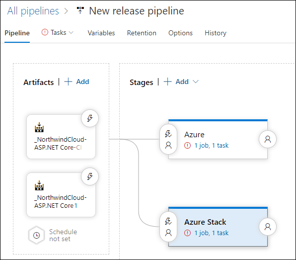
   
1. Under **Parameters**, select your Azure Stack endpoint, and enter your Azure Stack web app name as the **App service name**.
   
1. Under **Run on agent**, select your Azure Stack build server agent from the **Agent pool** drop-down list.
   
1. For **Deploy Azure App Service**, select the **Package or folder** for the Azure Stack build, and then select **OK** in the **Select a file or folder** dialog.
   
1. On the **Variables** tab, find the variable named **VSTS_ARM_REST_IGNORE_SSL_ERRORS**. Set the variable value to **true**, and set its scope to **Azure Stack**.
   
   
   
1. On the **Pipeline** tab, select the **Continuous deployment trigger** icon for each artifact, and set it to **Enabled**.  
   
   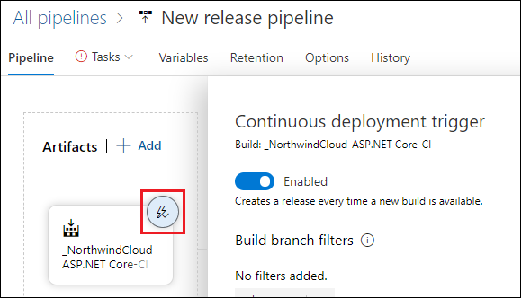
   
1. Select the **Pre-deployment conditions** icon on the Azure Stack stage, and set the trigger to **After release**.
   
   
   
1. Select **Save** at the upper right on the **New release pipeline** page to save the release pipeline.

> [!Note]
> Some settings for release tasks may have been automatically defined as [custom variables](/azure/devops/pipelines/release/variables?view=vsts#custom-variables) when you created the release pipeline from the template. These settings can't be modified in the task settings, but you can edit them in the parent stage items.

## Release the app

Now that you have a release pipeline, you can use it to create a release and deploy your app. 

Because the continuous deployment trigger is set in your release pipeline, modifying the source code starts a new build and creates a new release automatically. However, this time you'll create and run a new release manually.

To create and deploy a release:

1. On your new release pipeline page, select **Create release** at upper right. 
   
   
   
1. On the **Create a new release** page:
   1. Under **Pipeline**, select the **Azure** stage to change its trigger from automated to manual. 
   1. Under **Artifacts**, make sure the correct artifacts are selected.
   1. Enter a **Release description**, and then select **Create**. 
   
   A banner indicates that the new release is created. You can select the release name link to see a release summary page showing details about the release, such as deployment status.
   
1. To deploy the manual release, select the **Azure** stage, select **Deploy**, and then select **Deploy** in the stage dialog. 
   
1. When the deployment completes successfully, open the deployed app in your browser. For example, for the Azure App Services website, open the URL `https://<your-app-name>.azurewebsites.net`.

### Monitor and track releases

You can select the hyperlinked status in a release stage to see more information about the deployment. 

It's easy for an administrator to track the overall progress of releases, and see which releases are waiting for approval.

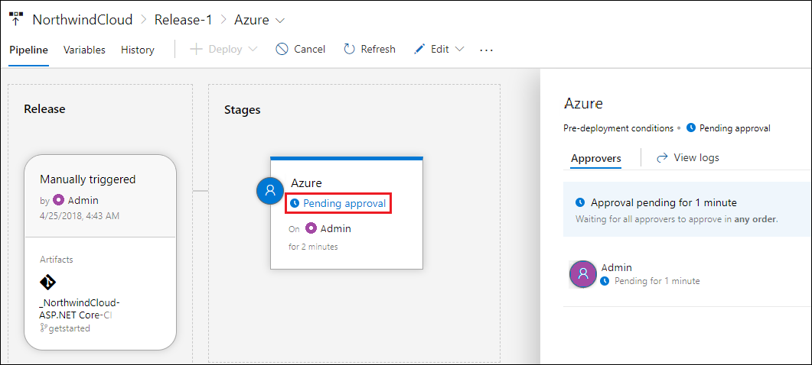

You can see the release logs from all your deployments: 

1. In your Azure DevOps project, Select **Pipelines** > **Releases** on the left, and then select a release. 
   
1. On the release summary page, hover over or select a stage, and then select **Logs**. 
   
   In the release log, the left pane shows the status of each operation for each stage. During a deployment, the right pane shows the live log from the agent. After the deployment finishes, the entire log file appears in the right pane. 
   
1. Select any step in the left pane to see the log file for that step, such as **Pre-deployment approvals**. 
   
1. To view approvals, select **View approval** in the right pane to see who approved or rejected the release, and other details. 
   
Seeing logs for the individual steps makes it easier to trace and debug parts of the overall deployment. You can also **Download all logs** as a *.zip* file.
   

## Next steps

To learn more about Azure Cloud Patterns, see [Cloud Design Patterns](/azure/architecture/patterns).
