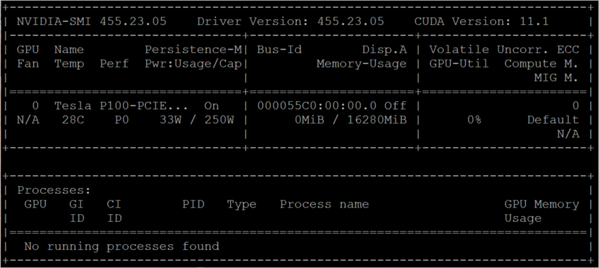
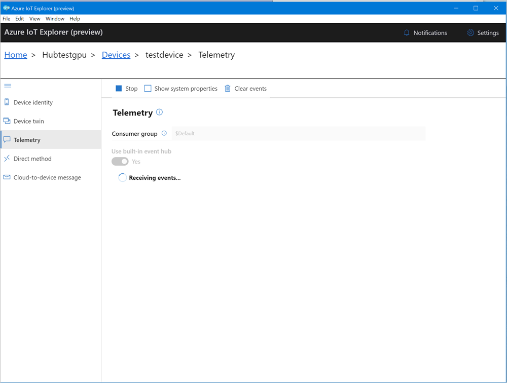

# Deploy a GPU enabled IoT module on Azure Stack Hub

With a GPU-enabled Azure Stack Hub, you can deploy processor-intensive modules to Linux devices running at the IoT Edge. GPU optimized VM sizes are specialized VMs available with single or multiple NVIDIA GPUs. In this article, you can learn to use GPU optimized VMs to run compute-intensive, graphics-intensive, and visualization workloads.

Before you start, you will need an Azure Active Directory (Azure AD) subscription with access to global Azure and Azure Stack Hub, an Azure Container Registry (ACR), and an IoT hub.

In this article, you:
  - Install an GPU-enabled Linux VM and install the correct drivers.
  - Install Docker in order to run a container that will also require the correct drivers.
  - Connect your IoT device to your iOT Hub and install from the iOT marketplace the model: `Getting started with GPUs`.
  - Install and monitor your device from a local machine using Azure IoT explorer.
  - Install and monitor your device using the Azure IoT extension in Visual Studio Code.

## Prerequisites

You'll need to have the following resources in place in your Azure Stack Hub instance, global Azure, and on your local development machine.

### Azure Stack Hub and Azure

  - A subscription as a user using Azure Active Directory (Azure AD) in an Azure Stack Hub Integrated System with an NVIDA GPU.
  - A global Azure subscription. If you don't have a global Azure subscription, create a [free account](https://azure.microsoft.com/free/?WT.mc_id=A261C142F) before you begin.
- An [Azure Container Registry (ACR)](azure/container-registry/container-registry-get-started-portal). Make a note of the ACR sign-in server, username, and password.
-   A free or standard-tier [IoT
    hub](https://docs.microsoft.com/azure/iot-hub/iot-hub-create-through-portal)
    in global Azure.

### A development machine

-   You can use your own computer or a virtual machine, depending on your
    development preferences. Your development machine will need to support nested virtualization. This capability is necessary for running Docker, the container engine used in this article.

  - Your development machine will need the following resources:
      - [Python 3.x](https://www.python.org/downloads/)
      - [Pip](https://pypi.org/project/pip/) for installing Python packages. This is been installed with your Python installation. If you have Pip installed, you may want to upgrade to the latest version. You can upgrade using pip, itself. Type: `pip install --upgrade pip`.
      - [Azure CLI 2.0](/cli/azure/install-azure-cli?view=azure-cli-latest)
      - [Git](https://git-scm.com/downloads)
      - [Docker](https://docs.docker.com/get-docker/)
      - [Visual Studio Code](https://code.visualstudio.com/)
      - [Azure IoT Tools](https://marketplace.visualstudio.com/items?itemName=vsciot-vscode.azure-iot-tools) for Visual Studio Code
      - [Python Extension Pack](https://marketplace.visualstudio.com/items?itemName=donjayamanne.python-extension-pack) for Visual Studio Code

## Register an IoT Edge device

Use a separate device to host your IoT Edge device. Using a separate device will provide a separation between your development machine and IoT Edge device more accurately mirrors a deployment scenario. 

Create an IoT Edge device in Azure with a Linux VM:

1.  [Create an N-series Linux server
    VM](https://docs.microsoft.com/azure-stack/user/azure-stack-quick-linux-portal)
    on Azure Stack Hub. As you install components for your server, you'll interact with the server via SSH. For more information, see [Use an SSH public key](/azure-stack/user/azure-stack-dev-start-howto-ssh-public-key).

2.  [Create and register an IoT Edge
    Device](https://docs.microsoft.com/azure/iot-edge/how-to-register-device)

## Prepare a GPU-enabled VM

1. Install the NVIDA GPU Drivers on your N-series Linux server by following the steps in the article, [Install NVIDIA GPU drivers on N-series VMs running Linux](https://docs.microsoft.com/azure/virtual-machines/linux/n-series-driver-setup).

    > [!NOTE]  
    > You'll use the bash command line to install your software. Make a note of the commands since you'll use the same commands to install the drivers on the container running in Docker on your GPU-enabled VM

2.  Install the latest IoT Edge runtime on your N-series Linux server in Azure Stack Hub. For instructions, see [Install the Azure IoT Edge runtime on Debian-based Linux systems](/azure/iot-edge/how-to-install-iot-edge-linux#install-the-latest-runtime-version)

## Install Docker and the Nvidia driver

Install Docker and the Nvidia driver on your GPU-enabled VM. You're going to run the module from the IoT Edge marketplace in a container on the VM.

### Install Docker

Docker containers can run anywhere, on-premises in the customer datacenter, in an external service provider or in the cloud, on Azure. Docker image containers can run natively on Linux and Windows. However, Windows images can run only on Windows hosts and Linux images can run on Linux hosts and Windows hosts (using a Hyper-V Linux VM, so far), where host means a server or a VM. For more information, see [What is Docker?](https://docs.microsoft.com/dotnet/architecture/microservices/container-docker-introduction/docker-defined).

1. Connect on your N-series Linux server using your SSH client.

1.  Update the apt index and lists.

    ```bash  
    sudo apt-get update
    ```

1.  Fetch the new versions of existing packages on the machine.

    ```bash  
    sudo apt-get upgrade
    ```

2.  Install dependencies required to add Docker's apt repository.

    ```bash  
    sudo apt-get install apt-transport-https ca-certificates curl software-properties-common
    ```

3.  Add Docker's GPG key.

    ```bash  
    curl -fsSL <https://download.docker.com/linux/ubuntu/gpg> | sudo apt-key
    add -
    ```

4.  Add Docker's apt repo.

    ```bash  
    sudo add-apt-repository "deb [arch=amd64] https://download.docker.com/linux/ubuntu $(lsb_release -cs) stable"
    ```

5.  Update apt index and lists, and install Docker Community Edition.

    ```bash  
    sudo apt-get update 
    sudo apt-get install docker-ce
    ```

6.  Verify install by checking the Docker version.

    ```bash  
    docker -v
    ```

### Install Nvidia-Docker

The [NVIDIA Container Toolkit](https://github.com/NVIDIA/nvidia-docker) help you to build and run GPU accelerated Docker containers. The toolkit includes a container runtime library and utilities to automatically configure containers to leverage NVIDIA GPUs.

1.  Set the GPG key and the remote repository for the **nvidia-docker** package.

    ```bash  
    curl -s -L https://nvidia.github.io/nvidia-docker/gpgkey | \
      sudo apt-key add -
    distribution=$(. /etc/os-release;echo $ID$VERSION_ID)
    curl -s -L https://nvidia.github.io/nvidia-docker/$distribution/nvidia-docker.list | \
      sudo tee /etc/apt/sources.list.d/nvidia-docker.list
    ```

3.  Update the apt index and lists, and install nvidia-docker2 and the Docker
    daemon configurations.

    ```bash  
    sudo apt-get update
    sudo apt-get install -y
    ```

1. Install **gcc**.

    ```bash  
    sudo apt update
    sudo apt install build-essential
    ```

2. Install the Nvidia driver using the commands from when you prepared your GPU-enabled VM. Review the steps in the article, [Install NVIDIA GPU drivers on N-series VMs running Linux](https://docs.microsoft.com/azure/virtual-machines/linux/n-series-driver-setup).  
   
    For example, the Ubuntu 18.04 the commands look like:

    ```bash
    wget https://developer.download.nvidia.com/compute/cuda/repos/ubuntu1804/x86_64/cuda-ubuntu1804.pin
    sudo mv cuda-ubuntu1804.pin /etc/apt/preferences.d/cuda-repository-pin-600
    sudo apt-key adv --fetch-keys https://developer.download.nvidia.com/compute/cuda/repos/ubuntu1804/x86_64/7fa2af80.pub
    sudo add-apt-repository "deb https://developer.download.nvidia.com/compute/cuda/repos/ubuntu1804/x86_64/ /"
    sudo apt-get update
    sudo apt-get -y install cuda
    ```

3. Verify your install by running the following command:

    ```bash  
    sudo docker run --runtime=nvidia --rm nvidia/cuda nvidia-smi
    ```

    

    You're now ready to install the module using the iOT marketplace.

## Get the item from the marketplace

Return to Azure portal and add the the model to your edge device using the iOT marketplace. Select **Marketplace Module** from the menu. And search for `Getting started with GPUs`, and follow the instructions to add the module.

For instructions see [Select device and add modules](/azure/iot-edge/how-to-deploy-modules-portal#select-device-and-add-modules)

## Enable monitoring

1. Download [Azure IoT explorer](/azure/iot-pnp/howto-use-iot-explorer), and connect the application to your IoT Hub.

2. Select your IoT Device and navigate to Telemetry from the navigation menu.

3. Select **Start** to begin monitoring output from the IoT Edge Device.



## Monitor the module  

1. In the VS Code command palette, run **Azure IoT Hub: Select IoT Hub**.

2. Choose the subscription and IoT hub that contain the IoT Edge device that you want to configure. In this case, select the subscription used to deploy the Azure Stack Edge device, and select the IoT Edge device created for your Azure Stack Edge device. This occurs when you configure compute via the Azure portal in the earlier steps.

3. In the VS Code explorer, expand the Azure IoT Hub section. Under **Devices**, you should see the IoT Edge device corresponding to your Azure Stack Edge device. 

    1. Select that device, right-click, and select **Start Monitoring Built-in Event Endpoint**.

    2. Go to **Devices > Modules** and you should see your **GPU module** running.

    3. The VS Code terminal should also show the IoT Hub events as the monitoring output for your Azure Stack Edge device.

    

    You can see that the time taken to execute the same set of operations (5000 iterations of shape transformation) by GPU is lot lesser than it is for CPU.

## Next Steps

  - Learn more about [Graphics processing unit (GPU) virtual machine (VM) on Azure Stack Hub](gpu-vms-about.md)

  - Learn more about Azure Stack Hub, Data Box Edge and the Intelligent Edge, [The future of computing: intelligent cloud and intelligent edge](https://azure.microsoft.com/overview/future-of-cloud)

  - Learn more about hybrid cloud applications, see [Hybrid Cloud Solutions](https://docs.microsoft.com/hybrid/app-solutions/)