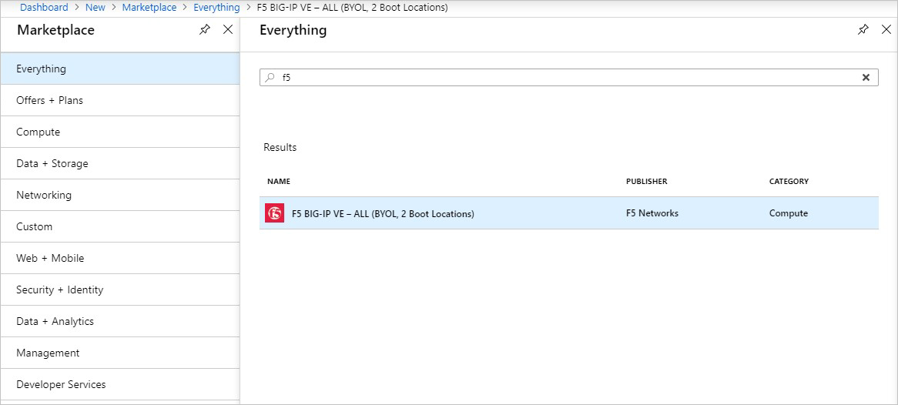
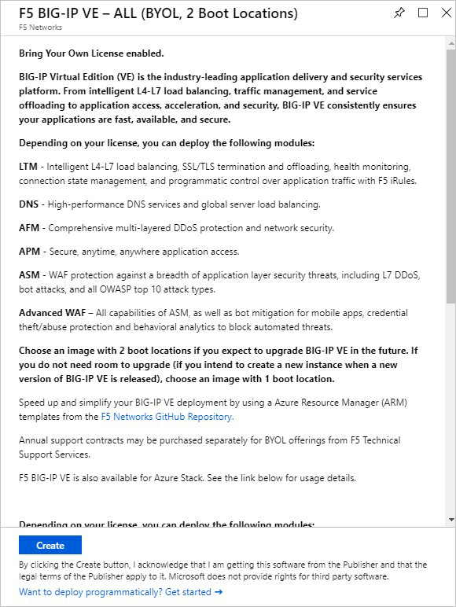
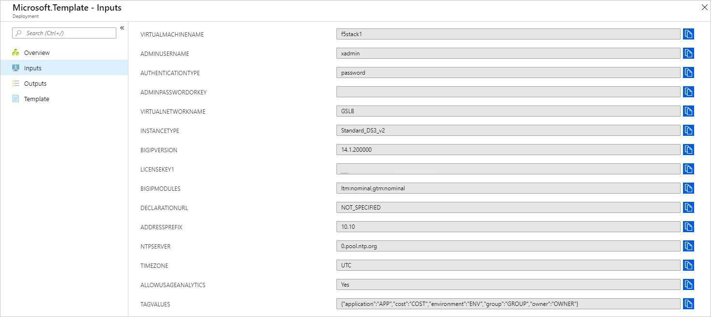
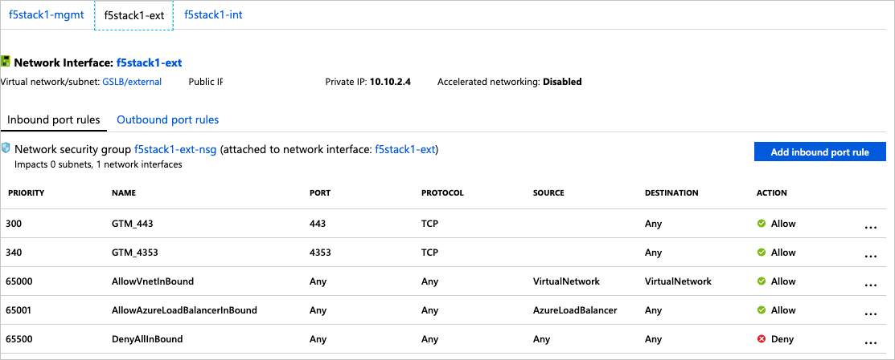
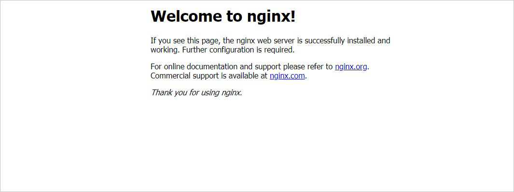
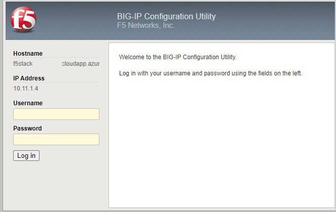

# How to deploy F5 across two Azure Stack instances

This article walks you through setting up an external load balancer on two Azure Stack environments to manage different workloads. In this article, you will Deploy F5 as a global load-balancing solution across two independent Azure Stack instances. You will also Deploy basic load balanced Web app running in an NGINX server across both Azure Stack Scale instances behind a high availability failover pair of F5 virtual appliances.

You can find the Azure Resource Manager templates in the [f5-azurestack-gslb](https://github.com/Mikej81/f5-azurestack-gslb) GitHub repository.

## Overview of load balancing with F5

The F5 hardware, the load-balancer, may be outside of Azure Stack and within the data center that hosts Azure Stack. Azure Stack doesn't have a native capability to load balance workloads across two separate Azure Stack deployments. Running identically on both platforms, F5's BIG-IP virtual edition (VE) supports parity between Azure and Azure Stack architectures through replication of the supporting application services. You can develop an app in one environment and move it to another. You can also mirror the entire production-ready Azure Stack, including the same BIG-IP configurations, policies, and application services. The approach eliminates the need for countless hours of application refactoring and testing, and allows you to get on with writing code.

Securing applications and their data is often a concern for developers moving apps to the public cloud—but that need not be the case. A developer can build an app in their Azure Stack environment, while a security architect configures the necessary settings on F5's web application firewall (WAF). The entire stack can be replicated in Azure Stack with the knowledge that the application will be protected by the same industry-leading WAF. With identical policies and rulesets, there won't be any security loopholes or vulnerabilities that might otherwise be generated by employing disparate WAFs.

Environment Access:

Azure Stack WestUS2: [*https://portal.westus2.stackpoc.com/\#@mashybridpartner.onmicrosoft.com/dashboard/private/c4054ea4-e781-4a21-a6ae-f7c8d6d6000e *](https://portal.westus2.stackpoc.com/#@mashybridpartner.onmicrosoft.com/dashboard/private/c4054ea4-e781-4a21-a6ae-f7c8d6d6000e)

Azure Stack WestUS: [*https://portal.westus.stackpoc.com/\#@mashybridpartner.onmicrosoft.com/dashboard/private/1cbb1a49-caa5-4023-af31-02d5a385000e *](https://portal.westus.stackpoc.com/#@mashybridpartner.onmicrosoft.com/dashboard/private/1cbb1a49-caa5-4023-af31-02d5a385000e)

> [!Note]  
> Sign in with your F5 email address. You should have received a separate notification email inviting you to both of the above locations.

MarketPlace: Azure Stack has a syndicated marketplace from Azure and only certain items are added. In this case, if you want to create a new Resource Group on each of the Azure Stacks and deploy the F5 virtual appliance that is available already. From there, you will see that a "Public IP" address will be required to allow network connectivity between both "WestUS" and "WestUS2" Azure Stack scale units. Essentially, they are both islands and the "public ip" will allow them to talk across both locations. We may need to join a session to discuss this after you get started to get everything configured as needed. Attached is a picture of essentially what we are trying to accomplish.

## Pre-Requisites

-   Download F5 BIG-IP VE - ALL (BYOL, 2 Boot Locations) into each Azure Stack Marketplace

-   Reference <https://github.com/Mikej81/f5-azurestack-gslb> for Resource Manager templates

### Deploy F5 BIG-IP VE - ALL to Azure Stack Scale Unit A and Scale Unit B

1. Sign into the Azure Stack user portal.

2. Select the green **+** sign at the top-left corner of the screen

3. Search the marketplace by typing `F5` in the search field and hit **Enter**. Take your time to view the different F5 products available.

4. Select **F5 BIG-IP VE – ALL (BYOL, 2 Boot Locations)**

    

1. At the bottom of the next page, selected **Create**

    

1. Create a New Resource Group called "F5-GSLB"

1. Reference the following values as an example to complete the deployment

    

1. Validate Deployment completes successfully

    

    > [!Note]  Each BIG-IP Deployment should take around 20 minutes*

1. Enable root account to establish trust <https://support.f5.com/csp/article/K13121>, once the trust (certificate exchange) is established, the root account should be disabled

1. Sign in to the BIG-IP and Create a DNS Sync Group <https://f5-dns-automation-demo-12-1-x.readthedocs.io/en/latest/lab2/sync-group.html>

    > [!Note]  You can find the local IP of the BIP-IP Appliance in your "F5-GSLB" Resource Group. The Network Interface is "f5stack1-ext" and you want to connect to the Public or Private IP (depending on access). *

    
          
    

1. Select the new Resource Group "F5-GSLB" and Select the "f5stack1" virtual machine. Under 'Settings' select 'Networking'

    Post Install Configurations to Azure Stack NSGs (lock down source IP)

    -   Initial deployment includes allow 22 on external interface, this can, and should be removed after trust is established.
    
    -   Initial deployment doesn't block source on NSGs, this should be changed once everything is online. Management NSG should be locked to management source, External (4353/TCP) NSG should be locked to the other scale unit for sync. 443 should also be locked until applications with Virtual Servers are deployed.
    
    -   GTM\_DNS Rule is set to allow port 53 (DNS) traffic in, and BIG-IP resolver will start working once. Listeners are created.

    

1. Deploy a basic web application workload within your Azure Stack environment to Load Balance behind the BIG-IP. Example: <https://docs.nginx.com/nginx/admin-guide/installing-nginx/installing-nginx-docker/> within an Ubuntu VM on Azure Stack

    > [!Note]  Deploy a instance on both Azure Stack A and Azure Stack B Scale Units*

1. After NGINX is deployed in a docker container on Ubuntu VM within each of the Azure Stack Scale Units, validate you can reach the default webpage

    

1. Sign in to the Management Interface of the BIG-IP Appliance. In my case I am using the "f5-stack1-ext" Public IP Address.

    

1. Publish access to NGINX through the BIG-IP
    
    -   In this task, you will configure the BIG-IP with a Virtual Server and Pool to allow inbound Internet access to the WordPress application. First we need to identify the private IP address for the NGINX instance.
    
    -   Let's go back to the Microsoft Azure Stack Portal

1. Select your NGINX Network Interface

    

1. From the BIG-IP GUI, go to **Local traffic -&gt; Pools -&gt; Pool List** and Select on the **+** sign. Configure the pool using the information provided in Table below leaving all other fields set to defaults.

    
    
    | Key | Value |
    | --- | --- |
    | Name | NGINX\_Pool |
    | Health Montitor | HTTPS |
    | Node Name | NGINX |
    | Address | &lt;your NGINX private IP address&gt; |
    | Service Port | 443 |

1. Select **Finished**. When configured correctly, the pool status will be green

    

    You now need to configure the Virtual server. To do this, you first need to find the private IP of your F5 BIG-IP.

1. From the BIG-IP GUI, go to **Network -&gt; Self IPs** and note the IP Address

    

1. Create a virtual server by going to **Local Traffic -&gt; Virtual Servers -&gt; Virtual Server List** and Select on the **+** sign. Configure the Virtual Server using the information provided in Table below leaving all other fields set to defaults.

    | Key | Value |
    | --- | --- |
    |Name | NGINX |
    |Destination Address | &lt;Self IP address of the BIG-IP&gt; |
    |Service Port | 443 |
    |SSL Profile (Client) | clientssl |
    |Source Address Translation | Auto Map |
        
        

    

1. You have now completed the BIG-IP configuration for the NGINX application. To verify proper functionality, let's browse the site and verify F5 statistics.

1. Open a browser to and ensure it displays your NGINX default page.

    

1. Now check the statistics of your virtual server to verify traffic flow, by navigating to **Statistics -&gt; Module Statistics -&gt; Local Traffic**

1. Under **Statistics Type**, select **Virtual Servers**

    

## Next steps

[Differences and considerations for Azure Stack networking](azure-stack-network-differences.md) 